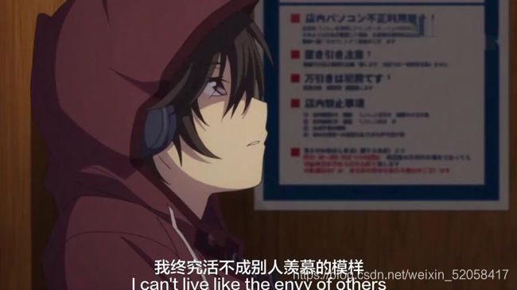
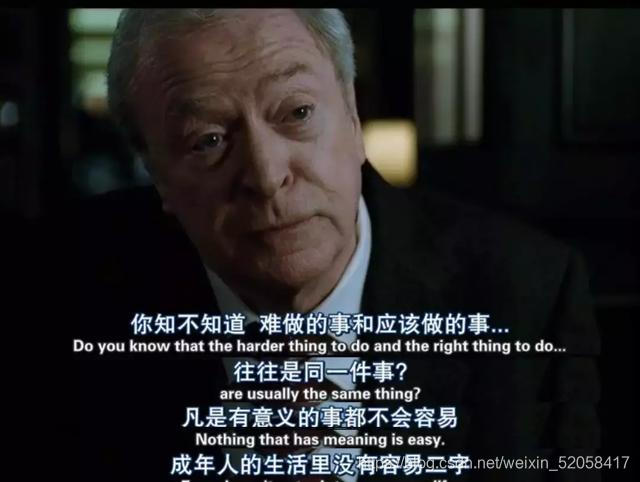
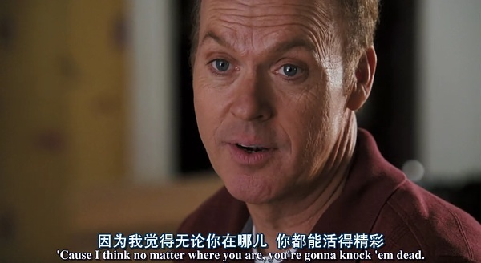
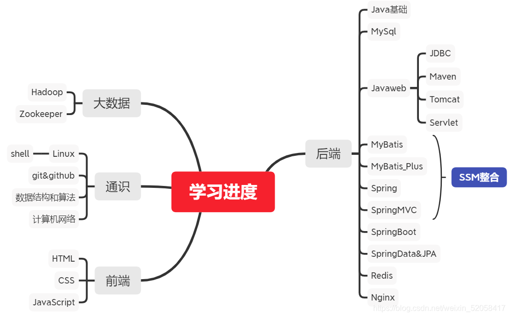
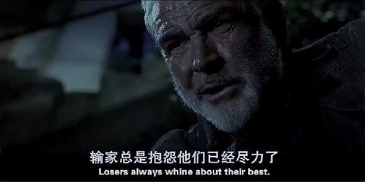

# 【程序人生】“阶段总结”-翰墨流离

不知不觉就已经20岁了，离我25岁的目标又近了一步。这几天，虽然是在放暑假，虽然我才大一升大二，却也像着大三考研的学长、学姐们一样早早前往图书馆，不等闭馆大爷催促，也是不会离开。

有时候发现这个社会的竞争似乎越来越激烈了，昨天有个还未报道的学弟问我学习C语言有什么推荐的书籍吗。我当时愣了一下，没有立刻回复他。回想起我的毕业假期，就是一个人一张床，一台电脑，游戏、动漫、小说......就是那一个夏天。现在想起来还是有一点点懊悔，为什么没有早做准备，白白错失了很多机会。我没有直接回复他，我问了他一个问题，我说，你热爱编程吗？还是只是为了准备大一的C语言考试提起预习。他隔了一会儿，回答我说，他对这个领域比较感兴趣......

最后我还是给他推荐了一本C语言的书籍，也许他不一定会买，但是至少他有自己的想法，在还未进入大学的时候。

学习的确是一件非常痛苦的事，图书馆的椅子确实没有宿舍的床软和，图书馆的空调也没有宿舍制冷（可能是因为人太多了吧），看着学长、学姐面前堆积的考研复习资料，像是回到了高考那年。生活确实越来越累了，很多以前简单的快乐，现在变得不快乐了；很多以前身边的人，都渐行渐远了。

**学习进度汇总：**

很多都只是过了一遍，了解了一下大概是个什么玩意，上实战还是差得远......（有的就会一个Hello Word，嘿嘿）

好吧，不管怎么说，不会停下学习的脚步......

大二，继续加油吧！