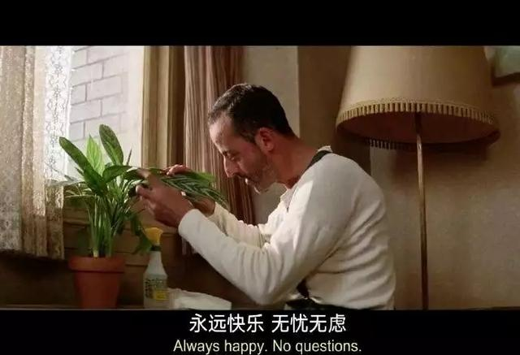
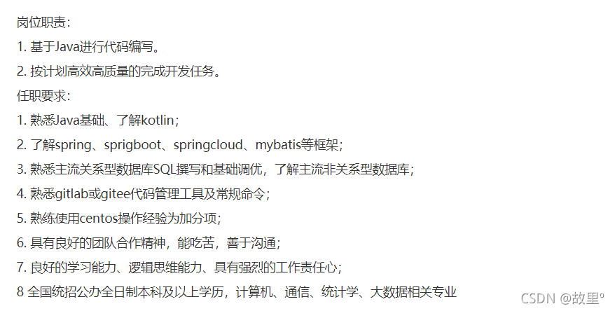

# 【程序人生】“阶段总结”-心余力绌

时间过得真快，一转眼就开学了，一转眼就二年级了（大学），一转眼女朋友也要毕业了（呜呜呜，😭😭😭）。有时候不知道为什么，总是觉得自己碌碌无为，虽然每天都在学习，可每当晚上躺在床上回想一整天，发现似乎自己也没学到什么东西这一天就过去了......

想去试一试，看看自己看不可以。总觉得自己不够好，还达不到要求，我不知道是不是身边优秀的人太多了，还是我太废物了，他们拥有的机会和资源远远比我多得多。有时候很迷茫不知道该如何努力，如何超越......

今天忍不住上了某招聘网站看了看，实习生的要求我截图了下来。太难了吧😭😭😭（菜鸡表示无能为力）总是心有不甘，总想要做得更好......2k-4k就是现实吗???

还记得是前几天的事，一个学弟找到我，一上来就是一句"有项目吗？"问我要后端项目，没有任何称呼（当然，我也不是那种阶级主义者😱别喷我）。当时我觉得很惊讶，现在这么卷了吗？大一还没开始就能写项目？加上他之后，和他简短的聊了几句。我不知道是不是我感觉有问题，还是事实就是如此，他的言语之间透露出他很自信（就那种觉得自己很6😳😳），然后我问他会些什么，技术栈都有些什么，他回了我"Java语言基础知识"，"一些小项目经历"，然后他把他的GitHub地址给我了，让我看看他处于什么水平，最后还补了一句"有时间就看吧，没时间就算了"，我幸幸苦苦码了一大段，就回一个好，嗯，后面就直接不回了（好像不是很耐烦的样子😢😢😢）。

我看了看他所谓的小项目经历，也和Web后端开发没有太多关系，好像是一个基于我的世界基岩版服务端的Nukkit核心做的插件（他是这样介绍的，我一个游戏废物都不打游戏😥不是很懂），大致看了一下，基本就是Java高级的一些东西用到了，异常处理，集合类等等。确实在新生中，他可能算得上基础比较好的了，我也很羡慕他的那种自信（认真的！！！）

唉，我也不知道我想表达什么，可能是觉得自己努力得还不够吧！现在想想做自己就好了，心别太大了，被像文章得标题一样，心余力绌！！！

心有余而力不足，清楚的认识自己。记得看到过一句话，送给在这条路上奋斗的大家：

无论人生上到哪一层台阶，阶下有人仰望你，阶上也有人在俯视你，你抬头自卑、低头自得，唯有平视才能看见真正的自己！！！

