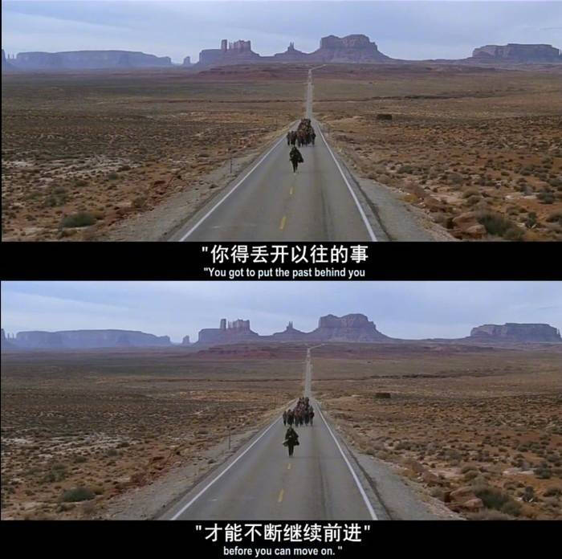
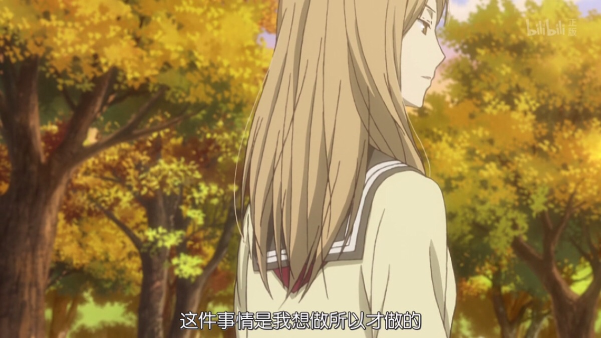
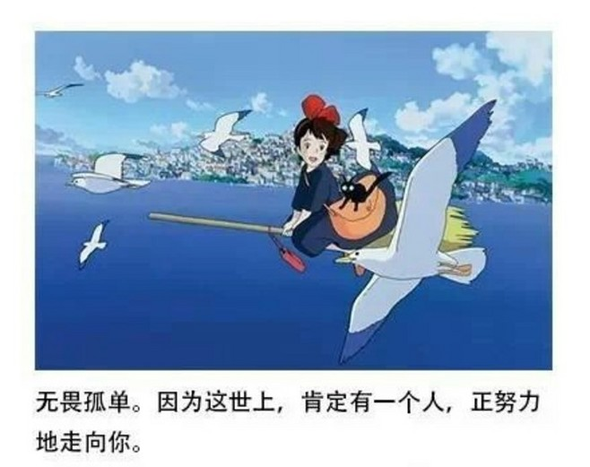
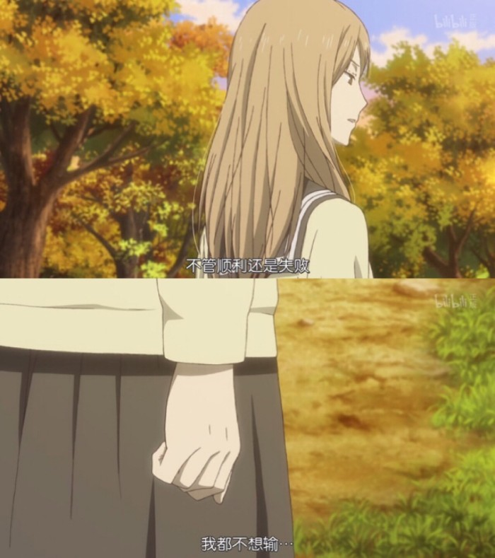

# 【程序人生】“阶段总结”-芝草无根

---

## 🚩阶段一：回顾过往

好久没有更新博客了😅（鸽了太久），嘿嘿，感觉是时候回过头来写一篇了......

主要是因为国庆假期快过去了，才发现自己好像什么事都没有开始做。确实深有体会：人越长大，时间过得越快，当下的我就处在时间飞逝的浮光掠影之中......（浮光掠影：表示我对国庆假期如何度过的几乎没什么影响就草草收尾了😭😭😭）

后端的基础经过一年多的不断学习，渐渐进入了尾声...终于在国庆不久前进入了分布式、SpingCloud等技术栈的学习，后面我会慢慢把学习笔记整理成博客发布的，希望大家会喜欢😊

😭学习真是一件让人又爱又恨的东西呀，唉，我都不知道该怎么去形容学习所带给我的一切。

我现在所记录的是我国庆回家摸鱼，以及回想这几天的经历所想所感，希望对正在看这篇文章的你有所帮助😊！

- 别去抱怨，无论任何时候，面对任何事、任何人

学校，国庆放假七天，我并没有一上完最后一节课就立刻拖上行李箱踏上归家的路程。相反我甚至没有太多想回家的念头。但最后我还是在国庆假期第二天选择了回家......

假期前的最后一节课莫名漫长，四节连上，下课就是晚上10点半了，教室里肯定少不了抱怨声。其实我倒是无所谓，我觉得作为一个学技术的人，我觉得就应该有这样的心态，无论面对什么一定要沉得住气，不抱怨，任何时候，面对任何事，任何人。抱怨并不能解决问题。就像我们就算抱怨了，Bug也不能自己修复，就算抱怨了，也不能提前下课。

人生有很对时候本身就是身不由己的，我们能做的无非就是坦然面对、淡然处之。其实，我这个还是喜欢平平淡淡的，你我安康，岁月静好，就好了。当然，如果能做着自己喜欢的事，陪着相互深爱的人就够了，其实这样就是最幸福了。

- 学会低调，做了不一定要说，一旦说了一定要做！

国庆七天，其实在放假前我就早已经把所有的安排都计划好了！！！😅

可是，计划永远赶不上变化......虽然有很多安排都被打乱了，但是我依然在坚持学习......我不知道是不是所有都这样，还是只是像我这种比较虚伪的人才会这样。如果有人来问我国庆干了啥呀，我肯定会毫不犹豫地回答，玩了整整七天呀！天天在家颓废！！！我要躺平！！！（虽然似乎这是事实，哈哈哈😂😂😂）。做了不一定要说！！！

随着年龄的增长，我愈发没有了分享欲，尤其是对于我的努力，我的学习进度，以及我的学习成果。首先，我学习的初衷并不是为了和别人分享，其次我也并不想让别人知道我学习有多刻苦有多努力（就像想在凌晨2点我仍然在这里写博客😂其实就是欠的之前的债😭😭😭）。我也并不需要被别夸奖来获取所谓的成就感，那些习惯性的把自己的日常发布在空间、朋友圈的行为，我做不到，我不喜欢我的生活毫无保留的展示在别人的面，先不论别人是否对我的生活感兴趣。

但是，答应别人要做的，请竭尽全力去做。哪怕最后发现自己无法做到了。也请遗憾的给对方到一个歉，坦率地说出自己做不到，辜负了她的期望。

就像《当幸福来敲门》里面的男主，I'm the type of person,if you ask me a question, and I don't know the answer,I'm gonna to tell you that I don't know.But I bet you what: I know how to find the answer, and I'll find the answer.（我是这样的人，如果你问的问题我不知道答案，我会直接告诉你“我不知道”。但我向你保证：我知道如何寻找答案，而且我一定会找出答案的。） 说了就一定要做！！！

- 珍惜眼前！珍惜所有！一旦失去可能就不再会有！

现在也偶尔会回想起以前，尤其是看到一些视频的时候，鼻子总会是酸酸的。但是错过了终究是错过了，也回不去了，也没办法再去经历了。

那些课桌上成堆的练习题，终于没有机会再去翻看了；晚自习前空荡荡的旧操场也没机会和那些人一起走过了；拥挤的教室，不安紧张的测验都离我远去了......

珍惜眼前，别等她逝去后，才来缅怀！！！

---

## 🚩阶段二：展望未来

无论今天过得如何，就请她留在工作台上就好了，别把她带上床，带进梦乡......当你躺在床上的时候，今天的不开就止于此吧！！！

**明天仍然是新的一天，晚安，追梦人！加油！！！**

**最后，最后，最后！！！无论如何，都不想输！！！**

