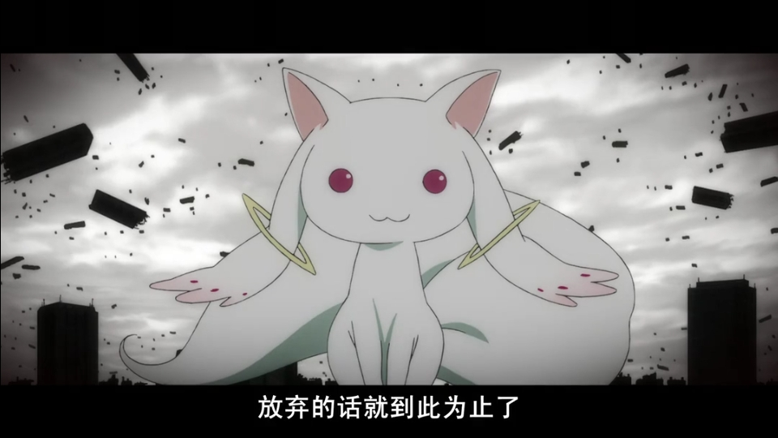
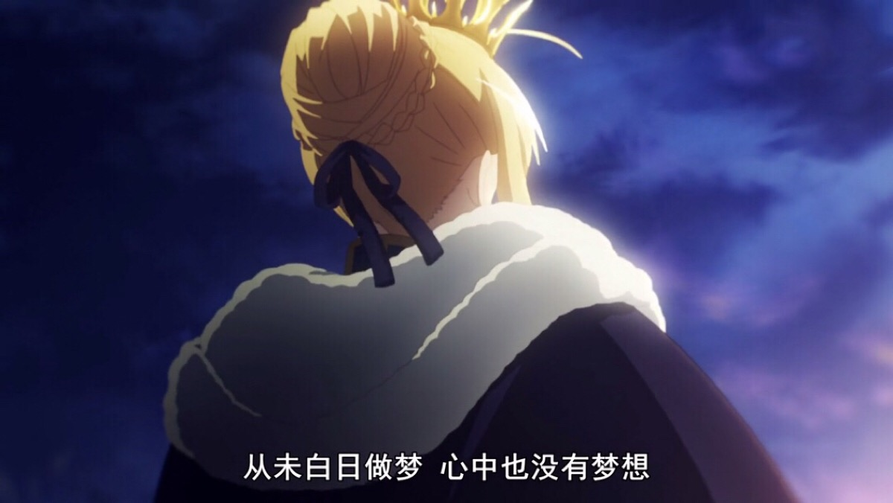

# 【程序人生】“阶段总结“-枯枝再春

## 一、枯枝✍：

不知为何愈发觉得时间不够用，也愈发觉得生活被许许多多的琐事所填满。似乎一天并没有做什么就潦草结束了，没有成就感，浑浑噩噩......晚上凌晨躺在床上的时候，总是忍不住得去想今天到底做了些事......思索了很久，突然惊醒，发现似乎又是一天无所事事，于是又为明天（今天）做一个规划（立一个flag），心满意足睡了.......

计划早上6：30起床，30分钟背单词，因为你知道你的英语并不优秀，甚至很差.......（或者在第二专业-英语专业班上是最差的）。计划吃过早餐之后，从7点到10点的三个小时里不断提升自己技术，你也想去学习人工智能，去做一点图像识别，文本挖掘的项目。你也想发表一两篇学术论文，和优秀的人一起卷一卷。然后，在10点到12点期间开始学习大学数学相关的课程，一边完成这个学期的概率论数理统计的课程要求，一边又为考研做一点准备......

中午，吃完午饭之后，1点，回到宿舍睡半个小时的午觉。起床之后2点了，开始学习英语，你可以多练练你的阅读能力，你可以适当听听6级听力，别忘了还要写一写英语作文...对了翻译......下午，抽出一点时间，看看自己想看的书或者有意义的电影，或者听听音乐，写写博客......

晚上，晚餐后，牵着爱的人的手去操场闲逛一会儿，或者换上跑鞋，一跑就是5公里......回到宿舍之后洗漱，然后在桌前坐下，打开电脑，复习一下早上背过的单词，上午做错的数学题，没有解决的Bug，为下午的电影或者文章写一点心得，再听一遍下午那一首你觉得特别特别的歌曲......如果已经12点，收拾收拾准备上床休息了。订好闹钟...明早6点30，手机就留在桌上，带一本书，可以是小说，可以是计算机组成原理，计算机网络，最好不是漫画，但可以是杂志（有意义的会比较好）。最晚1点前睡觉......

早上6点30闹钟响了，我想再休息10分钟吧，于是我吧闹钟延时10分钟.......9点了，突然惊醒，记得我该背词，吃早餐......带着一丝懊恼，从被窝里挣扎起来，找了找手机，貌似昨晚刷完短视频之后......简单洗漱一下，我感到一丝失落，不知道该干嘛。坐在桌前掏出手机，看看有没有新消息，朋友圈里有没有更新，有没有消息推送......恍惚间肚子饿了，但是再过一两个小时就该吃午饭了......一上午，我似乎什么也没做，嗯......今天应该早起的，唉......突然想起实验报告今天就截止提交了，匆匆忙忙地去询问我的室友，要了一份过来修修改改，就草草提交了。又拿起手机滑滑，想想中午可以吃点什么，或者打开动漫一看就是一上午，不太喜欢玩游戏，不然也是一打就是一整天，至少以前是这样......

中午了，简单把睡得乱糟糟的头理顺一下，一个人晃晃悠悠去食堂吃个午饭，一边吃饭一边看着短视频或者动漫......然后在晃晃悠悠回到宿舍，重复这上午的经历，或者突然想起还有课，那就背个空荡荡的书包，坐在倒数一二排，换个地方看手机。

当下课铃声响了，和着一群你不认识，不熟悉的人一起往宿舍的方向走。走到宿舍楼下时，调个头，还是去食堂打一个包吧，晚上就不出门了。回到宿舍开始边看动漫边吃饭......回过神来，阳台外的天已经暗下去了，算了，今天就这样吧，明天一定早点起。于是，我又拿着手机上了床......

---

## 二、再春👊：

每天坐在电脑面前时，我觉得他就是我的全世界了，我也不知道我坚持的是否正确，但是我知道坚持总没有错。至少我从不后悔第一次输出“Hello World”，第一次遇到Bug，第一次调试程序，第一次独自完成项目......

不是常有人说嘛，人这短暂一生总有许许多多第一次，所以趁你还年轻大胆去尝试，你还有机会，还有时间去改变，你还有很多能量去释放，你拥有着无限可能！

无论你身在何方，你是否已不再年少，但是请为自己而活，别被生活束缚住了自己。或许你是因为现实而被迫走上编程这一条路，还是因为热爱而义无反顾，至少请在一行一行code中找到能让你快乐的地方。

就算每天筋疲力竭，每天劳于奔波 ，每天都在四处碰壁......别忘了，你也曾年少有为，你也曾风生水起，你也有过成功，你也与众不同，坚持自己最初想坚持的，去做自己想做的，别给人身留遗憾，别等浑浑噩噩之后来后悔，别等时间错过来，再等明天，没有明天了，有的就是现在，只有今天。至少今天为自己而活！

