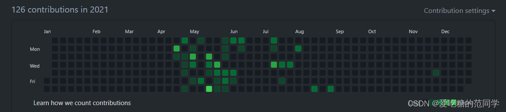
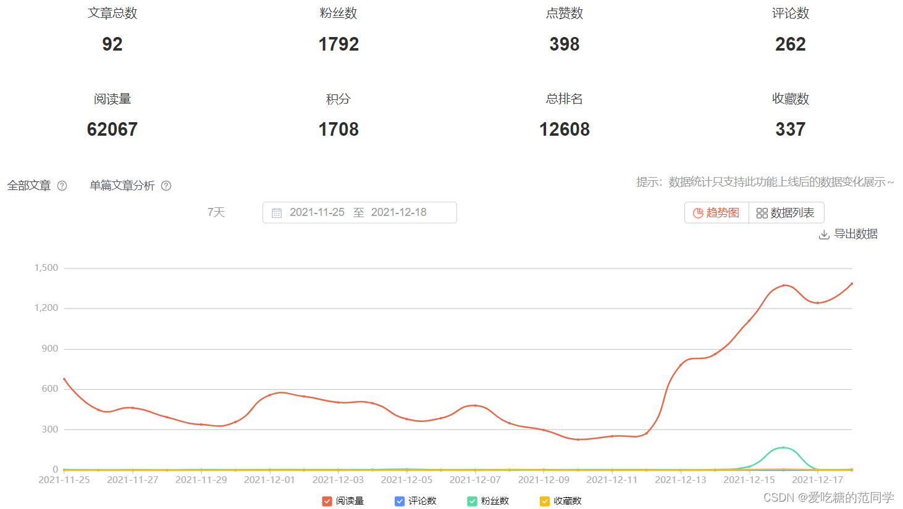
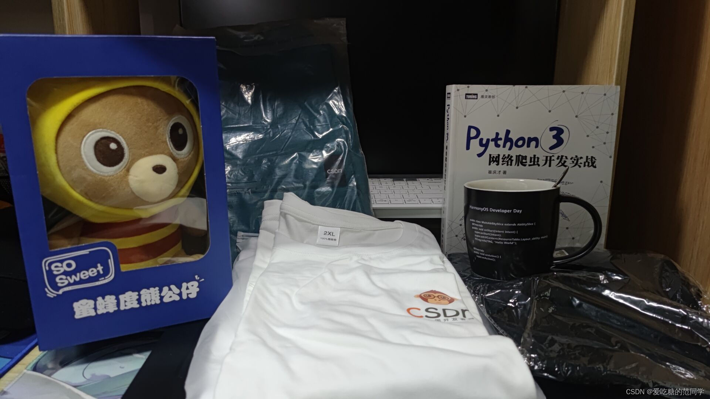
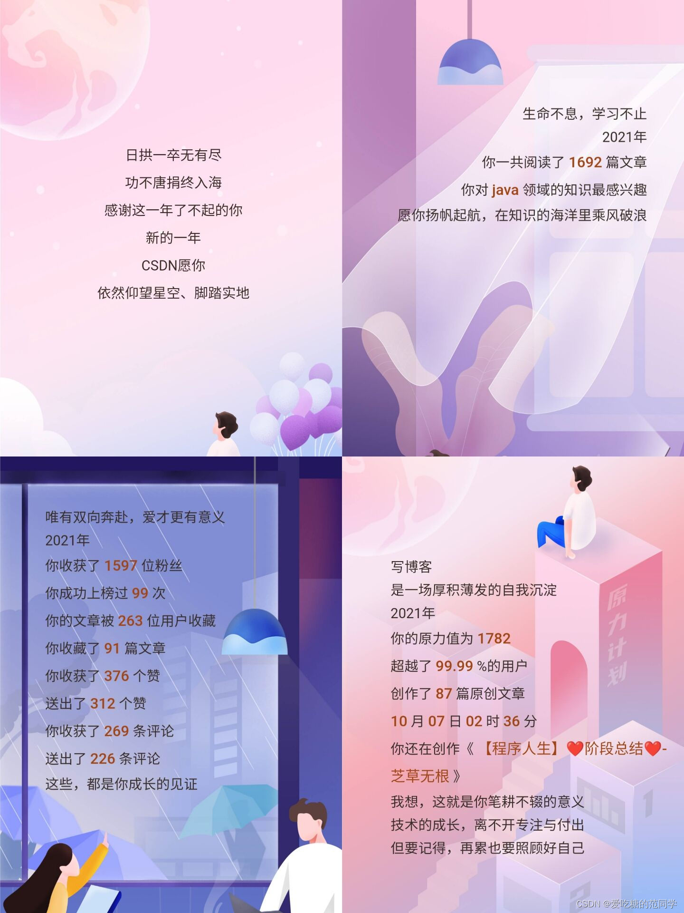
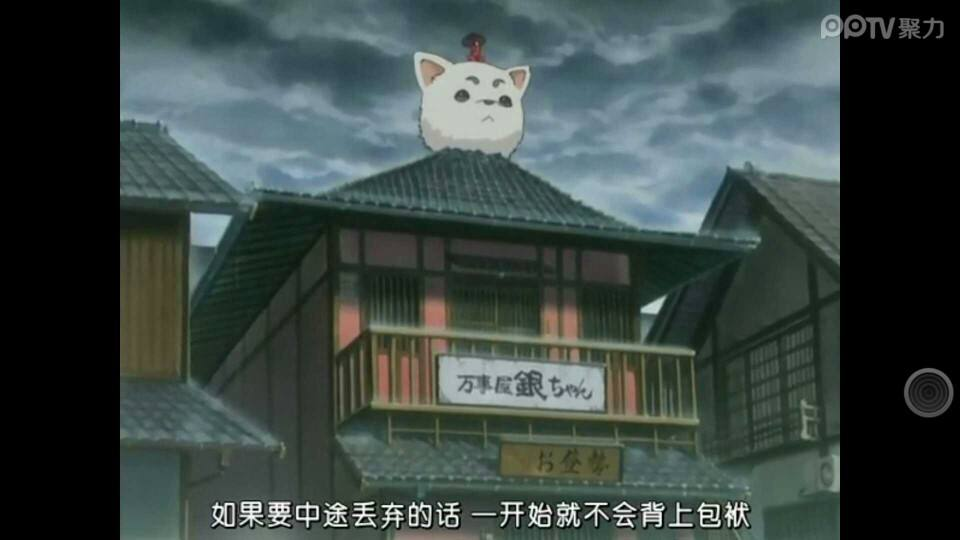

# 【程序人生】“2021年终总结“-后会无期

## 一、历程📅：

 从啥也不知道的一小白，到第一次接触计算机，再到学习如何编写一个Hello World，再到入门，了解这个领域，认识了许许多多的大佬......

2021年，经历了很多，收获了很多...一年的成长，终于明白了自己真正的想要，也再次认清了自己。经历和感悟要慢慢写，就像人生的篇章只有一笔一划才能写得明白，写得清楚。而不是等到人老恍惚时，到都来发现自己苍白的人生，后悔曾几何时我也年少轻狂，遗憾的是却没留下点什么，值得纪念......

从第一篇文章，到第100篇，未来还会有更多。坚持不断地去努力，做自己想做的事，不要去在意别人的眼光和看法，我有我自己的主张，坚持自己喜欢的，做一个自私的人没什么不好，我本就不是度世人的菩萨，也不是救赎别人的上帝，我就是一个普通人，在普通而平凡的生活中去找寻一点属于自己的快乐！

### 1.创作✏️&收获🍬：

从第一次注册github后提交，到越来越多的提交，编写越来越熟练的代码，是这一年的历程

从最初的0粉丝0阅读慢慢涨到10到100到1000，也许以后还会慢慢变多吧，（我会努力写作滴，啊哈哈哈），这是一年的历程。

当然这也是有收获的一年（还有些奖品没有拍到），虽然在客观上并不值多少钱，但是十分开心付出后得到的回报！！！

未来还很长，还需要继续坚持下去，执着着自己热爱的事，为之努力和奋斗。哪怕过程艰辛并且困难重重，享受着一路的荆棘，伤痛总是伴随着成长，加油，你能坚持下去，并且你一定可以做到！！！

### 2.不足💦&努力💪：

试着与人为善，但是绝不随波逐流，保持自己的初心，坚持自己，不因别人的言论或看法而动摇，我就是我，别人怎么说怎么想终究只是别人的看法，他们根本不了解你，真正了解你的只有你自己。

只对自己好，别当烂好人。多爱自己一些，付出太多，总有人会把这份善意当成理所当然。孤独高傲一点，少说话，或者不说话，多做事，多努力，做自己。说再多期望再多规划，描绘再多美好未来，功成名就也只是在白日做梦，还不如珍惜眼前时间，多做一点，多努力一点，向优秀的人多靠近一点。

珍视时间，量化自己的时间。不浪费别人的时间，也不要让别人浪费自己的时间。多花些时间在学习和努力提升自己这件事上，其他的与自己利益无关的事，少关心，少过问，少说话，少参合。

---

## 二、期许🎄：

**希望粉丝还能涨一点，哈哈哈，想得到一个创作者身份！！！**

能坚持学习，学习更多的计算机知识，用代码去编写自己的人生。希望自己坚持变得更好，每天进步那么一点，改变一点。期许我爱的人一直都在💓，爱我的人会有人一直爱💓.......

希望有越来越多的人能喜欢我的文章，也希望自己的文章能被更多人看到，如果有什么问题也希望有人能给出指正。

希望自己还能更优秀一些，更努力一些，更自律一些！！！

---

##  三、规划🌌：

   学习前端，用HTML、CSS、JavaScript...去搭建自己的个人网站，写一个个人简历吧，记录自己的程序人生。继续深入的学习后端的知识，总要有一个比较突出的能力方向。不断尝试AI，未来必然是人工智能的时代。

坚持阅读，坚持去欣赏文学中的美。努力提高自己的英语，无论是口语还是写作！

每天保持一个良好的心态去面对未来的一切，即使险些不堪重负，也要笑着去面对，笑着去享受每一生命中所有的经历的一切，无论是成功或者失败，这都是人生旅程中的风景。不去悲观，不去怨天尤人，不去自暴自弃，不去自我消耗；就是淡然享受便好！！！

无论如何，永远也不会停下前进的脚步！！！加油！！！2021👊不负期许，未来可期！！

