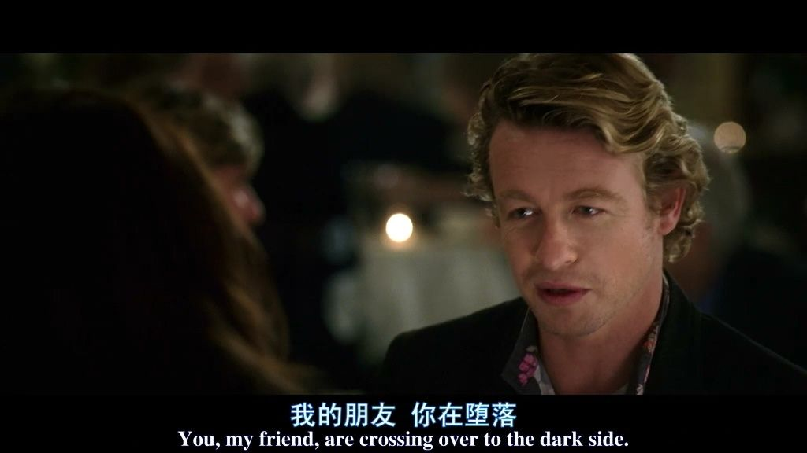

# 【程序人生】“阶段总结”-室迩人远

---

## 📌致即将踏上这条路的你：

看了网上很多大佬的分享，确实写得很精彩，说得很对。实话实说，我还是很羡慕大佬们能进入大厂工作。编程这条路确实是为数不多的不用拼爹靠关系的路，它只看个人的硬实力！！！也确实给了很多像我这样的普通人提供了无限的可能，创造了很多机会。

有人问编程难吗？

作为一个普通人，我觉得难！很难！！特别难！！！

难在坚持！难在是否有继续学习的动力！难在爆红了，你是否有耐心去一行一行的检查代码！！难在同一个算法，你能否敲几十上百遍！！！

我不是一个天才，也没想过去超越任何人，我只是热爱这一行业，喜欢用代码去创造我想创造的，去实现我想实现的......如果你也是，那我很希望能和你交朋友，我们可以一起学习，一起进步。

如果不是也没关系，人各有志，也可以一起加油！

坚持真的很重要，这将是你一生都值得珍惜的东西！我也曾想过要放弃，和他们一样在宿舍打游戏，一边看番一边吃零食，不用每天7点前就起床，不用背着电脑和书去图书馆，不用改bug，不用学习，不用记笔记......可是我不想浪费我的时间去做一些我认为没有意义的事，人活着不就是为了意义这两个字吗？如果活着没了意义，我觉得可能这个人离墓碑也不远了吧。

无论如何，一但选择这条路，请一定一定要坚持下去（对我自己也是！！！），请一定要坚持。没有什么能阻挡学习的脚步！一天可以不需要学习很多，但是一定要坚持每天学习一点，哪怕只是一点点！！！ 

保持学习的热情，每天进步一点一点！

别怕出错，学习就是不断试错的过程。只用不断地试错，不断地改正，才能不断地成长。救我而言，没有一次编译就能完美执行地案例，每次都需要不断地调试，不断地修改，我也认同这一观点：没有完美地代码，只有代码的不断完善！好比人生，没有谁地人生能够一帆风顺，至少我的人生不是，如果你的人生也不是那么的一帆风顺，没关系，我们一样，都是在风雨中见证着自己的成长，所以加油！！！

---

## 📌致自己：

已经接触编程快一年了吧，从什么都不懂的小白，一步一步走到了现在。比不上那些大佬们，就是一个普通人，会写一点小小的demo，会对数据库中的数据进行CRUD操作......

回想过去的一年，好像什么也没有做成，时间就这样一点一点一点...过了，后知后觉......偶尔想起来，一焦虑就是一整天......

今天没有课，我中午才从睡梦中清醒，人总是恍恍惚惚的，我想了很久才决定去洗把脸。回来后，我下意识地打开了电脑，盯着桌面出神，却又不知道该做些什么，是继续学习SpringBoot？还是重新复习一遍Linux的基本操作......总有太多事情要去做，却又不知道从哪里开始做起......

>  现在想起来，好像给自己写的任务清单，自己从来就没有全部完成过的感觉......（你们有什么好方法能做到坚持吗？在这里跪求😭......）
>
> 

经过了一系列思想斗争......于是，我又躺下了......刷起了短视频。

曾经有段时间我特别抵制短视频这种东西，之前我从没用过这些短视频软件，我甚至还傻乎乎的劝告别人不要用...但是，我现在不得不承认，它确实是一个逃避现实的好工具。我可以什么也不想，什么也不做，躺在床上刷上一整天。不用去思考接下来要做什么，怎么做，只是看完一个视频后不断地往下滑，但是确实能逃避现实那么一会会儿......

唉！可，终究还是要面对的。马上就是大一的最后一次考试了，希望自己别挂科就好。奖学金这些，就不是我这种人能奢求得了，哈哈哈...只是希望自己的技术能更进一步吧！！！

我重新看了看之前写的博客，确实没有上心过，压根就没认真写过（真想给自己一个大嘴巴子）随便把笔记里的部分，断章取义的截过来，CV，发布，就完事了......完全没有自己进行系统的回顾和总结，也没有写输出一点点有用的。所以我一口气把所有的博客全部删了（虽然没几篇，哈哈哈，还是自己太懒了，嘿嘿🤭），打算重新开始认真的总结自己学习，好好的写写博客（绝对不会咕咕了😅）

---

去自习的路上，看到了很多毕业的学长学姐在拍毕业照。虽然我不知道他们是带着什么样的心情离开，希望是带着骄傲和自豪，而不是最后的遗憾离场。我也想起了我高中拍毕业时候，一群人在足球场上摆阵型。那时候的我目标是那么明确，知道自己每天要干什么，一起床就只有一个目标那就是高考。一眨眼，我的高考就结束了，别人的高考也结束了，而现在到了大学确实迷茫了一些......

回顾过去一年，从高中步入大学，确实经历了很多，也收获了很多，同时也失去了很多。别人打游戏的时间，追剧看番的时间，我几乎全花在了敲代码上。有人说过：成长是痛苦的，我们都在拼命挣扎。我这个人啥都不多，就是一天想法多（还净是一些没有的想法😱），确实想做一些别人不愿意去做的事，尝试一些别人不想尝试的事。由于疫情原因，被困在了家里，高考延期，自己也没有好好复习，勉强考上一所大学，将个烂就的继续读书，确实也不想辜负自己，也不想辜负了家人。

---

## 🚩回顾过往：

 时间真的过得好快，一年时间转瞬即逝。当时间如同流水不停时，我感觉自己任然在原地徘徊着。大一，从刚进入大学校园的懵懂，迷茫，不知所措；从什么都不懂的小白😭，到第一个HelloWorld！的运行，再到第一个CRUD项目的实现......慢慢的，收获了很多，失去了很多，改变了很多......从早早的回到寝室进行洗漱，打游戏，然后睡觉...变成了需要被门卫大爷催促着离开图书馆自习室的人，变成了在工作室通宵写BUG的人，从一群人慢慢的变成了一个人。

他们总说成长是孤独的。事实也的确如此！💫只有一个人的时候，才能深入的思考问题，不会被别人的想法牵动自己的思维，💫也只有一个人的时候才能静下心来好好学习，💫只有一个人的时候才能看清自己，才能不随波逐流！！！

大一这一年真的真的好快啊！现在回想起来，就感觉不久前才进入校园，没想到马上就是大二的学生了，马上就会有一群学弟学妹，叫自己学长了😂。进校的军训确实特别累，强大的紫外线☀️确实让我黑了不少（女朋友看着我晒黑了倒是挺开心的，说这样能显得她更白😂），但十几天的军训实实在在的锻炼了我，不论是身体素质还是精神意志，我觉得都是一次不错的洗礼！

大一这一年，我明白了很多道理，了解了什么是现实，看过了什么是人情世故，利害关系......

- 必要的事，尽快做；不必要的事，不做！
- 别随波逐流，自己有自己的价值和追求，没必要听风就是雨，别人始终是别人，了解你的只有你自己。
- 君子之交淡如水 小人之交甘若醴。没必要委屈自己去迎合他人，强颜欢笑只会让自己难受。
- 我没有义务也没有责任去附和任何人。
- 对我好的人，我会加倍对他（她）好。
- 我并不需要所有人都喜欢我，能和我交往，做朋友。我也不需要为了让所有人喜欢
- 我而白白浪费自己宝贵的时间。
- 对你有偏见的人，无论你做什么他（她）都会对你有偏见，所以没必要去改变这种局面，避而远之。
- 懂得有所隐藏，别将自己全全暴露，别让别人了解你太多了。
- 永远永远永远别停止学习！！！

 技术上，慢慢的慢慢的，向着自己追求的方向努力着.......

虽然，也有想过放弃，但是最后还是坚持了下来！有过焦躁不安，有过失落彷徨，也有过兴奋激动，编程确实带给我了很多很多。我有对未来的期望，有自己的向往与追求，我热爱这一东西，所有我花费我所能花费的所有时间和精力在其中，所以我坚持了下来。我不希望有人被迫去做自己不愿去做的事，虽然时常我们别无选择......😖

---

## 🚩来日可期：

放弃了班上班长职务，放弃了学生会学生工作，放弃了我所能放弃的一切......这个七月之后，我将把所有的热情奉献给我热爱的一切，不会再因为任何事而改变自己的想法，改变自己所向往的一切，我不会再停下我追逐的脚步。

在我21岁生日那天之前，我希望我已经收到了我想要的offer，去到我想去的公司实习，把我承诺给编程现实！！！不负自己，不负他们！！！

学习规划：语言：Java  方向：Web后台、大数据

一定一定要多多的练习项目（SSM、SpringBoot等等），不断的熟悉开发流程，不断强化自己的开发能力，提高自己的开发效率！！！

注意基础：计算机网络，计算机操作系统，计算机组成原理，数据结构和算法！！！

不要盲目的追求新技术，要不断巩固自己的基本功！！！