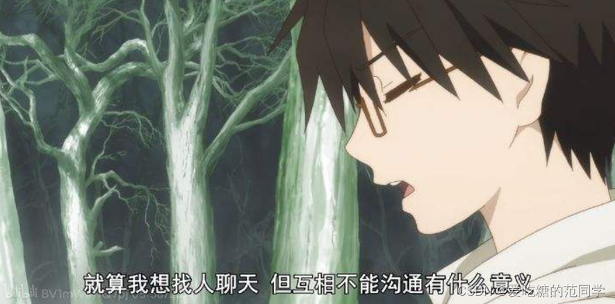
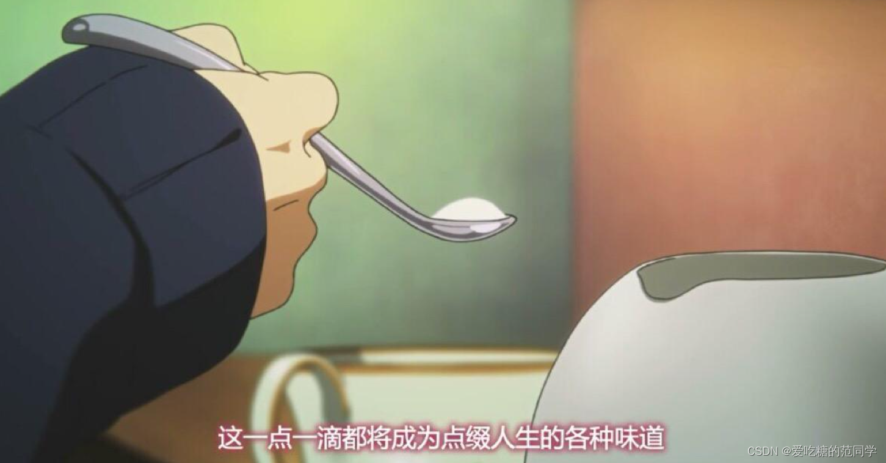
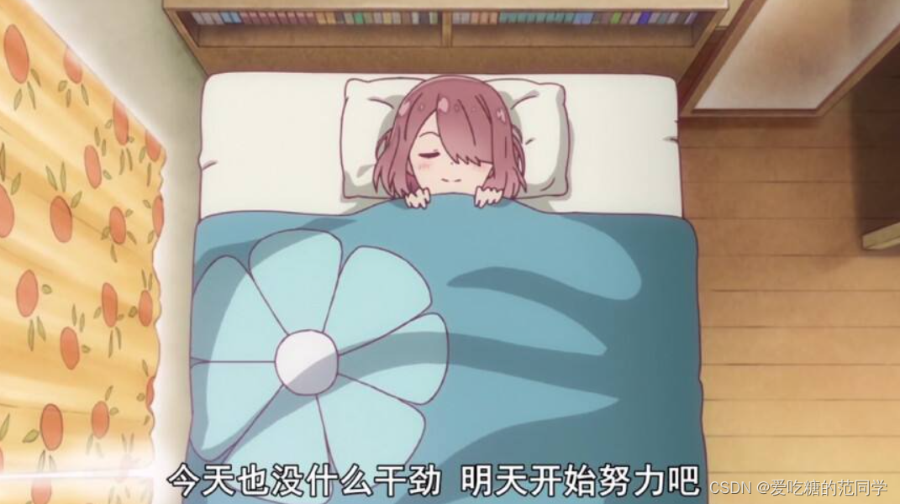

# 【程序人生】“阶段总结”-归来仍是少年

## 一、人生恍惚：

恍恍惚惚，又是一年，恍恍惚惚又是一个寒假......时间过得好快好快呀，就在你逐渐意识到它存在的时候，它就已然悄悄溜走......当你意识到它已逝去的时候，为时已经过晚......

过去的就让他过去吧，无需缅怀，也无需后悔，毕竟那已是过去。只是期望自己能一如既往的努力下去，人生短短几十载，我已经浪费了五分之一了吧......想想看自己也快21了。不知道从20岁那年幡然醒悟，决定未来好好规划咸鱼翻身的我，在这一年中成就了些什么......

踏上编程这条路我从未后悔，未来也将继续前行，用代码去编制世界！这是我的初心，希望当未来的某一天，当我再次看到这句话时，希望我仍是初心不改，归来仍是少年！！！

总是心有不甘，总是在追逐着什么，可是这个什么是什么呢？？?我自己也说不上来......昨晚写了一点，最终还是被睡意打败，是呀！我似乎一直在被什么东西打败，可以说是一败涂地吧。合上笔记本，真正躺下的时候，却又辗转反侧睡不着了......

似乎今天的任务没有完成！似乎明天也会有很多任务和安排...似乎今天也没什么成就吧......为了逃避，我还是拿起手机，刷起了视频，不知不觉12点...1点...疲惫伴随不安再次袭来，这次我放下手机，睡着了.......

唉，最近似乎忙起来了，可是却又不知道在忙些什么，说不上来这算不算得上是充实，只知道自己的日程表里总是有任务......早八，睁开眼的时候头似乎有点痛，昏昏沉沉，后悔昨晚没有早点休息（其实很多次早上醒来都会这样后悔，但是还是会去刷视频......）。

---

## 二、晃晃少年：

一晃眼已经是中午了，又换辅导员了，说来也是神奇，一年多换了两个辅导员......不过也没啥关系，基本没啥影响。春天来了，还是容易犯困，上课也没有什么精神。选择了坐在最后一排，马克思主义基本原理.......这样的课，对于像我这样的码农这种课貌似显得没什么营养了。

项目也搁置住了，卡在了登录注册，一个死活解决不了的空指针问题......我人也是傻了。最近也有很多比赛想去试试......要做的事总是特别多。现在居然开始担心我的身体是否能扛得住了？？？唉......

未来不可知，至少现在还有时间和精力去闯一闯，尝试更多未知，探索更多未知， **现在能做的就是期待未来，不负当下了吧！！！**

不知道该说些什么了...期待明天更好吧！