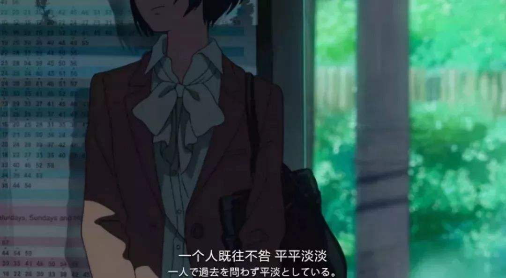

# 【程序人生】“阶段总结“-雨过天晴

一晃又是几个月过去了，依稀记得上次写阶段总结还在学校。因为疫情的原因似乎还不能返校。一时间也不知道怎么说，还记得上次回家还是在临近春节假期，那一走就是半年......

我的大学四年，已经在疫情中度过了两年。别人的大学生活是满世界的乱跑，而我的大学生活只有三点一线，不是在去工作室的路上就是在去食堂的路上，宿舍除了休息时似乎也不是很想继续呆下去。虽然关系谈不上很好，偶尔能聊两句。目前也不太想把太多的精力和时间花费在人际交往上。说实话，人际交往上我确实是一个白痴，慢慢学吧！大学生活和我想象的不能说一样吧，只是毫无关连，我深刻体会到了什么叫理想很丰满，现实很骨感！

暑假，经管楼，工作室，晚饭前，我们总要等到太阳快落山时去吃晚饭，傍晚的风还带着这个夏天的温度，天很蓝很深远，光线穿过云层散射出来，

暑假两个月的时间转瞬即逝，恍惚之间已经记不清那段时间我都做了些啥......可能啥事也没做成吧。

