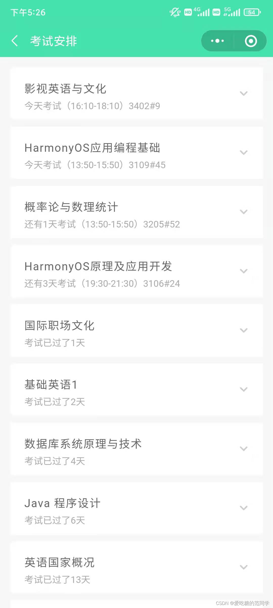

# 【程序人生】“阶段总结”-不甘雌伏

> **过往已是事实，无须懊悔；未来还未到来，无须顾虑；唯有珍视当下，把握当下所能把握的，珍惜现在所能拥有的......**

终于快要完成所有学科的期末考试了，大二上的这半年，是我最辛苦，最忙碌的一段时间了。今天成功考完了“概率论&数理统计”，也成功的挂掉了（呜呜呜呜呜呜呜呜呜呜...😭😭😭），这估计会成为我第一次挂科了......不知道会不会对我未来的发展产生特别大的影响...果然平时还是不能太过于划水了......

唉😔，事已至此，唯有寒假加油了！！！要把偷的懒全部补回来了。

---

## 一、忙碌&绝望📝

后天，考完最后一堂考试，将结束2021年-2022年学年上的学习。我不能说完美结束，因为概率论大概率会挂课了吧，毕竟好多题都不会（平时花时间还是太少了）......唉😔，等到21号，成绩出来就知道结果了，我看淡了，毕竟结果已经十分明显了......

就这几天，天天熬夜复习，内心的煎熬，以后还是要在平时安排好学习时间，不能把希望寄托在期末复习了，这样真的太难熬了！！！下学期一定要安排好学习时间，不能重蹈这学期期末的覆辙了。

 哈哈哈，估计没有人会比我的课多了吧......🤣

几乎每天都是忙着上课，学习编程，我几乎不怎么玩游戏，唉😔！可能确实是因为我自身的问题，确实感觉忙忙碌碌，也确实碌碌无为......无论是学业还是编程能力似乎都没有等到很大的提升，绩点年年都在下降，期末也是复习得稀里糊涂的......

一个星期几乎是天天考试，我也几乎是天天熬夜复习着。焦虑，不安，恐惧......我一度因为这些考试还睡不着，虽然十分疲惫了，但还是不能安稳入睡。

我认真反思了原因：还是平时时间安排的问题，没有权衡好对课程学习和编程学习的时间投入了！认真总结了以下问题：

- 浮躁！！！学习时，不能集中精力在当前的学习任务上，容易受到别的事情干扰，无法深入思考，达到一个很好的学习状态
- 学习还不够系统和深入！看似学习了很多东西，但是很多都只是学习了皮毛，没有深入到核心，没有理解原理和思想上的领悟。没有自己的思考和理解以及运用实践太少！
- 总结和提炼的东西太少！没有形成自己的知识体系，很多内容都是零散的，缺乏一种能激发创造的知识体系和思维！
- 时间规划和安排，对事情的轻重缓急拿捏不准，很多时候往往是当前紧急且必要的事放着不做（拖延！！！），做一些需要长远安排和规划的事（对于当前毫无意义！！！）
- 不够自信！！！总是自我否定，不敢轻易尝试，对于未知探索的畏惧（畏惧心理）

好吧，还有很多小问题需要不管改正，希望接下来的一个学期能够做出改变，然后安排好自己的学习和生活，不断进步吧！加油！！！

---

## 二、坚持&加油⏳

不管怎么样，也不管未来会发生什么，无论是好是坏。我，至少还活着，至少我还可以继续努力，至少我还可以改变，至少我还在努力，至少我还有时间和机会去改变，去搏一个我想要的生活。期望有一天那个童话可以成为现实，我能牵着我爱的人的手，走完这一程！！！

寒假的时间，尽量都留给自己提升吧！那糟糕的英语，那废物的数学.......还有那一生都值得去奉献给他的Coding......对了，别忘记在忙碌的生活中留点时间给阅读......哦哦，还有读书笔记（还是以博客的方式推送吧，哈哈哈，有时间公众号同步更新......）

2022年，别再花费大量的时间在动漫和游戏上了，你已经20岁了，不再18（虽然希望永远18），你需要对你负责，你需要对家人负责，你需要对她负责......所以，你不能输！！！

至少，别输得太狼狈！！！

