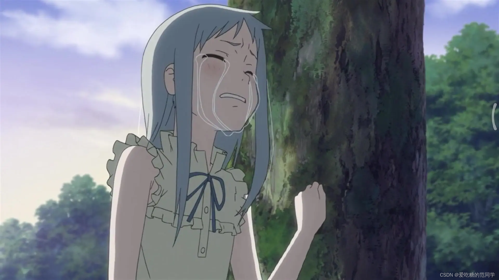

# 【程序人生】“阶段总结”-不论过往

今天，嗯......准确点是昨天，因为已经过了12点了，我经历了人生的第一次答辩。虽然是在线上，但是也是第一次参加比赛，第一次进行答辩，第一次带队打比赛......很多第一次，虽然准备过程十分艰难，也想过逃避和放弃，但是：“机会和困难是并存的，如果有一天困难没了，机会也就没了！！！”，给了我很大的力量，后面我们团队还将继续打磨项目，同时，我也发现了自己更多的不足......

人生中总有太多次，但是只要经历过了，其实也就对它无所谓了。其实未经历过的那种出于人对未知恐惧的感觉就荡然无存！嗯！趁现在我还能熬夜修改PPT和过策划书，趁现在我还能在凌晨12点多接近1点的时候还能坐在电脑前码字，趁我还有激情还有热情，想做并且能做的岁月中，做出那么一点点小成就！

世界上厉害的人太多了，而我只是普通人中的普通人，我只是怀揣着对技术的执着追求，热爱，的平凡于平凡。可能穷我这一生也无法改变这个世界，但是如果，我想有人或许能看到我这篇不伦不类的博客是会对他或她产生一点点触动，或许我的目的就达到了。

我多么希望能有一群学习技术的人，我们不分彼此，敞开心扉，交流技术，以及我们那傻傻想用代码改变是世界的期许或是初衷。带着那份偏执与孤高站在一点。看着世界一点一点变得更好！

虽然，我只是一个，一个普普通通的学生，甚至没经历过社会的毒打，只是安稳的坐在大学的宿舍里，对着电脑屏幕痴人说梦。没经过这所谓的现实！总有人会用的他们的言语或者行动来阻止或者劝告你，你不行！你不可以！！你做不到！！！

我想告诉你的是，没有什么可以或者不可以，也没有行与不行！只有你想或者不想！！！我看到这样一段话：当你面对一件东西买还是不买的时候，不买；当你遇到一件事，你犹豫要不要说的时候，不说；当你决定一件事情做还是不做的时候，做！！！只有行动才会带来改变，空想并未意义，百日做梦谁不会，当梦中惊醒，被逼无奈的时候，你就会后悔，为什么当初我们做......

多做少说，少说多做，能不说就不说，能不做就不做，别去攀比，也别去拿着未取得的成就去炫耀，低调做自己！情绪未必要表现在脸上！做人期望自己能做到心如止水！！！