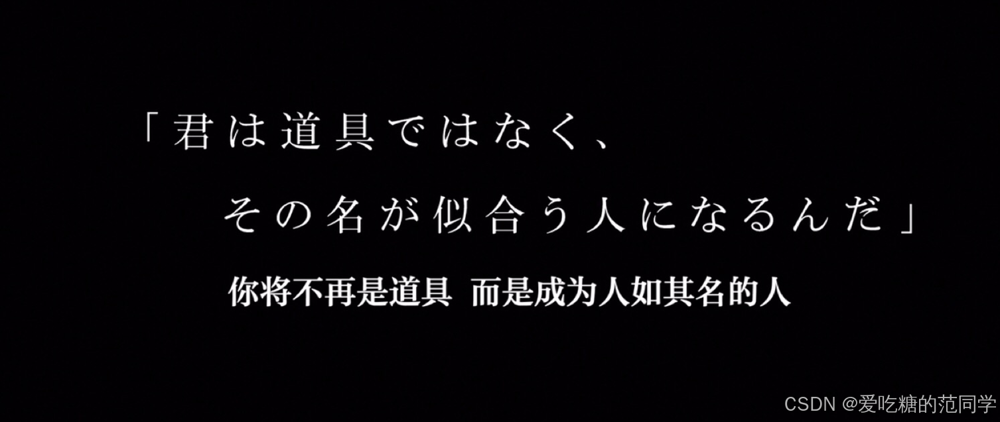

# 【程序人生】“阶段总结“-前路茫茫

岁月如白驹过隙，如指尖流沙，不知不觉已经离开了陪伴我度过四年岁月的学校，离开了那间堆满各种书籍的宿舍，离开了通宵开发的实验室，离开了教室里的最后一排课桌椅......（虽然，我并不是很喜欢它，可当真正要离开的时候还是会有那么一点伤感）一个人坐上飞机，来到了一千多公里以外熟悉而又陌生的城市。熟悉是因为这是首都，陌生是因为第一次踏足......

离校的那天下午，下起了下雨，淅淅沥沥。家里刚提了新车，我爸不熟练的驾驶技巧，也来帮忙搬我的行李（大部分是一些心血来潮是买的书，买来后基本上也就没有再翻开......）。一个人上上下下跑了四五趟，终于搬空了宿舍床位旁的床头柜和书桌架，一瞬间的空荡荡反而不那么习惯了。那天下午正好是毕业典礼，糟糕的心情，不太想去参加这样的典礼，再见也只不过是陌生人，也许再也不见......想再走走以前上课下课走过的那段路，但似乎被时间催着快点向前走了，也没有给我机会再去回顾我走过的人生旅程。我们都是被岁月卷走的人，边走边遗忘......就像那把坐了四年的电脑椅，带不走却也舍不得，只能遗留在那间再也回去的宿舍了。那张单人床如今想来硬硬的却也睡过了四年，那个小小书桌书本一放亦是四年，一台笔记本电脑记录了我四年的成长，虽说没有什么成绩，但也有所成长......

恍恍惚惚，来到这里已经临近半年了，告别校园也临近半年。还记得那个下午，阳光明媚大家在第四教学楼前集合列队，快门按下的那一瞬，我们的青春就定格在了那一刻，朋友们如今已经各奔天涯，也许是见得最后一面，各自开启了各自新的人生篇章，而我也奔赴向我未完的旅程。

唉，现在总是稀里糊涂的过着日子，重复着枯燥且乏味的生活，公司，出租屋，公司，出租屋......经历了酷暑，寒冬将至，短袖也换成了棉服，北方已经开始使用了暖气，真是很不幸运的是合租里唯一一间暖气坏掉的房间，好在并不是很冷。开始慢慢规划自己的作息，调整自己的生活节奏，注意饮食，希望能从中找到一点意义。一个人总是有很多的时间去思考（嗯......胡思乱想），作为INTJ总是容易沉浸在自己的幻想世界中，当抽离回来面对真实世界时，巨大的落差感把我击碎。这个世界并不是那么美好（也许是我没有发现他的美好）。越长大越觉得世界越复杂，它并不纯粹，我更喜欢小时候记忆中的那个样子，不大不小，刚好容下我对它的幻想。

世界是一个巨大的草台班子！也许并不是没有道理的......

不过也无所谓了，平凡且渺小的我又能做些什么呢？在高楼的夹缝中勉强生存已经是我的极限，无法成为站在楼顶的人，最终能保持自己最后一点点对世界的质疑已是我最后的用尽全力的倔强。嘿，前面起雾了，你还能看得清吗？

