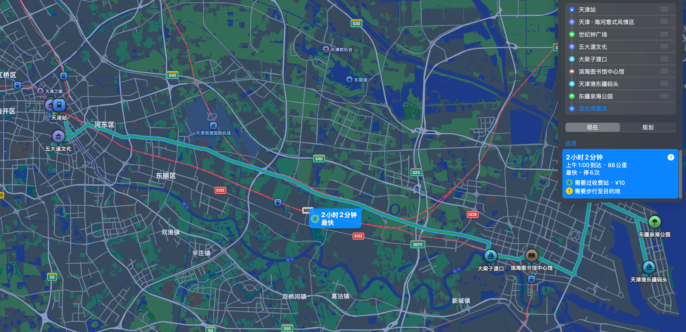
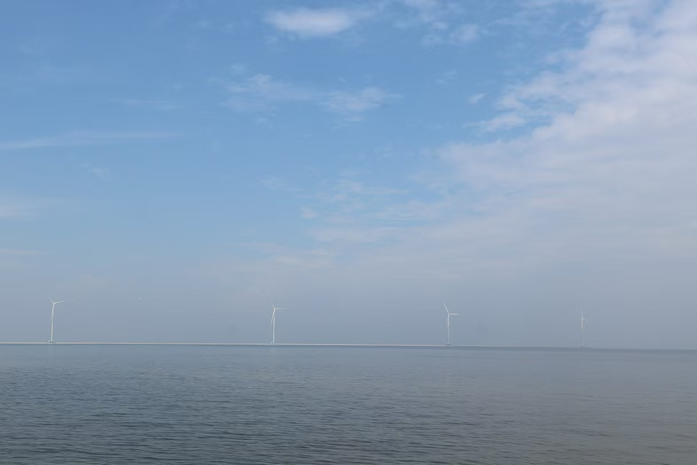
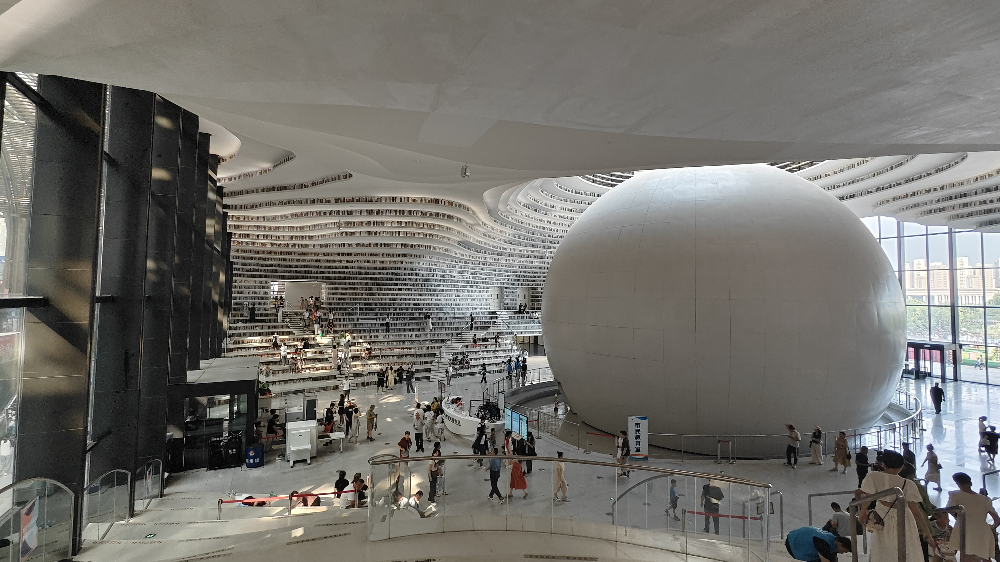
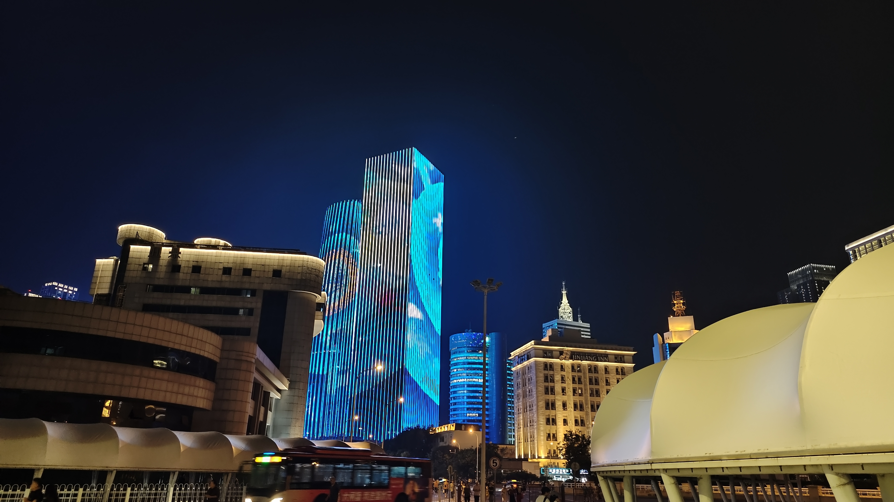
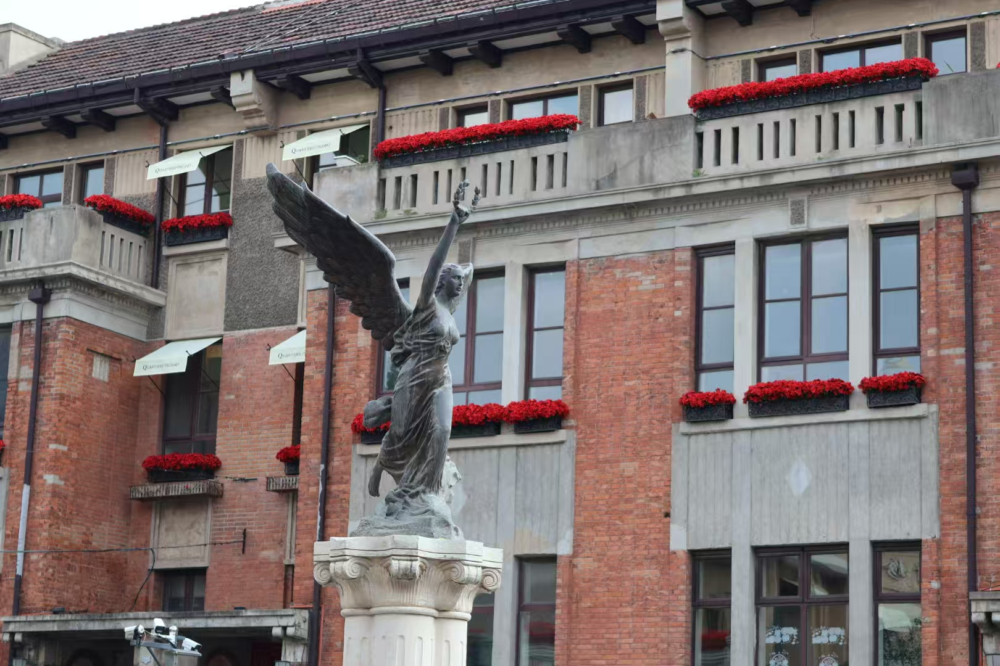
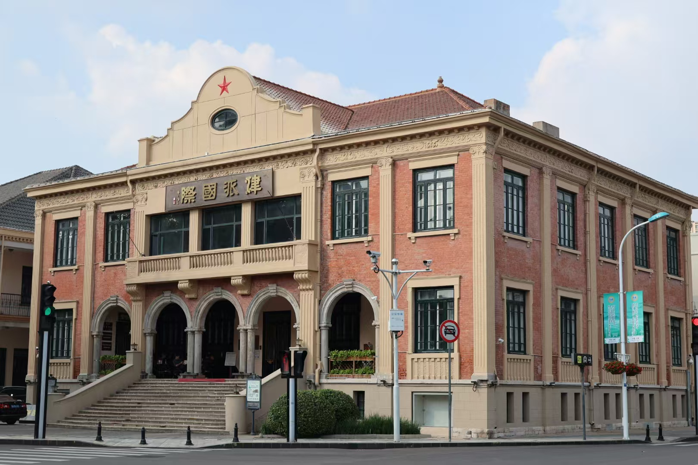
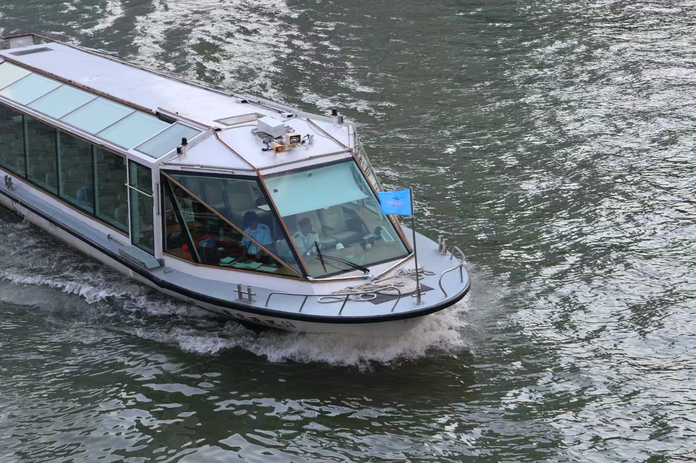
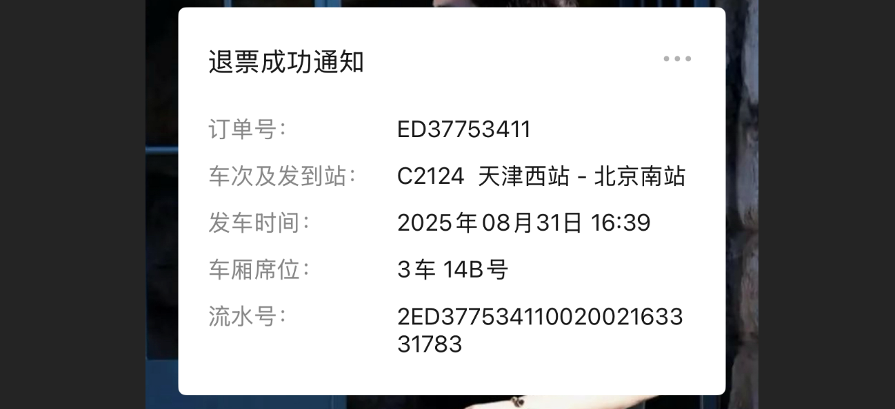

# 【旅行人生】“阶段总结“-天津之旅

终于下定决心离开北京出去看看～看了看，北京到天津只需要半个多小时的高铁，于是我们果断选择这个周末出发天津！做了攻略：

出了车站先去酒店放行李，然后就去第一站：意大利风情区；第二站：去看看世纪钟；第三站：五大道文化街；第四站：大梁子渡口；然后再前往滨海新区去看海，第五站：滨海图书馆；第六站：码头、亲海公园。

但是，**计划总赶不上变化！！！** 这句话是真理！真理！！！

好巧不巧赶上天津上合组织峰会，中心区域戒严了，出了高铁站打车只能到戒严区边，我们下车步行到酒店。得知戒严我们一行人傻掉了，街上像样的饭馆都关门了，无奈之下我们就近找了家快餐店垫了肚子。商量了下，改变计划直接前往滨海新区......

## 天津之眼

打卡"天津之眼"摩天轮，可惜没有开放。所以我们只是骑了单车过来拍了照就赶往高铁站前往滨海新区了。（主城区戒严了得晚上才放开）

## 滨海公园

看了看海，天津的海并不好看，可能是我们去的时候天气不太好，天灰蒙蒙的海也并不蓝。

## 滨海图书馆

第一眼确实很不错，建筑风格很有新意，不让带相机进入，很多人进来拍照打卡。

## “津”城

晚上才回到天津主城（PS：又是冲冲忙忙赶高铁）

打不到车，根本打不到车；想骑共享单车，根本找不到一辆，于是我们步行了好几公里回酒店......晚上，天津所有人都出来了，地铁站那是一个人山人海。

晚上走回酒店我和我对象实在是不行了，于是我俩决定在酒店呆着哪儿也不想去。我朋友和他对象本着来都来了，出门看灯光秀去了。（由衷佩服他两的毅力）

## 意大利风情区

周天一早我们一行人就前往意大利风情街，好在这里没有受到戒严影响，行人游客不少。

## 回京

想着第二天还要上班，于是我和我对象便准备提前回北京，我朋友和她对象则去听天津相声了。在吃过午饭后，我们便出发前往高铁站。有趣的事来了，我对象便想着把高铁票改签了，于是我们改到了一个更近的时间。当我们来到天津站，发现过了安检后进不了站，我打开手机一看她给改到天津西去了。于是我们又退票再买票回北京。

终于回到家，累得不行，总结两天的行程都在赶高铁......
