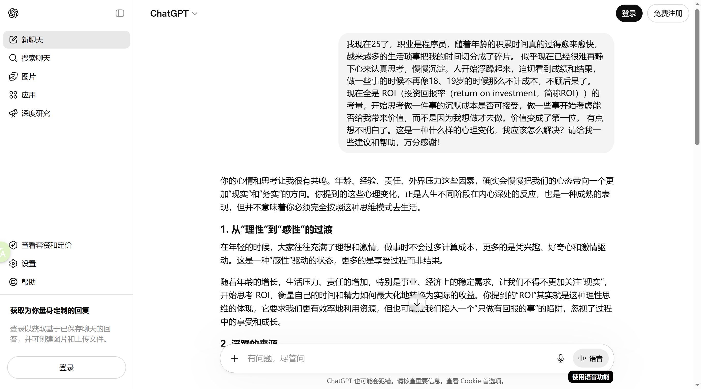
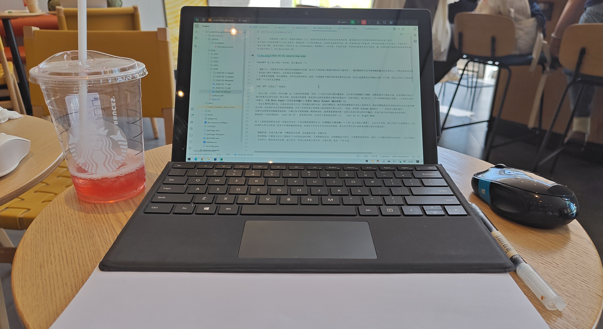

# 【阶段总结】无所事事&徒劳无功

嗯......一转眼就到了26年五一假期的倒数第二天了，随着年龄的积累时间真的过得愈来愈快，越来越多的生活琐事把我的时间切分成了碎片。
似乎现在已经很难再静下心来认真思考，慢慢沉淀。人开始浮躁起来，迫切看到成绩和结果，做一些事的时候不再像18、19岁的时候那么不计成本，不顾后果了。
现在全是 ROI（投资回报率（return on investment，简称ROI））的考量，开始思考做一件事的沉默成本是否可接受，做一些事开始考虑能否给我带来价值，而不是因为我想做才去做。价值变成了第一位。
有点想不明白了，所以我决定问问 AI：

ChatGPT 给了我上面的一些回答，我大概总结一下：

- 难静下心，浮躁是因为每天都在接受超载的信息量（因为工作原因每天都感受着AI的飞速变化），越来越快的生活节奏和越来越大的生活压力，习惯快速看到结果变得急功近利。
（身边的人都在不断成长，反而我还在原地踏步）
- 心理变化的根源：责任感增加、对时间态度的变化（是的，以前感受不到时间的变化能有这么快，从内心来说我还认为我自己是一个小孩，但是已经到了该成家的年纪，我身边好多人已经慢慢开始结婚生小孩了，
而我一个人还在北京飘着......）

当然，GPT 还是给了一些建议：

- 给自己留一点空间，回归兴趣：这一点我觉得很重要，培养一个主业以为的长期兴趣爱好。从年初开始慢慢学习摄影，初衷是想当个副业去做，但是慢慢发现这个行业也是一个通过时间换取报酬的事情就放弃了。
现在转换为记录生活的一种方式吧。阅读真的很重要，我觉得先从财富积累的书籍开始看起写一写读书笔记，每天给自己一个小时的时间进行积累。（后续我应该会列一个清单，先培养习惯）
**对了，不要 Only Input（只有信息的输入）还要有 Basic Output（输出积累）**
- 设定长期和短期目标，以前总是会给自己定一些很难达成的目标，因此回顾我这一路历程仿佛都是在求其上而得其中，现在回顾起来其实发现这样的决定其实很糟糕，
因为每一次收获时并没有很高的成就感，以至于在某些场合和事情上就表现得不那么自信。（因此，我需要 change myself --- 改变自己越快越好）
短期目标需要垫垫脚就能够到的，长期目标可能需要跳一跳能够到的。最重要最重要的事一定要记录成长的过程对外输出，在如今这个时代真的真的很重要。
Nike的广告标语就很好：`Just Do It`，我觉得非常好，但是对于我来说还是差一点： `Just Do It，Right Now！`

除了上面我觉得AI给出的一些建议外还有一个很关键和重要的有点：**爱惜自己的身体！！！** 这个真的太重要了，从去年中开始，我几乎每个月都需要去一次医院检查，不是腰疼就是脖子疼的。唉~
给我的日常生活带来了很多不必要的麻烦和焦虑，在我这个年纪本不应该有这些焦虑，所以在日常生活中真的真的要有意识注意这些~

- 健康饮食：少油少盐少辣、少喝饮料少饮酒；多吃蔬菜水果，多喝白水
- 坚持锻炼：尽量每天给自己规划半个小时的运动时间吧，不需要剧烈运动，合理微微出汗即可，不需要练肌肉等等，保持一个长期有效的运动状态。（出了校园之后真的很少有运动了......）
- 合理养生：睡前泡泡热水脚，适当补充一些益生菌和维生素等等，少量长期。保持一个好心情。

---

## 梳理一下我的日常时间

### 工作日程安排

目前的日常是早上9点半左右起床，10点多到公司开始干活；晚上9半左右下班回家。（从起床开始算工作日上班几乎会占据12个小时的时间），从成年人8个小时的必须睡眠时间来看。
工作日可支配的个人时间其实只有4个小时。个人洗漱收拾什么的可能会花半个小时左右的时间，上面说的运动花上半个小时、阅读花上一个小时的时间，还剩下2个小时的时间。

按照正常的下班时间来看，10点左右到家（在公司运动完），收拾半个小时大概10点半左右完成洗漱，11点半左右完成阅读，12点左右上床睡觉。看起来是一个比较合理的时间。

早睡早起（居然晚上12点睡觉在北京已经是一个比较早的时间了），争取养成习惯8点10分到20分左右起床。洗漱喝杯热水吃个早饭就去公司。（这段时间可以学习英文？？？）

🎉 **注意，早上起床避免直接看手机，进入信息流，让自己保持清晰的思维，专注于学习或整理思绪。**

工作日在公司的12个小时，其中中午有1~2个小时吃饭和休息的时间，需要好好利用。下午有半个小时左右的休息时间需要好好利用。（在公司尽可能提升自己的Coding能力）
工作日更多的时间花费在个人职业技能的提升上，尤其是AI的迭代速度实在太快了，我需要保持我的个人竞争力。因此这两段时间都ALL IN 个人职业技能提升上。技术深度和广度都需要提升。

### 周末节假日程安排

周末是相对比较完整的时间，投入到非职业技能的学习上是否合理？目前有什么非职业想学习的技能？？？

- 摄影&后期（前期拍摄、PS图像后期、色彩调整、特效制作、Blender后期渲染）
- 视频剪辑（AE动画制作、PR视频剪辑）
- 微信公号运维（AI技术、金融新闻资讯、王者荣耀游戏资讯等等）
- 游戏制作（这是一个探索方向，我希望和AI进行结合进行开发，但是目前没有什么好的方向，想做一个人生副本的地球Online游戏）

---

## 写在最后碎碎念

其它的一些细节暂时没有别的想法了，总结一下近期的状态吧。大概就是原地踏步没有进步，突然找不到方向了，看着身边的人都在进步，唉~鸭梨山大！！！
26年就快过半了，下半年我要开启turbo模式挑战这个人生副本了，丢掉的 Life Record 得捡起来！

前半年工作上的变化主要是方向彻底转变为AI工程开发，一个体感就是传统开发逐渐被AI Coding取代，初级程序员已经被取代，注意是已经被取代！而不是可能被取代......
AI Coding 不是未来已经是现在了，当然让我感到焦虑，距离我失业的日子又进了一步，当然我之前就说过我不能一辈子打工，但是也感受到了AI所带来的压力，已经我对这个社会的轻视。
创业也许并没有那么容易。当然这可能取决于我的认知还不够。

用好AI工具，一定要用最好的AI工具！！！别怕花钱，我觉得将我的收入的部分划分出来进行每个月的AI探索。（具体金额我还没有算好......）目前以有的的比较好用的AI 工具是Claude & 他们公司的
Claude Code，还没有尝试长期使用 GPT 的订阅。Claude目前使用 Max5x 的月成本是在800左右，GPT的订阅是 20刀 也就是180左右。也就是目前在AI上花费的账单大概是1000元。
当然 Claude + GPT 应该在绝大多数场景下已经够用了。国内还有一些免费的 AI 工具比如豆包等等，可以作为补充。（有付费需求的时候果断付费）

Assert 断言：AI势必会取代一部分人，这部分一定是不会使用AI工具的人！！！

Mark 记录：今天是五一假期的倒数第二天，第一次来北京这边的星巴克和咖啡学习，体验感不错~下次不想在家呆就来这吧（推荐......）

