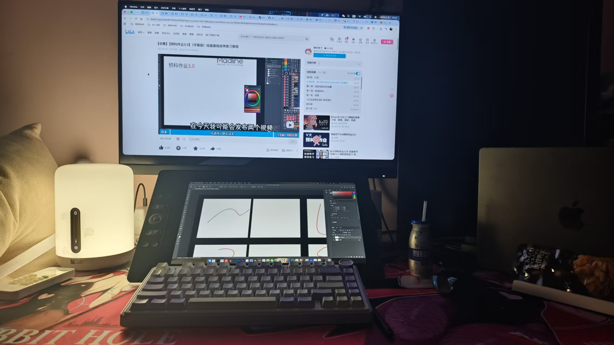

# 【阶段总结】

昨天是25岁生日......原来在大人口中的时间过得快是真的，我也成为大人了，原来成为大人一点也不好。

我能很明显感觉到上班之后身体素质的下滑，借口总是说没有时间去锻炼，其实是自己没有养成一个良好的生活习惯。熬夜纵欲...唉。

不管怎么样不能在这样继续下去了，身体健康要放在第一位了，因为也不再年轻，身体给我的犯错机会也越来越小。

---

嘿嘿，数位屏开始尝试去画画，真的好难入门...（AI对绘画行业的冲击，这个行业行业，或者这个副业还有前途吗😂，不过当个消遣的爱好还是挺不错的）

