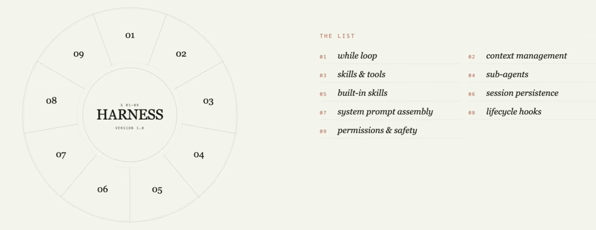

# Agent Harness

Harness Agent 包含如下的9个部分：

- Agent Loop
- Agent Context Management
- Agent Skills & Tools
- SubAgent Management
- build-in skills
- Session Persistence (Memory)
- System Prompt Assembly (Claude.md or Agent.md)
- Lifecycle Hooks
- Permissions & Security

