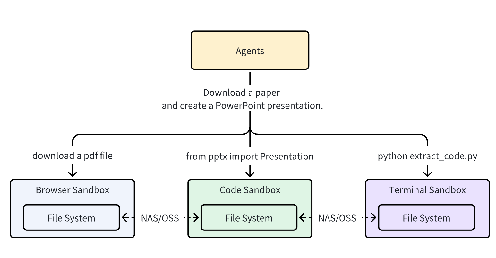

# Agent Sandbox

大多数沙盒都是单一用途（浏览器、代码或 Shell），这使得文件共享和功能协调变得极其困难。
例如，浏览器沙盒下载的文件需要通过 NAS/OSS 与其他沙盒共享，而一个 Agent 任务通常需要多个沙盒准备就绪才能运行。

AIO Sandbox：https://sandbox.agent-infra.com/zh/

AIO Sandbox Github：https://github.com/agent-infra/sandbox