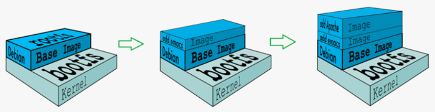
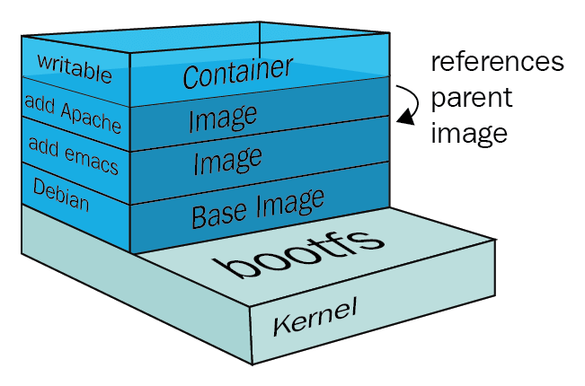

# Docker 镜像

---

## 一、分层镜像

镜像（ `Image` ）：是一种轻量级、可执行的独立软件包，它包含运行某个软件所需的所有内容，我们把应用程序和配置依赖打包好形成一个可交付的运行环境（包括代码、运行时需要的库、环境变量和配置文件等），这个打包好的运行环境就是`image`镜像文件。
只有通过这个镜像文件才能生成`Docker`容器实例（类似`Java`中`new`出来一个对象）

Docker 镜像是由一系列只读层组成的，每一层都代表了对镜像所做的一次修改。每当你对镜像进行修改（例如安装软件包、添加文件等），都会创建一个新的只读层，并将其叠加在现有层之上。这种分层结构使得镜像更加高效，因为多个镜像可以共享相同的基础层，从而节省存储空间。

### 1.UnionFS 联合文件系统

`UnionFS`（联合文件系统）：`Union`文件系统（`UnionFS`）是一种分层、轻量级并且高性能的文件系统，它支持对文件系统的修改作 为一次提交来一层层的叠加，同时可以将不同目录挂载到同一个虚拟文件系统下（`unite several directories into a single virtual filesystem`）。
`Union`文件系统是`Docker`镜像的基础。 镜像可以通过分层来进行继承，基于基础镜像（没有父镜像），可以制作各种具体的应用镜像。

:::info

特性：一次同时加载多个文件系统，但是只显示一个文件系统的内容。`UnionFS` 通过将多个目录挂载到同一个虚拟文件系统下，实现了对文件系统的修改作为一次提交来一层层的叠加。

:::

### 2.Docker 镜像加载原理

`docker`的镜像实际上由一层一层的文件系统组成，这种层级的文件系统`UnionFS`。`UnionFS`的底层是`bootfs`，`bootfs`之上是`rootfs`

- `bootfs(boot file system)`：主要包含`pootloader`和`kernel`，`bootloader`主要是引导加载`kernel`，`Linux`刚启动时会加载`bootfs`文件系统，
在`Docker`镜像的最底层是引导文件系统`bootfs`。这一层与我们典型的`Linux/Unix`系统是一样的，包含`boot`加载器和内核。
当`boot`加载完成之后整个内核就都在内存中了，此时内存的使用权已由`bootfs`转交给内核，此时系统也会卸载`bootfs`。

- `rootfs(root file system)`：`rootfs`在`bootfs`之上。包含的就是典型`Linux`系统中的`/dev`，`/proc`，`/bin`，`/etc`等标准目录和文件。
`rootfs`就是各种不同的操作系统发行版，比如`Ubuntu`，`Centos`等等。

对于一个精简的OS，rootfs可以很小，只需要包括最基本的命令、工具和程序库就可以了，因为底层直接用Host的kernel，
自己只需要提供rootfs就行了。由此可见对于不同的Linux发行版，bootfs基本是一致的，rootfs会有差别，因此不同的发行版可以公用bootfs。

:::info

Docker镜像层都是只读的，容器层是可写的。当容器启动时，一个新的可写层被加载到镜像的顶部。这一层通常被称作“容器层”，“容器层”之下的都叫“镜像层”。
 
:::

当容器启动时，一个新的可写层被加载到镜像的顶部。这一层通常被称作“容器层”，“容器层”之下的都叫“镜像层”。
所有对容器的改动，无论添加、删除、还是修改文件都只会发生在容器层中。只有容器层是可写的，容器层下面的所有镜像层都是只读的。

---

