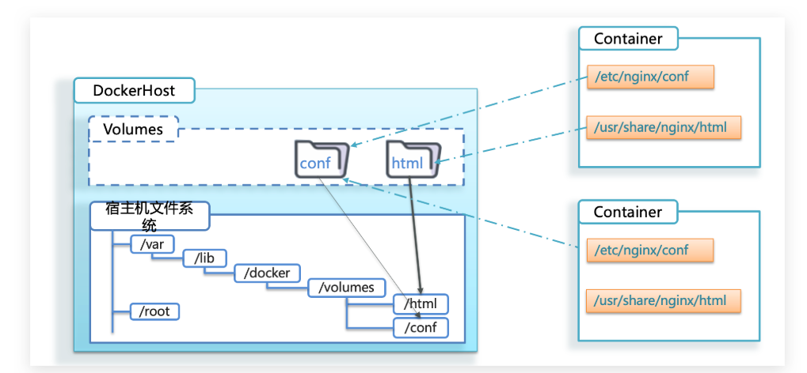

# Docker 数据卷

---

数据卷（Volume）是 Docker 提供的一种机制，用于在容器之间共享数据或在容器和主机之间持久化数据。数据卷可以帮助你管理容器的数据，使其在容器重启或删除后仍然保留。

卷就是目录或文件，存在于一个或者多个容器中，由Docker挂载到容器，但不属于联合文件系统，因此能够绕开 Union File System 提供一些用于持续存储或共享数据的特性。

卷设计的目的就是数据的持久化，完全独立于容器的生命周期，因此Docker不会在删除容器时删除其挂载的数据卷。

## 一、权限扩容

```shell
--privileged=true
```

`Docker`挂载主机目录访问如果出现`cannotopendirectory: Permissiondenied`

解决办法：在挂载目录后多加一个`--privileged=true`参数即可

如果是`CentOS7`安全模块会比之前系统版本加强，不安全的会先禁止，所以目录挂载的情况被默认为不安全的行为，
在SELinux里面挂载目录被禁止掉了，如果要开启，我们一般使用`--privileged=true`命令，扩大容器的权限解决挂载目录没有权限的问题，
也即使用该参数，`container`内的`root`拥有真正的`root`权限。否则，`container`内的`root`只是外部的一个普通用户权限。

---

## 二、数据卷的使用

```shell
-v /host/path:/container/path --privileged=true
```

默认情况下，`-v`参数会创建数据卷到`/var/lib/容器名`目录下。



```shell
docker run -it -v /host/path:/container/path --privileged=true 镜像名称 /bin/bash
```

- `docker run`：创建并启动一个新的容器
- `-it`：以交互模式运行容器，并分配一个伪终端
- `-v /host/path:/container/path`：将主机的`/host/path`目录挂载到容器的`/container/path`目录
- `--privileged=true`：扩展容器权限，解决挂载目录没有权限的问题

- `镜像名称:标签`：指定要运行的镜像名称和标签（标签可选，默认是latest）
- `/bin/bash`：指定容器启动后执行的命令

- `-d`：后台运行容器（detached）并返回容器ID（启动守护模式容器）
- `--name`：为容器指定一个名称

数据卷可以在容器之间共享或重用数据，卷中的数据更改可以直接实时生效，数据卷中的更改不会包含到镜像中的更新，数据卷的生命周期持续到没有容器使用它为止。

### 1.宿主机与容器间映射添加容器卷

```shell
docker run -it -v /host/path:/container/path --privileged=true 镜像名称 /bin/bash
```

如果在执行上述命令时，没有指定的映射目录，Docker会自动创建相应的目录。

:::info

查看数据卷是否挂载成功

```shell
docker inspect 容器ID
```

输出容器内部的详细信息

```JSON
xx
```

:::

### 2.读写规则映射添加说明

#### (1) 读写（默认规则）

```shell
docker run -it -v /host/path:/container/path:rw --privileged=true 镜像名称 /bin/bash
```

`rw`：指定当前挂载的数据卷可读可写（默认不写，就是可读可写）

#### (2) 只读

```shell
docker run -it -v /host/path:/container/path:ro --privileged=true 镜像名称 /bin/bash
```

`ro`：指定当前挂载的数据卷只读（限制的是容器的读写权限，不限制宿主机）

### 3.数据卷继承和共享

容器与容器的数据卷继承

```shell
docker run -it --privileged=true --volumes-from 父类(容器) 镜像名称 /bin/bash
```

`--volumes-from 父类(容器)`：创建容器时，指定一个父类容器，继承其挂载的数据卷映射。


