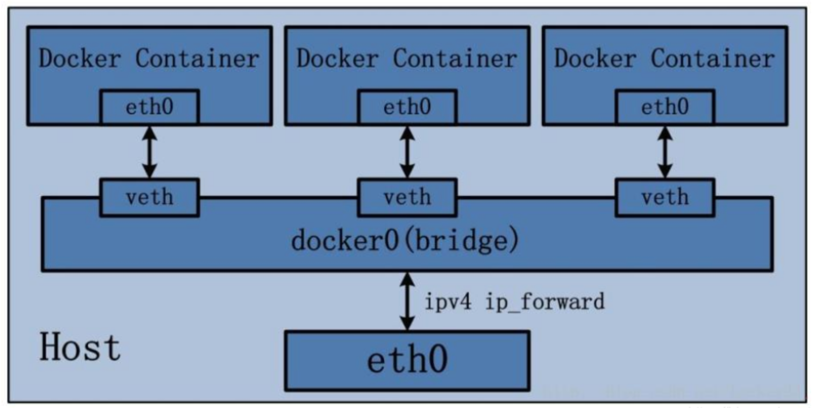

# Docker 网络

---

从其架构和运行流程来看，Docker是一个C/S模式的架构，后端是一个松耦合架构，众多模块各司其职。

Docker运行的基本流程为：

1. 用户是使用Docker Client与Docker Daemon建立通信，并发送请求给后者。 
2. Docker Daemon作为Docker架构中的主体部分，首先提供Docker Server的功能使其可以接受Docker Client的请求。
3. Docker Engine 执行 Docker 内部的一系列工作，每一项工作都是以一个JOB的形式存在，`Docker Engine` 通过 `Job` 分发器 `Job Dispatcher` 将不同的Job分发给不同的驱动（Driver）来完成具体的工作。 
4. Job的运行过程中，当需要容器镜像时，则从DockerRegistry中下载镜像，并通过镜像管理驱动 Graph driver 将下载镜像以 `Graph` 的形式存储。
5. 当需要为Docker创建网络环境时，通过网络管理驱动 Network driver 创建并配置 Docker 容器网络环境。 
6. 当需要限制Docker容器运行资源或执行用户指令等操作时，则通过 Exec driver 来完成。 
7. `Libcontainer` 是一项独立的容器管理包，`Network driver` 以及 `Exec driver` 都是通过 `Libcontainer` 来实现具体对容器进行的操作。

Docker 网络主要是用来解决容器之间的通信和端口映射问题，容器IP变动时可以通过服务名直接进行网络通信而不受影响。

---

## 一、Docker 网络命令

### 1.查看 Docker 网络模式

```shell
docker network ls
```

输出 Docker 默认的三大网络模式：

```text
NETWORK ID     NAME      DRIVER    SCOPE
0ceff546c8f8   bridge    bridge    local
93bb68db89c0   host      host      local
c82b7fa437d8   none      null      local
```

---

### 2.查看网络详细信息

```shell
docker network inspect NAME/NETWORK ID
```

输出指定网络的详细信息：

```json
[
    {
        "Name": "bridge",
        "Id": "0ceff546c8f87d6c571e776b935b73390d30a411a3423437d56b544ae172ef73",
        "Created": "2025-09-21T13:20:35.283461167Z",
        "Scope": "local",
        "Driver": "bridge",
        "EnableIPv4": true,
        "EnableIPv6": false,
        "IPAM": {
            "Driver": "default",
            "Options": null,
            "Config": [
                {
                    "Subnet": "172.17.0.0/16",
                    "Gateway": "172.17.0.1"
                }
            ]
        },
        "Internal": false,
        "Attachable": false,
        "Ingress": false,
        "ConfigFrom": {
            "Network": ""
        },
        "ConfigOnly": false,
        "Containers": {
            "335dd67f5da191cb0216918379e872a166fd3d2bf4a00ef0afcbb425562eb3cc": {
                "Name": "minos",
                "EndpointID": "e05b067a3708dcd5b37899cb4409bb169efc8d6952a2b19f62e36dd347bace87",
                "MacAddress": "e2:c4:7e:eb:82:eb",
                "IPv4Address": "172.17.0.2/16",
                "IPv6Address": ""
            }
        },
        "Options": {
            "com.docker.network.bridge.default_bridge": "true",
            "com.docker.network.bridge.enable_icc": "true",
            "com.docker.network.bridge.enable_ip_masquerade": "true",
            "com.docker.network.bridge.host_binding_ipv4": "0.0.0.0",
            "com.docker.network.bridge.name": "docker0",
            "com.docker.network.driver.mtu": "65535"
        },
        "Labels": {}
    }
]
```

---

## 二、Docker 网络模式

Docker 默认提供三种网络模式，分别是 `bridge`、`host` 和 `none`。还有另外两种模式： `container` 和 自定义网络模式

### 1.bridge 模式

`bridge` 模式是 Docker 默认的网络模式，也是最常用的网络模式。该模式下，Docker 会创建一个虚拟网桥（bridge），并为每个容器分配一个私有的 IP 地址，容器会连接到docker0的虚拟网桥。容器之间可以通过该虚拟网桥进行通信。

```shell
--network bridge
```

Docker服务默认会创建一个docker0网桥（其上有一个docker0内部接口），该桥接网络的名称为docker0，它在内核层连通了其他的物理或虚拟网卡，这就将所有容器和本地主机都放到同一个物理网络。Docker默认指定了docker0接口的IP地址和子网掩码，让主机和容器之间可以通过网桥相互通信。



Docker 使用 Linux 桥接，在宿主机虚拟一个 Docker 容器网桥（docker0），Docker 启动一个容器时会根据 Docker 网桥的网段分配给容器一个 IP 地址，称为 Container-IP，同时 Docker 网桥时每个容器的默认网关。
因为在同一宿主机内容的容器都接入同一个网桥，这样容器之间就能通过容器的 Container-IP 直接通信。

docker run 的时候，没有指定 network 的话，默认使用的网桥模式就是 bridge，使用的是 docker0。在宿主机 ifconfig 就可以看到 docker0 和 自己 create 的 network eth0、eth1、eth2...代表网卡一、网卡二、网卡三...
lo代表127.0.0.1，即 localhost 本地回环地址，inet addr 用来表示网卡的 IP 地址。

网桥docker0创建一对对等虚拟设备接口一个叫veth，另一个叫eth0，成对匹配。 

- 整个宿主机的网桥模式都是docker0，类似一个交换机有一堆接口，每个接口叫veth，在本地主机和容器内分别创建一个虚拟接口，并让他们彼此联通（这样一对接口叫veth pair); 
- 每个容器实例内部也有一块网卡，每个接口叫eth0; 
- docker0上面的每个veth匹配某个容器实例内部的eth0，两两配对，一一匹配。

通过上述，将宿主机上的所有容器都连接到这个内部网络上，两个容器在同一个网络下，会从这个网关下各自拿到分配的IP，此时两个容器的网络是互通的。

```text

容器内部网络信息：

```text
eth0: flags=4163<UP,BROADCAST,RUNNING,MULTICAST>  mtu 65535
        inet 172.17.0.2  netmask 255.255.0.0  broadcast 172.17.255.255
        ether e2:c4:7e:eb:82:eb  txqueuelen 0  (Ethernet)
        RX packets 20820  bytes 378656833 (378.6 MB)
        RX errors 0  dropped 0  overruns 0  frame 0
        TX packets 13172  bytes 940633 (940.6 KB)
        TX errors 0  dropped 0 overruns 0  carrier 0  collisions 0

lo: flags=73<UP,LOOPBACK,RUNNING>  mtu 65536
        inet 127.0.0.1  netmask 255.0.0.0
        inet6 ::1  prefixlen 128  scopeid 0x10<host>
        loop  txqueuelen 1000  (Local Loopback)
        RX packets 0  bytes 0 (0.0 B)
        RX errors 0  dropped 0  overruns 0  frame 0
        TX packets 0  bytes 0 (0.0 B)
        TX errors 0  dropped 0 overruns 0  carrier 0  collisions 0
```

```json
[
    {
        "Name": "bridge",
        "Id": "0ceff546c8f87d6c571e776b935b73390d30a411a3423437d56b544ae172ef73",
        "Created": "2025-09-21T13:20:35.283461167Z",
        "Scope": "local",
        "Driver": "bridge",
        "EnableIPv4": true,
        "EnableIPv6": false,
        "IPAM": {
            "Driver": "default",
            "Options": null,
            "Config": [
                {
                    "Subnet": "172.17.0.0/16",
                    "Gateway": "172.17.0.1"
                }
            ]
        },
        "Internal": false,
        "Attachable": false,
        "Ingress": false,
        "ConfigFrom": {
            "Network": ""
        },
        "ConfigOnly": false,
        "Containers": {
            "335dd67f5da191cb0216918379e872a166fd3d2bf4a00ef0afcbb425562eb3cc": {
                "Name": "minos",
                "EndpointID": "e05b067a3708dcd5b37899cb4409bb169efc8d6952a2b19f62e36dd347bace87",
                "MacAddress": "e2:c4:7e:eb:82:eb",
                "IPv4Address": "172.17.0.2/16",
                "IPv6Address": ""
            }
        },
        "Options": {
            "com.docker.network.bridge.default_bridge": "true",
            "com.docker.network.bridge.enable_icc": "true",
            "com.docker.network.bridge.enable_ip_masquerade": "true",
            "com.docker.network.bridge.host_binding_ipv4": "0.0.0.0",
            "com.docker.network.bridge.name": "docker0",
            "com.docker.network.driver.mtu": "65535"
        },
        "Labels": {}
    }
]
```

### 2.host 模式

`host` 模式下，容器与宿主机共享网络栈，不进行网卡虚拟化，容器内的应用程序可以直接使用宿主机的网络接口和 IP 地址。该模式下，容器之间无法通过虚拟网桥进行通信，但可以通过宿主机的网络接口进行通信。

```shell
--network host
```


### 3.none 模式

`none` 模式下，容器没有任何网络连接，无法与其他容器或宿主机进行通信。该模式下，容器内的应用程序只能通过本地回环接口进行通信。容器有独立的 Network Namespace，但没有配置任何网络接口，如分配 veth pair 和网桥连接，IP等。

```shell
--network none
```

### 4.container 模式

`container` 模式下，新建的容器不会创建自己的网卡和配置自己的IP，而是和一个指定的容器共享IP、端口范围等。该模式下，容器之间可以通过共享的网络栈进行通信。

```shell
--network container:<container_id|container_name>
```

### 5.自定义网络模式

Docker 还支持自定义网络模式，可以通过 `docker network create` 命令创建自定义网络。自定义网络可以使用不同的驱动程序（如 `bridge`、`overlay`、`macvlan` 等）来实现不同的网络功能。

```shell
docker network create --driver bridge my_bridge_network
```

```json

```

---

:::info

Docker 容器中的网络IP是可能变化的！

:::

