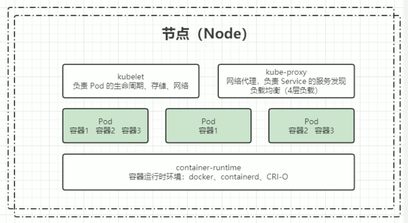

# K8S 简介

---

## 一、K8S 相关概述

Kubernetes（简称 K8S）是一个开源的 **云平台多主机** 容器编排平台，用于自动化部署、扩展和管理容器化应用程序。它最初由 Google 开发，并于 2014 年捐赠给了云原生计算基金会（CNCF）。Kubernetes 提供了一套强大的工具和 API，使得开发者和运维人员能够更高效地管理容器化应用程序的生命周期。

### 1.部署方案的演变

- 传统部署：互联网早期，会直接将应用程序部署在物理机上
- 虚拟化部署：可以在一台物理机上运行多个虚拟机，每个虚拟机都是独立的一个环境
- 容器化部署：与虚拟化类似，但是共享了操作系统，实现了更轻量级的隔离（实现了文件系统、网络、磁盘、CPU、内存、进程、用户空间隔离等等）

---

### 2.Kubernetes 的主要功能

- 自我修复：自动重新启动失败的容器，替换和重新调度容器，当节点不可用时杀死容器，并且不会向客户端暴露这些问题，直到它们已经准备好提供服务。
- 弹性伸缩：根据 CPU 使用率或其他自定义指标自动扩展和缩减容器的数量。
- 自动部署和回滚：自动部署新的应用程序版本，并在出现问题时回滚到以前的版本。
- 服务发现和负载均衡：自动分配 IP 地址和一个单一的 DNS 名称给一组容器，并且可以在它们之间进行负载均衡。
- 机密和配置管理：可以存储和管理敏感信息，如密码、OAuth 令牌和 SSH 密钥，并且可以在不重新构建容器镜像的情况下更新应用程序配置。
- 存储编排：可以自动挂载本地存储、公共云提供商等存储系统。
- 批处理执行：可以管理批处理和 CI 工作负载，并且可以替代失败的容器。

---

### 3.企业级容器调度平台

- Apache Mesos：一个分布式系统内核，可以将整个数据中心抽象成一个单一的资源池，支持多种工作负载，包括容器化应用程序。
- Docker Swarm：Docker 的原生集群管理工具，提供简单的容器编排和调度功能，适合小型集群和简单应用场景。（小规模集群）
- Google Kubernetes：一个功能强大且灵活的容器编排平台，支持自动化部署、扩展和管理容器化应用程序，适合各种规模的集群和复杂应用场景。（大规模集群）

---

## 二、K8S 集群架构与组件

### 1.Kubernetes 组件

#### (1) 控制面板组件（Master）

**Kube API Server**

**Kube Controller Manager**

**Cloud Controller Manager**

**Kube Scheduler**

**etcd**

#### (2) 节点组件（Node）

**Kubelet**

**Kube Proxy**

**Pod**

**container**

容器运行时环境（Docker、ContainerD、CRI-O）

#### (3) 附加组件（Addon）

**Kube DNS**

Kube DNS 是 Kubernetes 集群中的一个核心组件，负责为集群内的服务和 Pod 提供域名解析服务。它允许用户通过友好的域名（如 `my-service.default.svc.cluster.local`）来访问集群内的服务，而不需要记住复杂的 IP 地址。

**Ingress Controller**

Ingress Controller 是 Kubernetes 集群中的一个重要组件，负责管理和控制外部流量进入集群内的服务。它通过定义 Ingress 资源来实现对 HTTP 和 HTTPS 流量的路由和负载均衡，从而简化了应用程序的访问和管理。

**Prometheus**

Prometheus 是一个开源的系统监控和报警工具，广泛应用于 Kubernetes 集群中。它通过收集和存储时间序列数据，帮助用户实时监控集群的性能和健康状态。

**Federation**

**Fluentd Elasticsearch**

### 2.Kubernetes 分层架构

#### 生态系统

#### 接口层

#### 管理层

#### 应用层

#### 核心层