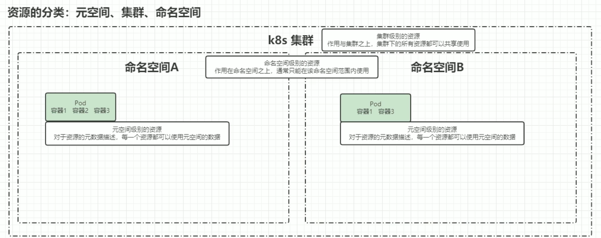

# K8S 核心概念

## 一、服务分类

### 1.无状态

不会对本地环境产生任何依赖

- 对客户端透明，无依赖关系，可以实现高效扩展、迁移
- 不能存储数据，需要额外的数据服务支撑

### 2.有状态

对本地环境有依赖需求

- 可以独立存储数据，实现数据管理
- 集群环境下需要实现主从、数据同步、备份、水平扩容复杂

---

## 二、资源和对象

Kubernetes中的所有内容都被抽象为"资源"，如Pod、Service、 Node等都是资源。“对象"就是“资源"的实例，是持久化的实体。如某个具体的Pod、某个具体的Node。Kubernetes使用这些实体去表示整个集群的状态。

对象的创建、删除、修改都是通过"Kubernetes API"，也就是"Api Server"组件提供的API接口，这些是RESTful风格的Api，与k8s的万物皆对象"理念相符。命令行工具"kubectl"，实际上也是调用kubernetes api。

K8S中的资源类别有很多种，kubectl可以通过配置文件来创建这些“对象”，配置文件更像是描述对象“属性"的文件，配置文件格式可以是“JSON"或YAML"，常用"YAML"。

### 1.资源分类

#### (1) 元数据型

**Horizontal Pod Autoscaler（HPA）**

自动扩缩容

**Pod Template**

Pod Template是关于Pod的定义，但是被包含在其他的 Kubernetes 对象中（例如Deployment、StatefulSet、DaemonSet等控制器)。控制器通过Pod Template信息来创建 Pod。

**Limit Range**

可以对集群内 Request 和 Limits 的配置做一个全局的统一限制，相当于批量设置了某一个范围内（某个命名空间）的Pod的资源使用限制。

#### (2) 集群级

**Node**

不像其他的资源（如Pod和Namespace），Node本质上不是 Kubernetes 来创建的，Kubernetes只是管理Node上的资源。虽然可以通过Manifest创建一个Node对象，但Kubernetes也只是去检查是否真的是有这么一个Node，如果检查失败，也不会往上调度Pod。

**ClusterRole**

**ClusterRoleBinding**

#### (3) 命名空间级 

**工作负载 Pod**

Pod（容器组）是Kubernetes中最小的可部署单元。一个Pod（容器组）包含了一个应用程序容器（某些情况下是多个容器）、存储资源、一个唯一的网络IP地址、以及一些确定容器该如何运行的选项。Pod容器组代表了Kubernetes中一个独立的应用程序运行实例，该实例可能由单个容器或者几个紧耦合+起的容器组成 

Docker是Kubernetes Pod中使用最广泛的容器引擎： KubermetesPod同时也支持其他类型的容器引擎。

Kubermetes集群中的Pod存在如下两种使用途径：

- 一个Pod中只运行一个容器。“one-container-per-pod”是 Kubemetes中最常见的使用方式。此时，您可以认为Pod容器组是该容器的wrapperTKubernetes通过Pod管理容器，而不是直接管理容器。
- 一个Pod中运行多个需要互相协作的容器。您可以将多个紧密耦合、共享资源且始终在一起运行的容器编排在同一个 Pod中，可能的情况有。

**副本（replicas）**

**控制器**

- 适用于无状态

- 适用于有状态

- 守护进程

- 任务/定时任务

**服务防线**

**配置与存储**

### 2.资源清单

---

## 三、对象规约和状态

### 1.规约（Spec）

"spec"是“规约"、“规格"的意思，Spec 是必需的，它描述了对象的期望状态(Desired State)一一希望对象所具有的特征。当创建Kubernetes对象时，必须提供对象的规约，用来描述该对象的期望状态，以及关于对象的一些基本信息（例如名称）

### 2.状态（Status）

表示对象的实际状态，该属性由 Kubernetes 自己维护，K8S 会通过一些列控制器对对应对象进行管理，让对象尽可能的让实际状态与期望状态重合。