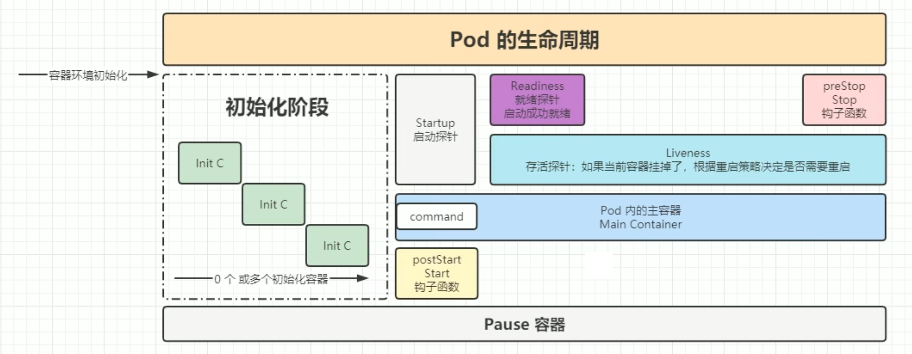

# K8S 深入Pod

---

## 一、Pod 配置文件

```yaml
apiVersion: apps/v1        # 1.9.0 之前的版本使用 apps/v1beta2，可通过命令 kubectl api-versions 查看
kind: Deployment           #指定创建资源的角色/类型
metadata:                  #资源的元数据/属性
  name: nginx-deployment       #资源的名字，在同一个namespace中必须唯一
  namespace:  xxxx             #命名空间
  labels:
    app: demo                  #标签
spec:
  replicas: 3         #副本数量3
  strategy:
    rollingUpdate:   ##由于replicas为3,则整个升级,pod个数在2-4个之间
      maxSurge: 1      #滚动升级时会先启动1个pod
      maxUnavailable: 1 #滚动升级时允许的最大Unavailable的pod个数
  selector:             #定义标签选择器,部署需要管理的pod（带有该标签的的会被管理）需在pod 模板中定义
    matchLabels:
      app: web-server
  template:      #这里Pod的定义
    metadata:
      labels:    #Pod的label
        app: web-server
    spec:        # 模板的规范  
      containers:
        - name: nginx      #容器的名字  
          image: nginx:1.12.1  #容器的镜像地址 
          command: [ "/bin/sh","-c","cat /etc/config/path/to/special-key" ]    #启动命令   
          args:                                                                #启动参数
            - '-storage.local.retention=$(STORAGE_RETENTION)'
            - '-storage.local.memory-chunks=$(STORAGE_MEMORY_CHUNKS)'
            - '-config.file=/etc/prometheus/prometheus.yml'
            - '-alertmanager.url=http://alertmanager:9093/alertmanager'
            - '-web.external-url=$(EXTERNAL_URL)'
          #如果command和args均没有写，那么用Docker默认的配置。
          #如果command写了，但args没有写，那么Docker默认的配置会被忽略而且仅仅执行.yaml文件的command（不带任何参数的）。
          #如果command没写，但args写了，那么Docker默认配置的ENTRYPOINT的命令行会被执行，但是调用的参数是.yaml中的args。
          #如果如果command和args都写了，那么Docker默认的配置被忽略，使用.yaml的配置。
          imagePullPolicy: IfNotPresent
            # IfNotPresent ：默认值,本地有则使用本地镜像,不拉取，如果不存在则拉取
            # Always：  总是拉取
            # Never：  只使用本地镜像，从不拉取
            livenessProbe:
              #表示container是否处于live状态。如果LivenessProbe失败，LivenessProbe将会通知kubelet对应的container不健康了。随后kubelet将kill掉container，并根据RestarPolicy进行进一步的操作。默认情况下LivenessProbe在第一次检测之前初始化值为Success，如果container没有提供LivenessProbe，则也认为是Success；
              httpGet:
                path: /health #如果没有心跳检测接口就为/
                port: 8080
                scheme: HTTP
              initialDelaySeconds: 60 ##启动后延时多久开始运行检测
              timeoutSeconds: 5
              successThreshold: 1
              failureThreshold: 5
              readinessProbe:
            readinessProbe:
              httpGet:
                path: /health #如果没有心跳检测接口就为/
                port: 8080
                scheme: HTTP
              initialDelaySeconds: 30 ##启动后延时多久开始运行检测
              timeoutSeconds: 5
              successThreshold: 1
              failureThreshold: 5
            resources:              ##CPU内存限制
              requests:
                cpu: 2
                memory: 2048Mi
              limits:
                cpu: 2
                memory: 2048Mi
            env:                    ##通过环境变量的方式，直接传递pod=自定义Linux OS环境变量
              - name: LOCAL_KEY     #本地Key
                value: value
              - name: CONFIG_MAP_KEY  #局策略可使用configMap的配置Key，
                valueFrom:
                  configMapKeyRef:
                    name: special-config   #configmap中找到name为special-config
                    key: special.type      #找到name为special-config里data下的key
            ports:
              - name: http
                containerPort: 8080 #对service暴露端口
            volumeMounts:     #挂载volumes中定义的磁盘
              - name: log-cache
                mount: /tmp/log
              - name: sdb       #普通用法，该卷跟随容器销毁，挂载一个目录
                mountPath: /data/media
              - name: nfs-client-root    #直接挂载硬盘方法，如挂载下面的nfs目录到/mnt/nfs
                mountPath: /mnt/nfs
              - name: example-volume-config  #高级用法第1种，将ConfigMap的log-script,backup-script分别挂载到/etc/config目录下的一个相对路径path/to/...下，如果存在同名文件，直接覆盖。
                mountPath: /etc/config
              - name: rbd-pvc                #高级用法第2中，挂载PVC(PresistentVolumeClaim)

  #使用volume将ConfigMap作为文件或目录直接挂载，其中每一个key-value键值对都会生成一个文件，key为文件名，value为内容，
  volumes:  # 定义磁盘给上面volumeMounts挂载
    - name: log-cache
      emptyDir: {}
    - name: sdb  #挂载宿主机上面的目录
      hostPath:
        path: /any/path/it/will/be/replaced
    - name: example-volume-config  # 供ConfigMap文件内容到指定路径使用
      configMap:
        name: example-volume-config  #ConfigMap中名称
        items:
          - key: log-script           #ConfigMap中的Key
            path: path/to/log-script  #指定目录下的一个相对路径path/to/log-script
          - key: backup-script        #ConfigMap中的Key
            path: path/to/backup-script  #指定目录下的一个相对路径path/to/backup-script
    - name: nfs-client-root         #供挂载NFS存储类型
      nfs:
        server: 10.42.0.55          #NFS服务器地址
        path: /opt/public           #showmount -e 看一下路径
    - name: rbd-pvc                 #挂载PVC磁盘
      persistentVolumeClaim:
        claimName: rbd-pvc1         #挂载已经申请的pvc磁盘
```

基于自定义的YAML文件创建Pod

```shell
kubectl create -f pod配置文件.yaml
```

查看节点执行信息

```shell
kubectl describe po <pod名称>
```

---

## 二、Pod 探针

Kubernetes提供了三种探针来监控Pod中容器的健康状态：`Startup Probe` 、`Liveness Probe` 和`Readiness Probe` 。这些探针帮助确保容器在运行时的健康状态，并在必要时采取相应的措施。

- `Startup Probe`：用于检测容器是否已经启动成功。如果容器启动时间较长，可以使用Startup Probe来避免Liveness Probe在容器启动期间误判为失败。
- `Liveness Probe`：用于检测容器是否处于健康状态。如果Liveness Probe失败，Kubernetes会重启该容器。
- `Readiness Probe`：用于检测容器是否准备好接受流量。如果Readiness Probe失败，Kubernetes会将该容器从服务的负载均衡池中移除，直到它恢复健康。


---

## 三、Pod 生命周期





Pod 生命周期包括以下几个阶段：

- `Pending`：Pod已被Kubernetes接受，但其中的容器尚未创建或启动。
- `Running`：Pod中的所有容器都已创建并至少有一个容器正在运行。
- `Succeeded`：Pod中的所有容器都已成功终止，并且不会再重新启动。
- `Failed`：Pod中的所有容器都已终止，但至少有一个容器是以失败状态终止的。
- `Unknown`：由于某种原因，无法获取Pod的状态。
- `Terminating`：Pod正在被删除，Kubernetes正在终止其中的容器。
- `Completed`：Pod中的所有容器都已成功完成其任务并终止。
- `CrashLoopBackOff`：Pod中的某个容器不断崩溃并重新启动，Kubernetes正在尝试重新启动该容器，但由于连续失败，进入了退避状态。
- `ImagePullBackOff`：Pod中的某个容器无法拉取其镜像，Kubernetes正在尝试重新拉取该镜像，但由于连续失败，进入了退避状态。
- `Evicted`：Pod由于资源不足（如内存或CPU）被Kubernetes驱逐出节点。
- `Init:0/1`：Pod中的初始化容器正在运行，但尚未完成。
- `Init:Completed`：Pod中的所有初始化容器都已成功完成。
- `PodScheduled`：Pod已成功调度到节点上，但其中的容器尚未创建或启动。
- `PodInitializing`：Pod中的容器正在初始化，但尚未运行。
- `PodReady`：Pod中的所有容器都已成功运行，并且准备好接受流量。
- `PodNotReady`：Pod中的某个容器未能成功运行，导致整个Pod未准备好接受流量。
- `PodUnknown`：由于某种原因，无法获取Pod的状态。
- `PodTerminating`：Pod正在被删除，Kubernetes正在终止其中的容器。
- `PodCompleted`：Pod中的所有容器都已成功完成其任务并终止。
- `PodCrashLoopBackOff`：Pod中的某个容器不断崩溃并重新启动，Kubernetes正在尝试重新启动该容器，但由于连续失败，进入了退避状态。
- `PodImagePullBackOff`：Pod中的某个容器无法拉取其镜像，Kubernetes正在尝试重新拉取该镜像，但由于连续失败，进入了退避状态。
- `PodEvicted`：Pod由于资源不足（如内存或CPU）被Kubernetes驱逐出节点。