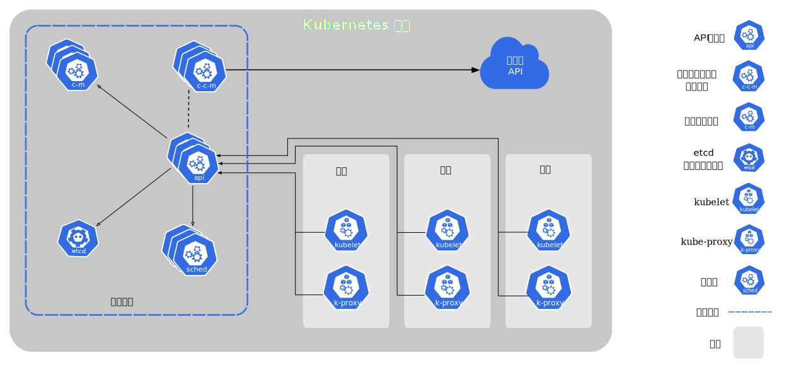

# Kubernetes

欢迎来到教程专区 🎉 这是知识导航，开始学习～ 这里你可以找到：

- 🌱 Kubernetes 容器化实现
- 🚀 Kubernetes 集群容器部署编排

---

【Kubernetes 官方文档】：https://kubernetes.io/zh-cn/docs/home/

- Kubernetes 组件：

## Kubernetes 知识结构

import MermaidChart from "../../../src/components/Mermaid";

<MermaidChart mermaidData={`
flowchart TD
    A["Kubernetes"]

`}/>

---

import DocCardList from '@theme/DocCardList';

<DocCardList/>