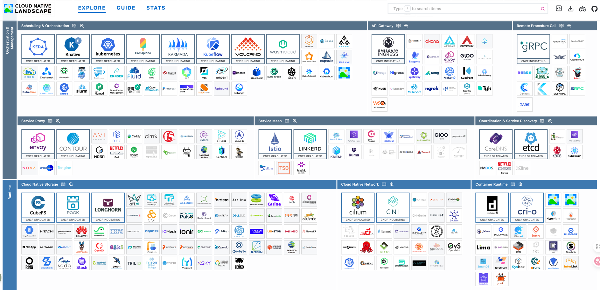

# 知识导航

欢迎来到教程专区 🎉 这是知识导航，开始学习～ 这里你可以找到：

- 🌱 Docker 容器化实现远路
- 🚀 K8S 集群容器部署编排

---

<strong>CNCF 云元件生态系统：</strong> https://landscape.cncf.io/?ajs_aid=8b1be764-51df-44ad-9f74-f3accd92e63a

---

import DocCardList from '@theme/DocCardList';

<DocCardList/>