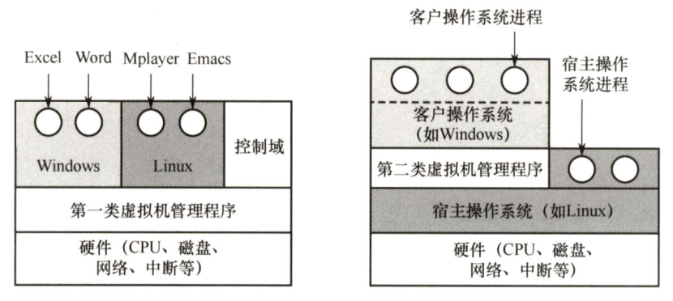

# 计算机系统概述

---

## 一、操作系统概念

### 1.操作系统特征

#### （1）并发

- 并发：统一时间间隔内发生
- 并行：同一时刻发生

:::tip

并发，并行的区别辨析非常重要

:::

#### （2）共享

- 互斥共享
  - 一段时间内只允许一个进程访问该资源（打印机、磁带机）
  - 临界资源（独占资源）：一段时间内只允许一个进程访问的资源
- 同时访问
  - 一段时间内允许多个进程访问该资源（磁盘、可重入代码）

#### （3）虚拟

| 复用技术     | 示例                                                         |
| ------------ | ------------------------------------------------------------ |
| 时分复用技术 | 虚拟处理机（多道程序并发执行分时使用一个处理器）、虚拟设备（spooling技术将一台物理设备虚拟为多台逻辑设备，从而将独占设备变为共享设备） |
| 空分复用技术 | 虚拟存储器（从逻辑上扩展了存储器的容量）                     |

#### （4）异步

---

## 二、操作系统发展历程

---

## 三、操作系统运行环境

## 六、虚拟机

