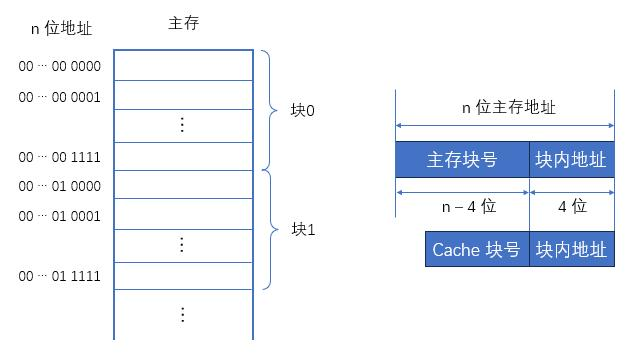
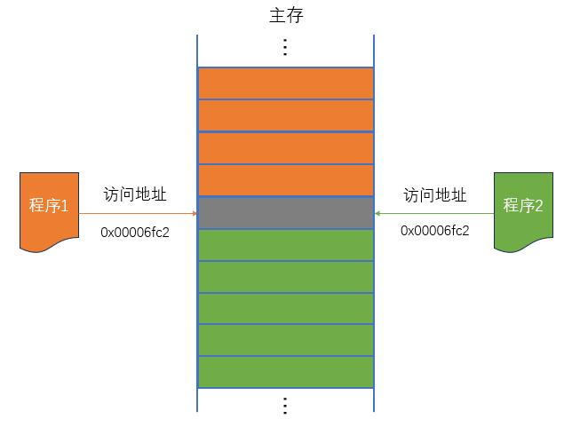

# 存储系统

---

高速缓冲存存储器（Cache）

为了解决 CPU 和主存之间速度不匹配的问题，计算机系统中引入了高速缓存（Cache）的概念。基本想法就是使用速度更快但容量更小、价格更高的 SRAM 制作一个缓冲存储器，用来存放经常用到的信息；这样一来，CPU 就可以直接与 Cache 交换数据，而不用访问主存了。

这种方案之所以有效，是因为通过对大量典型程序分析发现，在一定时间内，CPU 要从主存取指令或者数据，只会访问主存局部的地址区域。这是由于指令和数据在内存中都是连续存放的，而且有些指令和数据会被多次调用（比如常用函数、循环代码段、数组和一些常数）；也就是说，指令和数据在主存中地址分布不是随机的，而是相对的簇聚。这使得 CPU 执行程序时，访存具有相对的局部性；这称为程序访问的 局部性原理。

（1）Cache 基本工作原理：

为了便于 Cache 与主存交换信息，Cache 和主存都被划分为相等的块。Cache 块又称 Cache 行，每块由若干字节组成，块的长度称为块长。由于 Cache 的容量远小于主存的容量，所以 Cache 中的块数要远少于主存中的块数，Cache 中仅保存主存中最活跃的若干块的副本。

---

虚拟存储器

早期的计算机，CPU 是直接操作主存的，也就是运行程序时，直接给出要访问的实际主存地址。这种方式简单直接，但是会有一些问题：

- 不同的程序之间需要共享内存，它们的内存地址空间很难隔离，从而导致程序运行的稳定性和安全性降低；
- 主存容量有限，如果同时执行的程序太多、使用内存太大容易超出容量限制而崩溃。

为了解决这些问题，在主存-辅存这一层次的不断发展中，逐渐形成了虚拟存储系统。

主存和辅存共同构成了虚拟存储器，二者在硬件和系统软件的共同管理下工作。对于应用程序员而言，虚拟存储器是透明的。虚拟存储器具有主存的速度和辅存的容量。

（1）虚拟存储器的基本概念

