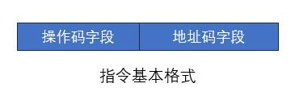
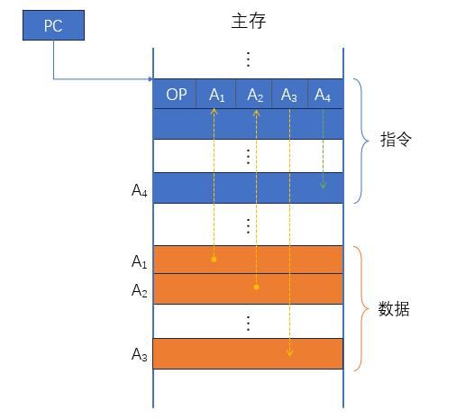

# 指令系统

---

指令和指令格式
（1）指令的基本格式
指令由 操作码 和 地址码（操作数地址） 两部分组成。

- 操作码：指出指令执行什么操作和具有何种功能。例如，指出是算术加运算，还是减运算；是程序转移，还是返回操作。
- 地址码：指岀被操作的信息（指令或数据）的地址，包括参加运算的一个或多个操作数的地址、运算结果的保存地址、程序的转移地址、被调用的子程序的入口地址等。
  （2）指令字长
  指令字长是指一条指令中所包含的二进制代码的位数，它取决于操作码的长度、操作数地址的长度和操作数的个数。不同机器的指令字长是不同的，指令字长通常取 8 的整数倍。
  按照字长是否可变，又可以将指令系统分为 定长指令字结构 和 变长指令字结构。

（3）地址码
地址码 用来指出指令操作涉及到的数据或指令具体保存的位置，可以包括：
- 源操作数的地址（一个或两个）
- 操作结果的地址
- 下一条指令的地址
  这里的 “地址” 一般指主存地址，也可以是寄存器的地址，甚至可以是 I/O 设备的地址。
  我们以主存地址为例，分析一下地址码的分配。根据地址码字段的数量不同，可以把指令再做分类：
  四地址指令
  地址码字段最多的指令，可以包含所有的信息，共有四个地址字段：

  其中 OP 是操作码；地址码 A1 为第一操作数地址，A2 为第二操作数地址，A3 为结果地址，A4 为下一条指令的地址。

  假设采用定字长指令结构，指令字长为 32 位，操作码 OP 固定为 8 位。这样，每个地址码就应该占据 6 位，那么能够寻址的地址范围为 $$2^6 = 64$$。
  三地址指令

$$
(A_1)OP(A_2)→A_3
$$
二地址指令

一地址指令

零地址指令
在指令系统中，还有一种指令是没有地址码的，这就是零地址指令。零地址指令中只有操作码也可以分两种情况：
- 没有操作数的指令，比如空操作（NOP）、停机（HLT）；
- 有一个隐含操作数的指令，比如子程序返回（RET）、中断返回（IRET），这类操作利用了栈数据结构，操作数的地址就隐含在堆栈指针（SP）中。
  （4）操作码

