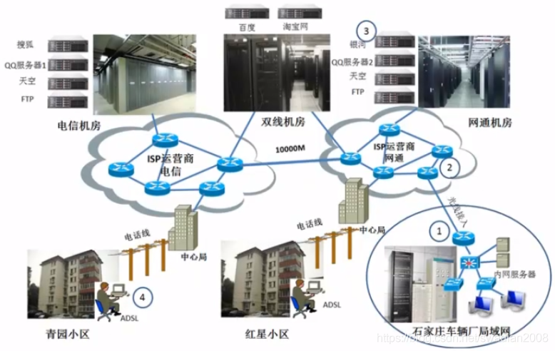

# 计算机网络体系结构

---

## 计算机网络概述

### 局域网

局域网（Local Area Network，LAN）是指在相对较小的地理范围内（如办公室、学校、企业内部等）建立起来的计算机网络。局域网通常用于连接位于同一物理位置的设备，使这些设备能够进行数据交换和共享资源。

局域网一般覆盖范围小，如一个学校的局域网络，设备自己购买和维护，而且带宽是固定的（购买的交换机带宽固定为100M或者1000M等）。

如图为一个局域网图示：

### Internet 和 广域网

广域网（Wide Area Network，WAN）是指覆盖范围更广、跨越较大地理区域的计算机网络。与局域网相比，广域网连接的地理范围更大，可以跨越城市、国家甚至全球范围。

互联网（Internet）是一个全球性的计算机网络系统，它连接了全球各地的计算机网络和设备，使它们能够互相通信和交换信息。互联网是一个庞大而分布式的网络，由无数的计算机、服务器、路由器和其他网络设备组成。

Internet网络由多个运营商组成，每个运营商都有自己的机房，对用户提供Internet访问。广域网覆盖范围广，用户与服务器之间的距离大于100米，带宽不固定（通过付费形式买带宽）。

局域网（Local Area Network，LAN）和广域网（Wide Area Network，WAN）是两种不同范围和特性的计算机网络。它们在覆盖范围、传输速率、拓扑结构和使用场景等方面有着明显的区别。

**1）覆盖范围：**

- 局域网：局域网的覆盖范围相对较小，通常局限在一个建筑物、校园、办公区域等较小的地理范围内。

- 广域网：广域网的覆盖范围较大，可以跨越城市、国家甚至全球范围，连接位于不同地理位置的设备。

**2）传输速率：**

- 局域网：局域网通常提供较高的传输速率，可以达到几百兆甚至几个千兆的速度，以支持高带宽需求和快速数据交换。
- 广域网：广域网的传输速率通常较低，受制于长距离传输、网络拓扑和公共基础设施等因素，速率可能较局域网低。

**3）拓扑结构：**

- 局域网：局域网通常采用简单的拓扑结构，如星型拓扑、总线拓扑或环形拓扑等，连接设备的距离相对较近。
- 广域网：广域网采用更为复杂的拓扑结构，使用路由器、交换机等设备连接远程地点，跨越长距离进行数据传输。

**4）使用场景：**

- 局域网：局域网通常用于连接位于同一地理位置的设备，如办公室、学校、企业内部等，用于内部通信、资源共享和协作。
- 广域网：广域网用于连接不同地理位置的分支机构、远程办公场所或远程用户，实现远程访问、数据交换和远程协作。        

**6）控制权：**

- 局域网：局域网通常由组织或个人拥有和管理，可以自由控制和配置网络设备、安全策略和资源共享。
- 广域网：广域网通常是公共网络，由电信运营商或其他网络服务提供商负责管理和维护，网络配置和策略受限。

### IP地址、子网掩码、网关、MAC地址

#### （1）什么是IP地址？

IP地址（Internet Protocol Address）是互联网中用于标识和定位设备（如计算机、服务器、路由器等）的唯一标识符。它是一个由数字和点组成的标识串，用于在网络中准确定位和寻址设备。

IP地址使用的是互联网协议（IP）来进行通信。IP地址分为IPv4和IPv6两种版本。

IPv4（Internet Protocol version 4）：IPv4是目前广泛使用的IP地址版本。它由32位二进制数字组成，通常表示为点分十进制形式，如192.168.0.1。IPv4地址共有约42亿个，由四个8位的数字组成，每个数字范围从0到255。IPv4地址中的一部分用于标识网络，另一部分用于标识设备。

IPv6（Internet Protocol version 6）：IPv6是IPv4的后继版本，由128位二进制数字组成，通常表示为冒号分隔的十六进制形式，如2001:0db8:85a3:0000:0000:8a2e:0370:7334。IPv6地址相比于IPv4地址更为庞大，提供了约340万亿亿亿亿（3.4 × 10^38）个唯一的地址。

IP地址的作用是在网络中唯一标识和定位设备。它允许设备之间相互通信和交换数据。通过使用IP地址，数据包可以被正确地路由到目标设备，实现设备之间的连接和互联网上的通信。

在网络通信中，IP地址通常与端口号一起使用。端口号用于标识设备上具体的应用程序或服务，以实现多个应用程序在同一设备上进行并行通信。通过将IP地址和端口号组合在一起，可以准确定位到具体的应用程序或服务。

#### （2）什么是子网掩码？

子网掩码（Subnet Mask）是一个与IP地址一起使用的32位二进制数，用于划分IP地址的主机部分和网络部分。它用于确定给定IP地址的网络标识和主机标识。// 主要用来划分网络

子网掩码的作用是将IP地址分成两个部分：网络部分和主机部分。网络部分用于标识所属的网络，而主机部分用于标识特定网络中的具体主机。

子网掩码使用1和0的组合来表示网络和主机部分。在子网掩码中，连续的1表示网络部分，连续的0表示主机部分。例如，对于IPv4地址192.168.0.1和子网掩码255.255.255.0，将IP地址和子网掩码进行逐位的逻辑与运算，可以得到网络地址192.168.0.0和主机地址0.0.0.1。这意味着该IP地址属于网络192.168.0.0，并且主机标识为0.0.0.1。

子网掩码的长度通常与IP地址的版本有关。对于IPv4地址，常见的子网掩码长度是24位（255.255.255.0），16位（255.255.0.0）或8位（255.0.0.0）。对于IPv6地址，常见的子网掩码长度是64位、128位等。

使用子网掩码可以实现对IP地址的灵活划分和管理，允许网络管理员根据需要创建和管理不同大小的子网。子网掩码还用于确定IP地址的网络范围和广播地址。通过结合IP地址和子网掩码，网络设备可以判断两个IP地址是否属于同一网络，以便进行数据包的路由和转发。

#### （3）什么是网关？

网关（Gateway）是连接两个或多个不同网络的设备或节点。网关充当网络之间的桥梁，负责将数据包从一个网络传递到另一个网络，实现网络之间的通信和数据交换。// 网关是不同网络间的桥梁

**网关在网络通信中起到以下几个重要的作用：**

- 数据转发：网关接收来自源网络的数据包，根据目标网络的地址信息将其转发到正确的目标网络。它负责解析目标网络的地址，并根据路由表或策略来选择正确的路径进行数据转发。
- 协议转换：网关可以实现不同网络之间的协议转换，使得使用不同协议的网络可以进行互联。例如，将来自一个网络使用TCP/IP协议的数据包转换成另一个网络所使用的UDP协议。
- 安全控制：网关可以对数据包进行安全过滤和访问控制，保护网络免受未经授权的访问和网络攻击。它可以实施防火墙策略、访问控制列表（ACL）等安全机制来监控和控制数据包的流动。
- NAT（网络地址转换）：网关可以执行网络地址转换，将内部网络中的私有IP地址转换成外部网络中的公共IP地址，以便与外部网络进行通信。这样可以解决IP地址不足的问题，并提供更好的网络安全性。
- DNS解析：网关可以作为DNS（域名系统）服务器，处理DNS查询请求，将域名解析为相应的IP地址，以实现网络中的域名解析功能。

网关可以是硬件设备（如路由器、交换机）或软件实现（如网络中的某个计算机或服务器）。根据网络的规模和需求，可以存在多个网关来实现不同网络之间的连接。

需要注意的是，网关不同于默认网关。默认网关是指在本地网络中设置的主机或路由器，用于处理出站数据包的目标地址，以及处理来自其他网络的数据包的转发。默认网关通常是本地网络中的第一跳路由器，而网关可以是连接不同网络的任意设备。

#### （4）什么是MAC地址？

MAC地址（Media Access Control Address）是网络设备（如网卡、网络接口卡等）在物理层上的唯一标识符。它是由网卡制造商预先分配并烧录到网络设备中的一个全球唯一的地址。

MAC地址是一个由48位二进制数组成的地址，通常以十六进制表示。它采用了6个字节（也就是12个十六进制数）的形式，如00:1A:2B:3C:4D:5E。前3个字节代表制造商的身份标识，后3个字节是由制造商分配的设备标识。

MAC地址的作用是在局域网中唯一标识和定位网络设备。每个网络设备都有一个唯一的MAC地址，它用于在局域网中识别设备和进行数据通信。当设备在局域网上发送数据时，数据包中包含源MAC地址和目标MAC地址，以指示数据的发送和接收方。

MAC地址在数据链路层（如以太网）中起着重要的作用，它用于帧的封装和解封装过程中，帮助设备在局域网中进行正确的寻址和数据传输。在局域网内部，通过交换机或集线器等设备，根据目标MAC地址来确定数据包的传输路径，将数据包仅发送到目标设备。

需要注意的是，MAC地址是在局域网范围内具有唯一性，但不会在不同的局域网之间传播。当数据包从一个局域网传输到另一个局域网时，会使用其他网络协议（如IP）来进行寻址和路由。因此，MAC地址主要用于局域网内部的设备通信和数据传输。

IP地址、子网掩码、网关、MAC地址的综合使用图示：

如图所示：

1. 在同一网段内的电脑，它们IP地址的网络部分是相同的。如处在13.0.0.0网段的电脑，它们IP地址的网络部分都是13。// 网络地址根据子网掩码划分
2. 子网掩码指明指明一个IP地址的哪些位标识的是主机所在的子网，以及哪些位标识的是主机的位掩码。子网掩码不能单独存在，它必须结合IP地址一起使用
3. 子网掩码只有一个作用，就是将某个IP地址划分成网络地址和主机地址两部分。如图，我们IP地址13.0.0.0，前两位13指的是网络地址，后三位是主机地址，那我们的子网掩码就是255.0.0.0，255指IP地址的网络部分，0指IP地址的主机部分。
   网关就是指明到其他网段的数据应该发送给谁，图示15.0.0.0网段如果要和其他网段的通信都需要通过路由器(15.0.0.1)进行数据转发，路由器在此就是充当了一个网关的角色。
4. 路由器负责在不同网段转发数据。图示15.0.0.0网段和13.0.0.0网段通信都需要经过各自的路由器进行数据转发。
5. MAC地址是一台机器上的物理地址，它是固定的、唯一的。如果说IP地址决定了数据最终给谁，那么MAC地址决定了数据下一跳将到哪里去。

**数据在互联网上传输的过程：**

比如解析15.0.0.2和13.0.0.2的通信过程，如果我们把13.0.0.2的网络域名取名为www.swadian.com。那么通信的过程如下:

1. 15.0.0.2通过DNS服务器获取到www.swadian.com的IP地址为13.0.0.2。
2. 15.0.0.2开始发送数据，目标地址为13.0.0.2，当数据到达交换机，交换机发现数据目标地址不是同一网段的IP，便把数据发送到路由器，此时需要指明发送数据机器的mac地址和接收数据机器的mac地址（m1->m2）；
3. 当数据到达路由器后，数据通过网关，为了最终到达目的地，路由器又需要将数据传输给下一个数据的载体（m2->m3）；
4. 通过不停的更换传输的mac地址，最终把数据传送到指定的IP地址。

数据包和数据帧的示例图:  // 数据包不包括MAC地址

**一个网页数据的传输图示：**

一个网页的数据都不是一次性传输的，而是分成一个一个的数据包进行传输。

如图，一个网页分成8个数据包，首先我们把前3个数据包放入服务器缓存进行传输，当第一个数据包到达目标地点后，目标地点会传送已确认收到数据包1的信息，然后第一个数据包就可以在服务器的缓存中进行清除了，此时再放入新的数据包到缓存，重复此传输过程。

## OSI 参考模型

### IOS 参考模型/七层协议体系结构

OSI 模型是一个由国际标准化组织（ISO）制定的框架，用于理解和描述计算机网络中不同层次之间的通信。它划分为七个层次，从物理层到应用层：

- 物理层（Physical Layer）： 负责定义硬件设备和传输媒介之间的接口。（硬件接口，接口标准，电器标准）
- 数据链路层（Data Link Layer）： 提供数据帧的传输，错误检测和纠正。（数据帧，定义帧的开始和结束，实现透明传输，差错校验）
- 网络层（Network Layer）： 处理数据包的路由和转发。（数据包，负责选择最佳路径，规划IP地址）
- 传输层（Transport Layer）： 提供端到端的通信，包括错误检测和数据流控制。（可靠/不可靠 数据传输，流量控制）
- 会话层（Session Layer）： 管理不同设备之间的会话。（`netstat -n`）
- 表示层（Presentation Layer）： 处理数据的格式和转换，确保不同设备间的数据交换能够理解。（是否进行加密 或者 压缩处理）
- 应用层（Application Layer）： 提供用户接口和网络服务。（所能产生网络流量的程序）

现实中，虽然整套的 OSI 国际标准都已经制定出来了，但是基于 TCP/IP 的互联网已抢先在全球相当大的范围内成功的运行，而与此同时却又找不到有什么厂家生产出符合 OSI 标准的商用产品，所以 OSI 只获得了一些理论研究的成果，成为了一种参考模型。

因此，得到最广泛应用的不是法律上的国际标准 OSI，而是非国际标准 TCP/IP。这样，TCP/IP 就常被称为是事实上的国际标准。

### TCP/IP 四层体系结构和五层协议的体系结构

OSI 的七层协议体系结构的概念清楚，理论也较完整，但它既复杂又不实用。TCP/IP 体系结构则不同，它现在得到了非常广泛的应用。TCP/IP 是一个四层的体系结构，它包含应用层、运输层、网际层和链路层(网络接口层)。  // TCP/IP全称：Transmission Control Protocol/Internet Protocol

很多时候，尤其是大学教材，在讲授计算机网络原理时往往综合 OSI 和 TCP/IP 的优点，采五层协议的体系结构，以便于更方便的阐述计算机网络的原理。各个方式的体系结构划分如下所示：

#### （1）应用层(application layer)

应用层是体系结构中的最高层。应用层的任务是通过应用进程间的交互来完成特定网络应用。应用层协议定义的是应用进程间通信和交互的规则。互联网中的应用层协议很多，如域名系统 DNS、支持万维网应用的 HTTP 协议、支持电子邮件的 SMTP 协议，等等。我们把应用层交互的数据单元称为报文(message)。

#### （2）运输层(transport layer)

运输层的任务就是负责向两台主机中进程之间的通信提供通用的数据传输服务。应用进程利用该服务传送应用层报文。运输层主要使用以下两种协议：// 进程和进程通信

传输控制协议TCP(Transmission Control Protocol)：提供面向连接的、可靠的数据传输服务，其数据传输的单位是报文段(segment)。

用户数据报协议UDP(User Datagram Protocol)：提供无连接的尽最大努力(best-effort)的数据传输服务(不保证数据传输的可靠性)，其数据传输的单位是用户数据报。

#### （3）网络层(network layer)

网络层负责为分组交换网上的不同主机提供通信服务。

在发送数据时，网络层把运输层产生的报文段或用户数据报封装成分组或包进行传送。在 TCP/IP 体系中，由于网络层使用IP 协议，因此分组也叫作 IP 数据报，或简称为数据报。

互联网是由大量的异构(heterogeneous)网络通过路由器(router)相互连接起来的。互联网使用的网络层协议是无连接的网际协议 IP (ntermet Protocol) 和许多种路由选择协议，因此互联网的网络层也叫作网际层或 IP 层。// 路由

#### （4）数据链路层(data link layer)

数据链路层常简称为链路层。两台主机之间的数据传输，总是在一段一段的链路上传送的，这就需要使用专门的链路层的协议。

在两个相邻节点之间传送数据时，数据链路层将 IP 数据报组装成帧 (framing)，在两个相邻节点间的链路上传送帧 (frame)。每一帧包括数据和必要的控制信息(如同步信息、地址信息、差错控制等)。// 帧=数据+控制信息

在接收数据时，控制信息使接收端能够知道一个帧从哪个比特开始和到哪个比特结束。这样，数据链路层在收到一个帧后，就可从中提取出数据部分，上交给网络层。

控制信息还使接收端能够检测到所收到的帧中有无差错。如发现有差错，数据链路层就简单地丢弃这个出了差错的帧，以免继续在网络中传送下去白白浪费网络资源。// 检错

如果需要改正数据在数据链路层传输时出现的差错(这就是说，数据链路层不仅要检错，而且要纠错)，那么就要采用可靠传输协议来纠正出现的差错。//纠错

#### （5）物理层(physical layer)

在物理层上所传数据的单位是比特。发送方发送 1 时，接收方应当收到 1 而不是 0。因此物理层要考虑用多大的电压代表 “1” 或 “0”，以及接收方如何识别出发送方所发送的比特。物理层还要确定连接电缆的插头应当有多少根引脚以及各引脚应如何连接。

请注意，传递信息所利用的一些物理传输媒体，如双绞线、同轴电缆、光缆、无线信道等，并不在物理层协议之内，而是在物理层协议的下面。因此也有人把物理层下面的物理传输媒体当作第 0 层。

