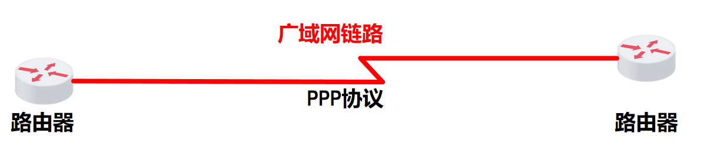
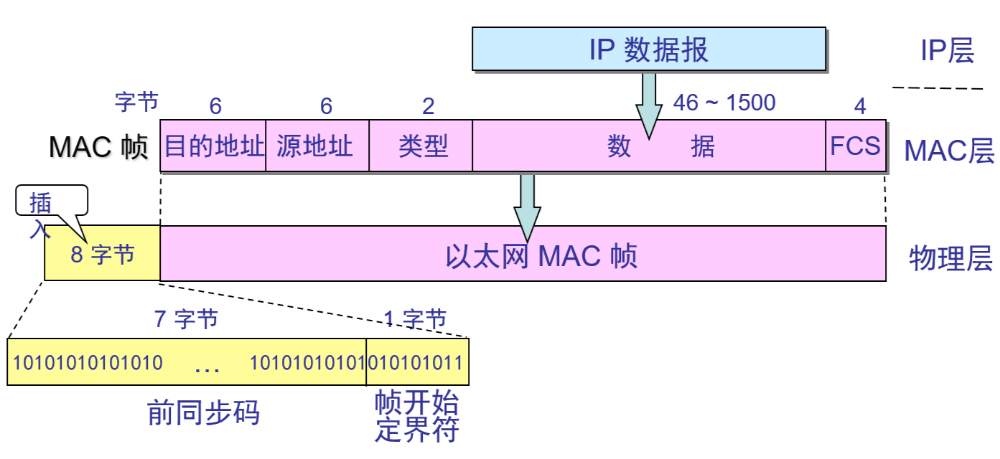

# 数据链路层

---

**数据链路层的信道类型**

数据链路层使用的信道主要有以下两种类型：

- 点对点信道。这种信道使用一对一的点对点通信方式。
- 广播信道。这种信道使用一对多的广播通信方式，因此过程比较复杂。广播信道上连接的主机很多，因此必须使用专用的共享信道协议来协调这些主机的数据发送。

链路与数据链路

- **链路（link）** 是一条无源的点到点的物理线路段，中间没有任何其他的交换结点。一条链路只是一条通路的一个组成部分。
- **数据链路（data link）** 除了物理线路外，还必须有通信协议来控制这些数据的传输。若把实现这些协议的硬件和软件加到链路上，就构成了数据链路。现在最常用的方法是使用适配器（即网卡）来实现这些协议的硬件和软件。一般的适配器都包括了数据链路层和物理层这两层的功能。

**帧**：数据链路层传送的是**帧**

帧：帧头 + 帧尾 + 物理层地址 + 校验值

数据链路层像数字管道

- 常常在两个对等的数据链路层之间画出一个数字管道，而在数据子管道上传输的数据单位是帧/
- 早期的数据通信协议叫做通信章程（procedure）。在数据链路层，章程和协议同义语。

---

## 数据链路层三个基本问题

### 封装成帧

### 透明传输

用字节填充法解决透明传输问题

发送端的数据链路层在数据中出现控制字符“SOH”或“EOT”的前面插入一个转义字符“ESC”(其十六进制编码是 1B)。

字节填充(byte stuffing)或字符填充(character stuffing)——接收端的数据链路层在将数据送往网络层之前删除插入的转义字符。

如果转义字符也出现数据当中，那么应在转义字符前面插入一个转义字符。当接收端收到连续的两个转义字符时，就删除其中前面的一个。

当传送的帧是用文本文件组成的帧时（文本文件中的字都是从键盘上输入的），其数据部分显然不会出现像SOH或EOT这样的帧定界控制字符。可见不管从键盘上输入什么字符都可以放在这样的帧中传输过去，因此这样的传输就是透明传输。

### 差错控制

---

## 点对点 PPP 协议

PPP 协议是点对点协议（Point-to-Point Protocol）的简称，是一种在点对点链路上运行的数据链路层协议。PPP 协议由三个组成部分：

> 广域网 点到点通信

- 数据链路层协议可以用于异步串行或同步串行介质。
- 使用 LCP （链路控制协议）建立并维护链路连接。
- 网路控制协议（NCP）允许在点到点连接上使用多种网络层协议。

> 高级数据链路控制协议 HDLC（High-Level Data Link Control）
> 
> HDLC（High-Level Data Link Control）协议是一种面向比特的数据链路层协议，主要用于点对点和多点通信环境中。

点对点协议还广泛应用在广域网路由器之间的专用线路

---

> 局域网 广播通信

**共享通信媒体**

静态划分信道

- 频分复用 
- 时分复用 
- 波分复用 
- 码分复用 

动态媒体接入控制（多点接入）

- 随机接入（主要被以太网采用）
- 受控接入，如多点线路探询(polling)，或轮询（已经不被采用）

---

## 以太网协议

以太网协议是局域网中使用最广泛的数据链路层协议。以太网协议最初由施乐公司在 1976 年开发，后来由 DEC、英特尔和施乐公司联合制定了以太网标准。1980 年，IEEE 制定了 802.3 标准，正式将以太网协议标准化。

### CSMA/CD 载波监听多点接入/碰撞检测

以太网协议使用 CSMA/CD（Carrier Sense Multiple Access with Collision Detection，载波监听多点接入/碰撞检测）协议来控制对共享通信介质的访问。

- “多点接入”表示许多计算机以多点接入的方式连接在一根总线上。 
- “载波监听”是指每一个站在发送数据之前先要检测一下总线上是否有其他计算机在发送数据，如果有，则暂时不要发送数据，以免发生碰撞。

总线上并没有什么“载波”。因此， “载波监听”就是用电子技术检测总线上有没有其他计算机发送的数据信号。

#### 碰撞检测

如果两台计算机同时检测到总线上没有其他计算机在发送数据，它们就都开始发送数据。由于它们同时发送数据，必然会发生碰撞。碰撞发生时，总线上的电压会升高到一个很高的水平，这时每一台正在发送数据的计算机都能检测到这种电压的升高，从而知道发生了碰撞。

碰撞发生后，每一台正在发送数据的计算机都停止发送数据，并且发送一个特殊的“阻塞”信号，以便让总线上的其他计算机知道发生了碰撞。然后，每一台计算机都等待一个随机的时间间隔后重新开始发送数据。

#### 传播时延对载波监听影响

在以太网中，传播时延对载波监听有很大的影响。假设有两台计算机 A 和 B，它们之间的距离很远，传播时延为 T 秒。

当 A 开始发送数据时，B 可能还没有检测到 A 的信号，因为信号需要 T 秒才能传播到 B。 

如果 B 在 A 的信号到达之前开始发送数据，就会发生碰撞。

为了避免这种情况，以太网协议规定了一个最小帧长，确保在发送最小帧的时间内，信号能够传播到网络的最远端，并且返回到发送端，从而使发送端能够检测到碰撞。

如果帧长小于这个最小值，发送端可能在发送完数据后，才检测到碰撞，从而无法正确处理碰撞。

因此，最小帧长的规定是为了确保载波监听和碰撞检测机制的有效性。

在标准以太网中，最小帧长为 64 字节（512 位），这包括了帧头、数据和帧尾。这个长度确保了在最大传播时延的情况下，发送端能够在发送完最小帧后检测到碰撞。

如果需要在更大的网络中使用以太网，可以通过增加中继器或交换机来缩短每个段的长度，从而保持有效的载波监听和碰撞检测。

总之，传播时延对载波监听有很大的影响，最小帧长的规定是为了确保在各种网络条件下，载波监听和碰撞检测机制能够有效工作。

#### 争用期

在以太网中，争用期是指从一台计算机开始发送数据到它能够确定是否发生碰撞的这段时间。在争用期内，如果另一台计算机也开始发送数据，就会发生碰撞。

#### 二进制指数退避算法

发生碰撞的站在停止发送数据后，要推迟（退避）一个随机时间才能再发送数据。 确定基本退避时间，一般是取为争用期 `2t` 。

定义重传次数 `k ，k ≤10` ，即 `k = Min[重传次数, 10]` 。从整数集合 `[0,1,…, (2k -1)]` 中随机地取出一个数，记为 r。重传所需的时延就是 r 倍的基本退避时间。

当重传达 16 次仍不能成功时即丢弃该帧，并向高层报告。

## MAC层 硬件地址

MAC地址（Media Access Control Address）是网络设备（如网卡、网络接口卡等）在物理层上的唯一标识符。它是由网卡制造商预先分配并烧录到网络设备中的一个全球唯一的地址。

MAC地址通常由48位二进制数表示，通常以十六进制形式表示为6组两位数，中间用冒号或连字符分隔，例如：00:1A:2B:3C:4D:5E 或 00-1A-2B-3C-4D-5E。

MAC地址的作用是在局域网中唯一标识和定位网络设备。每个网络设备都有一个唯一的MAC地址，它用于在局域网中识别设备和进行数据通信。当设备在局域网上发送数据时，数据包中包含源MAC地址和目标MAC地址，以指示数据的发送和接收方。

MAC地址在数据链路层（如以太网）中起着重要的作用，它用于帧的封装和解封装过程中，帮助设备在局域网中进行正确的寻址和数据传输。在局域网内部，通过交换机或集线器等设备，根据目标MAC地址来确定数据包的传输路径，将数据包仅发送到目标设备。

需要注意的是，MAC地址是在局域网范围内具有唯一性，但不会在不同的局域网之间传播。当数据包从一个局域网传输到另一个局域网时，会使用其他网络协议（如IP）来进行寻址和路由。因此，MAC地址主要用于局域网内部的设备通信和数据传输。

### MAC 帧格式

> ping 命令使用的是 ICMP 协议

---

### 以太网扩展

#### 网桥

#### 交换机

交换机是工作在数据链路层的网络设备，主要用于连接局域网中的多个设备，实现设备之间的通信和数据传输。交换机通过MAC地址来识别和转发数据包，从而提高网络的效率和性能。

### 高速以太网

100BASE-T 高速以太网

