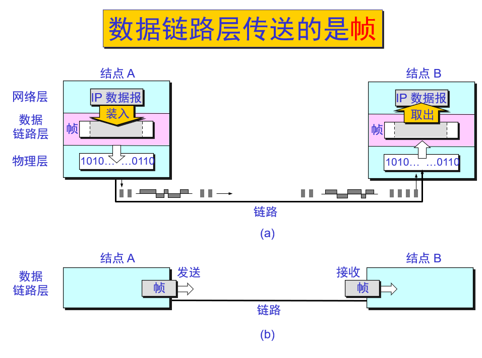
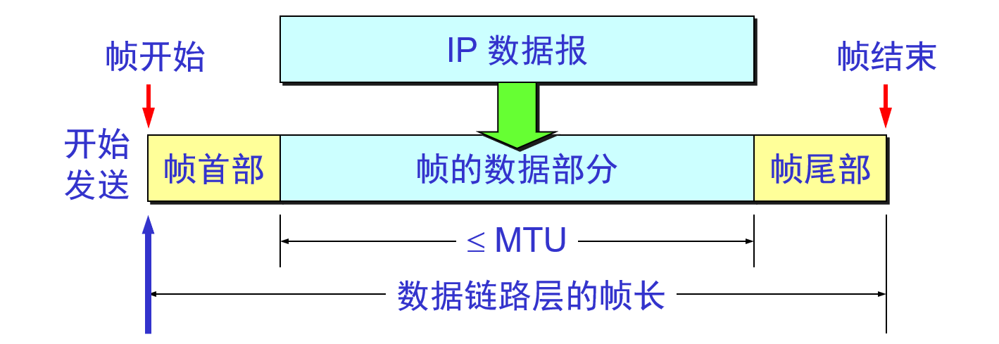
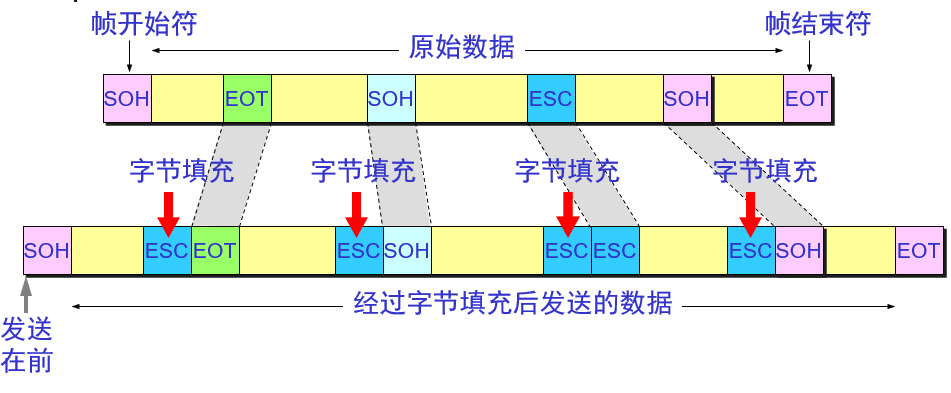
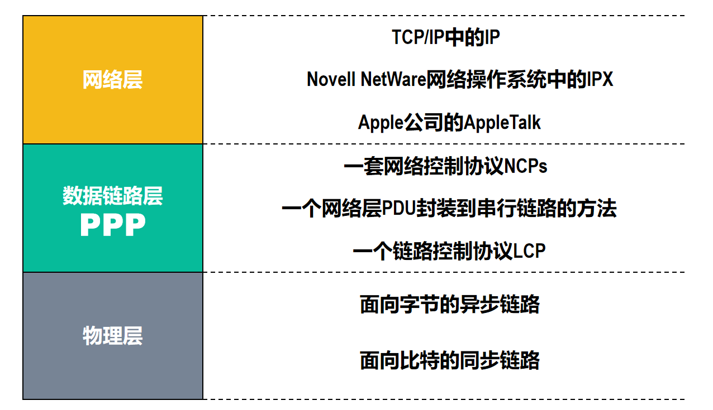

# 数据链路层

---

**数据链路层的信道类型**

数据链路层使用的信道主要有以下两种类型：

- 点对点信道。这种信道使用一对一的点对点通信方式。
- 广播信道。这种信道使用一对多的广播通信方式，因此过程比较复杂。广播信道上连接的主机很多，因此必须使用专用的共享信道协议来协调这些主机的数据发送。

链路与数据链路

- **链路（link）** 是一条无源的点到点的物理线路段，中间没有任何其他的交换结点。一条链路只是一条通路的一个组成部分。
- **数据链路（data link）** 除了物理线路外，还必须有通信协议来控制这些数据的传输。若把实现这些协议的硬件和软件加到链路上，就构成了数据链路。现在最常用的方法是使用适配器（即网卡）来实现这些协议的硬件和软件。一般的适配器都包括了数据链路层和物理层这两层的功能。

**帧**：数据链路层传送的是**帧**

帧：帧头 + 帧尾 + 物理层地址 + 校验值

数据链路层像数字管道

- 常常在两个对等的数据链路层之间画出一个数字管道，而在数据子管道上传输的数据单位是帧/
- 早期的数据通信协议叫做通信章程（procedure）。在数据链路层，章程和协议同义语。

---

## 数据链路层三个基本问题

### 封装成帧

### 透明传输

用字节填充法解决透明传输问题

发送端的数据链路层在数据中出现控制字符“SOH”或“EOT”的前面插入一个转义字符“ESC”(其十六进制编码是 1B)。

字节填充(byte stuffing)或字符填充(character stuffing)——接收端的数据链路层在将数据送往网络层之前删除插入的转义字符。

如果转义字符也出现数据当中，那么应在转义字符前面插入一个转义字符。当接收端收到连续的两个转义字符时，就删除其中前面的一个。

当传送的帧是用文本文件组成的帧时（文本文件中的字都是从键盘上输入的），其数据部分显然不会出现像SOH或EOT这样的帧定界控制字符。可见不管从键盘上输入什么字符都可以放在这样的帧中传输过去，因此这样的传输就是透明传输。

### 差错控制

---

## 

PPP 协议

