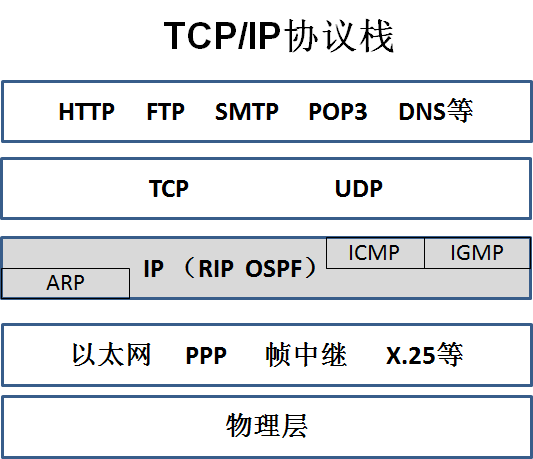

# 网络层

---

## 网络层提供的服务

在计算机网络领域，网络层应该向运输层提供怎样的服务（“面向连接”还是“无连接”）曾引起了长期的争论。争论焦点的实质就是：在计算机通信中，可靠交付应当由谁来负责？是网络还是网络层提供的两种服务在计算机网络领域，网络层应该向运输层提供怎样的服务（“面向连接”还是“无连接”）曾引起了长期的争论。争论焦点的实质就是：在计算机通信中，可靠交付应当由谁来负责？是网络还是端系统？ ？

两种服务：网络层应该向运输层提供怎样得服务

- 虚电路服务
- 数据包服务

### 虚电路服务

---

## 网络层协议

### IP 数据包结构

抓包查看网络层首部：

#### 网络层首部格式

IP数据包首部的格式能够说明IP协议都具有什么功能。

IP数据包由首部和数据两部分组成。首部的前一部分是固定长度，共20个字节，是所有IP数据包必须有的。在首部的固定部分的后面是一些可选字段，其长度是可变的。

**网络层首部固定部分各个字段**

（1）版本 占4位，指IP协议的版本。IP协议目前有两个版本IPv4和IPv6。通信双方使用的IP协议版本必须一致。目前广泛使用的IP协议版本号为4（即IPv4）。

（2）首部长度 占4位，可表示的最大十进制数值是15。请注意，这个字段所表示数的单位是32位二进制数（即4个字节），因此，当IP的首部长度为1111时（即十进制的15），首部长度就达到60字节。

（3）区分服务　占8位，配置计算机给特定应用程序的数据包添加一个标志，然后再配置网络中的路由器优先转发这些带标志的数据包，在网络带宽比较紧张的情况下，也能确保这种应用的带宽有保障，这就是区分服务，为这种服务确保服务质量（Quality of Service，QoS）。

（4）总长度 总长度指IP首部和数据之和的长度，也就是数据包的长度，单位为字节。总长度字段为16位，因此数据包的最大长度为216-1=65535字节。实际上传输这样长的数据包在现实中是极少遇到的。

如果超过1500字节，会进行分片，每片加上网络层首部，顺序，接收端组装合并，通过标识来确认是一个包分片得到，但一般包不超过1500。

---

### ARP 协议

不管网络层使用的是什么协议，在实际网络的链路上传送数据帧时，最终还是必须使用硬件地址。

每一个主机都设有一个 ARP 高速缓存(ARP cache)，里面有所在的局域网上的各主机和路由器的 IP 地址到硬件地址的映射表。

当主机 A 欲向本局域网上的某个主机 B 发送 IP 数据报时，就先在其 ARP 高速缓存中查看有无主机 B 的 IP 地址。如有，就可查出其对应的硬件地址，再将此硬件地址写入 MAC 帧，然后通过局域网将该 MAC 帧发往此硬件地址。

#### ARP 欺骗

ARP协议是建立在网络中各个主机互相信任的基础上的，计算机A发送ARP广播帧解析计算机C的MAC地址，同一个网段中的计算机都能够收到这个ARP请求消息，任何一个主机都可以给计算机A发送ARP应答消息，可以告诉计算机A一个错误的MAC地址，计算机A收到ARP应答报文时并不会检测该报文的真实性，就会将其记入本机ARP缓存，这就存在一个安全隐患--ARP欺骗。

---

### IP 协议

### ICMP 协议

ICMP协议是TCP/IP协议栈中的网络层的一个协议，ICMP是（Internet Control Message Protocol）Internet控制报文协议，**用于在IP主机、路由器之间传递控制消息**。控制消息是指网络通不通、主机是否可达、路由是否可用等网络本身的消息。

ICMP报文是在IP数据报内部被传输的，它封装在IP数据报内。ICMP报文通常被IP层或更层协议（TCP或UDP）使用。一些ICMP报文把差错报文返回给用户进程。

> pathping 命令：用于测试到目标主机需要经过多少个路由器

### IGMP 协议

Internet 组管理协议称为IGMP协议（Internet Group Management Protocol），是因特网协议家族中的一个组播协议。该协议运行在主机和组播路由器之间，IGMP协议是网络层协议。要想搞明白IGMP协议的作用和用途，先要搞明白什么是组播通信，组播也称为多播。

- 广播
- 组播（多播）
- 点对点

