# 传输层

---

## 传输层协议

**服务和端口的关系**

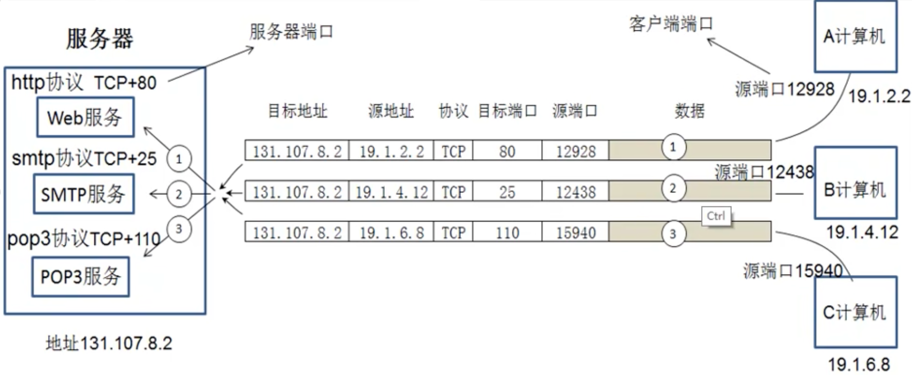

客户端和服务端的端口必须要唯一的。通信时，客户端的端口号可以随机分配，但服务端的端口号必须是固定的。

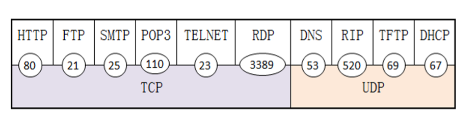

测试指定IP地址的端口号是否开放，可以使用telnet命令：

```shell
telnet IP地址 port端口号
```

端口扫描工具可以扫描指定IP地址的所有端口，查看哪些端口是开放的。

**端口和网络安全的关系**

客户端和服务器之间的通信使用应用层协议，应用层协议使用 传输层协议 + 端口标识，如果在网络设备封掉 TCP 或者 UDP 的某个端口，那么该端口对应的应用层协议就无法使用，应用服务就无法访问，实现网络安全。

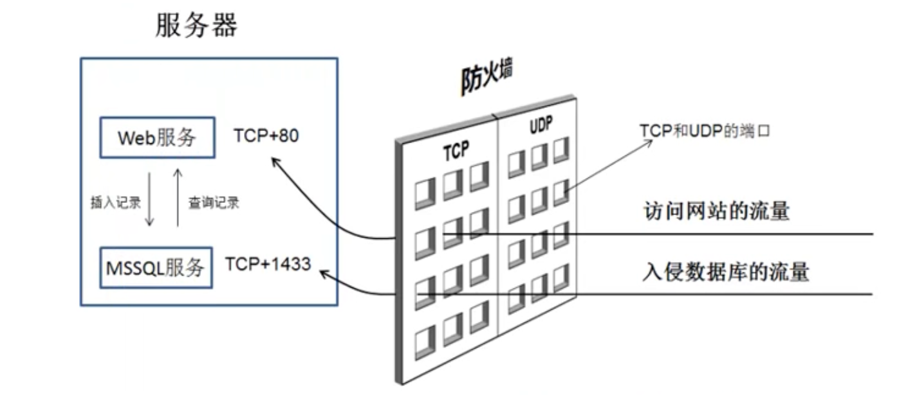

## 用户数据报协议 UDP

### UDP 协议特点

- (1) UDP 是无连接的，即发送数据之前不需要建立连接（当然发送数据结束时也没有连接可以释放），因此 UDP 的开销较小，传输效率较高。
- (2) UDP使用尽最大努力交付，即不保证可靠交付，因此主机不需要维持复 杂的连接状态表（这里面有许多参数），通信的两端不用保持连接，因此节省系统资源。
- (3）UDP是面向报文的，发送方的UDP对应用程序交下来的报文，在添加首部后就向下交付给网络层。UDP对应用层交下来的报文，既不合并，也不拆分，而是保留这些报文的边界。
- (4) UDP没有拥塞控制，因此网络出现的拥塞不会使源主机的发送速率降低。这对某些实时应用是很重要的。
- (5) UDP支持一对一、一对多、多对一和多对多的交互通信。
- (6) UDP的首部开销小，只有8个字节，比TCP的20个字节的首部要短。

<div align="center">

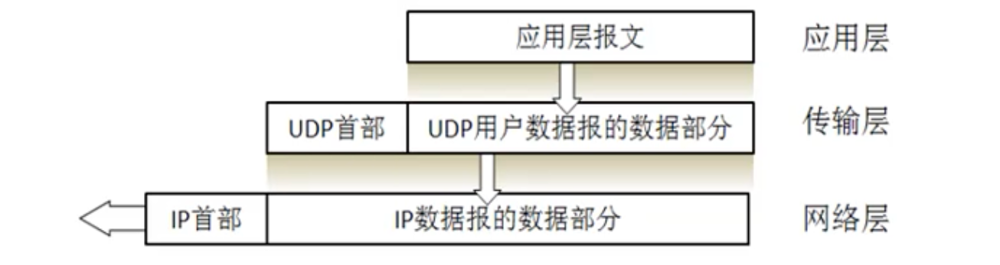

</div>

### UDP 首部格式

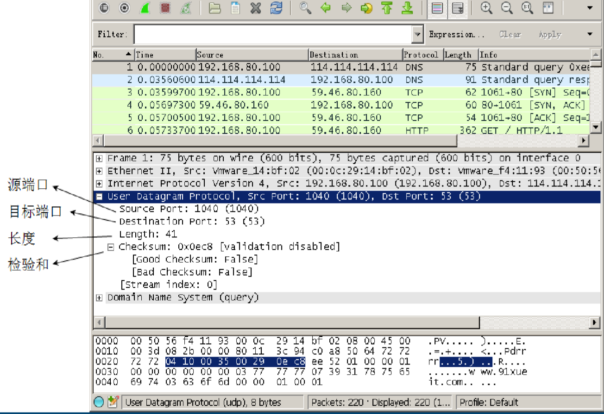

- UDP的首部包括四个字段，源端口、目标端口、长度和校验和，每个字段的长度是两个字节。 
- 伪首部包括：源地址、目的地址、UDP数据长度、协议类型（0x11），协议类型就一个字节，但需要补一个字节的0x0，构成12个字节。

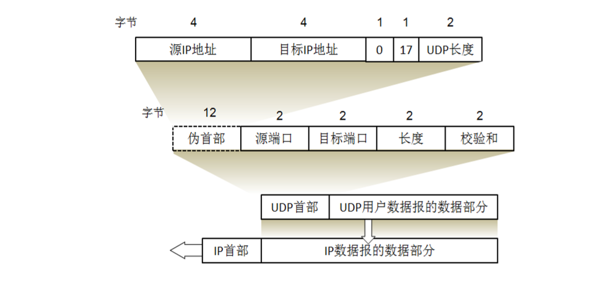


## 传输控制协议 TCP


### 可靠传输

#### 停止等待协议

TCP可靠传输的实现-停止等待协议

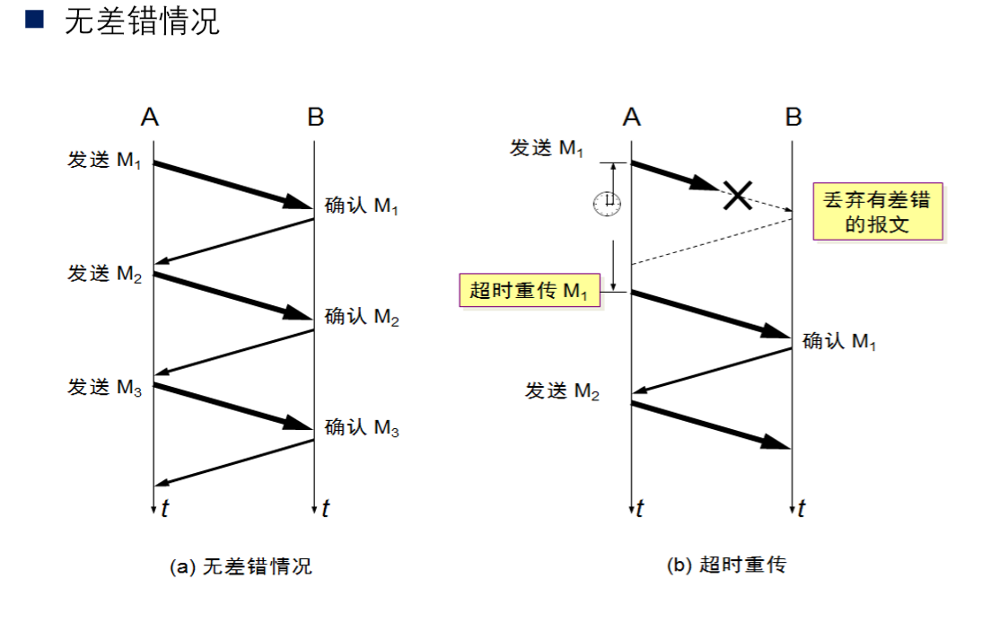

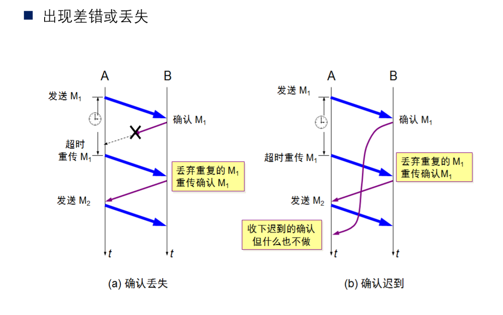

#### 滑动窗口协议

改进后的停止等待协议：连续 ARQ 协议（自动重传）和滑动窗口协议-改进的停止等待协议。

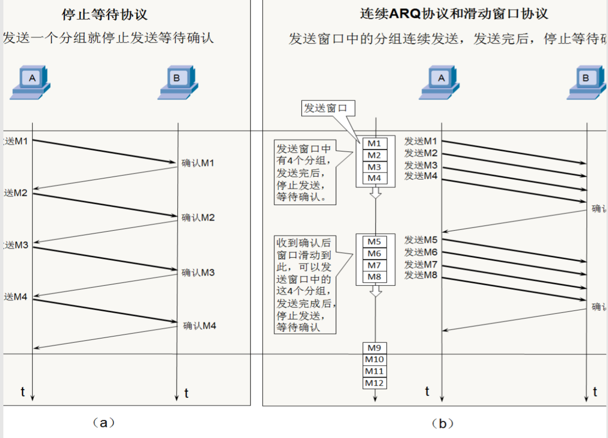

滑动窗口是面向字节流的，为了方便大家记住每个分组的序号，下面的讲解每一个分组就假设100个字节，为了方便画图表示，将分组进行编号简化表示，如图所示，不过你要记住，每一个分组的序号是多少。

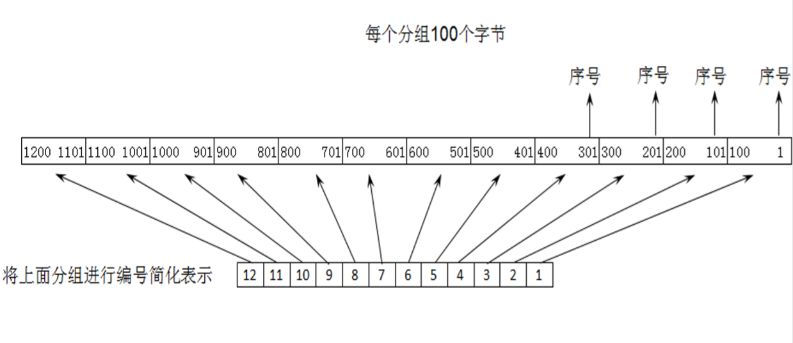

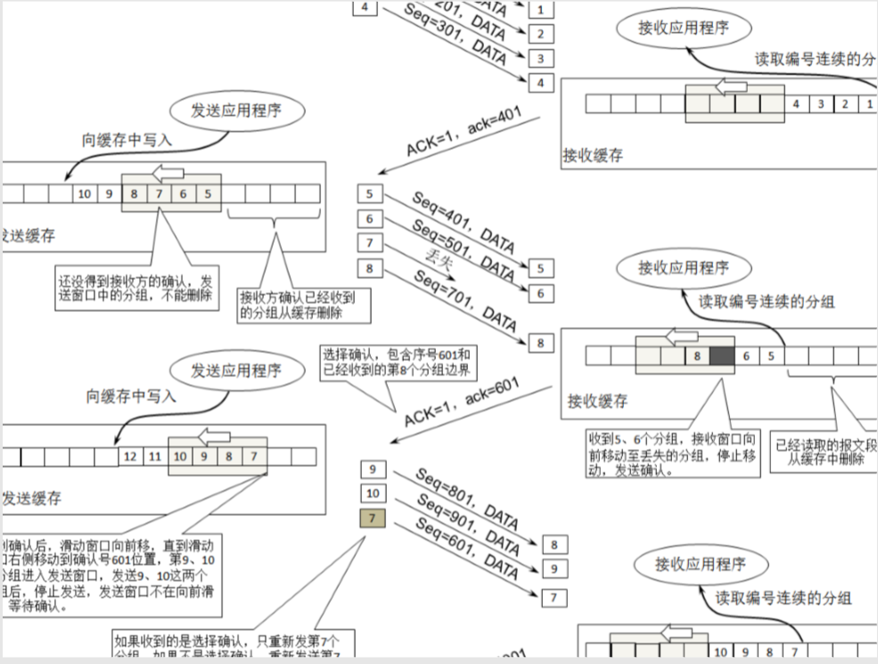

#### 选择确认（SACK）

改进的确认-选择确认（SACK）

TCP通信时，如果发送序列中间某个数据包丢失，TCP会通过重传最后确认的分组后续的分组，这样原先已经正确传输的分组也可能重复发送，降低了TCP性能。为改善这种情况，发展出SACK（Selective Acknowledgment，选择确认）技术，使TCP只重新发送丢失的包，不用发送后续所有的分组，而且提供相应机制使接收方能告诉发送方哪些数据丢失，哪些数据已经提前收到等。

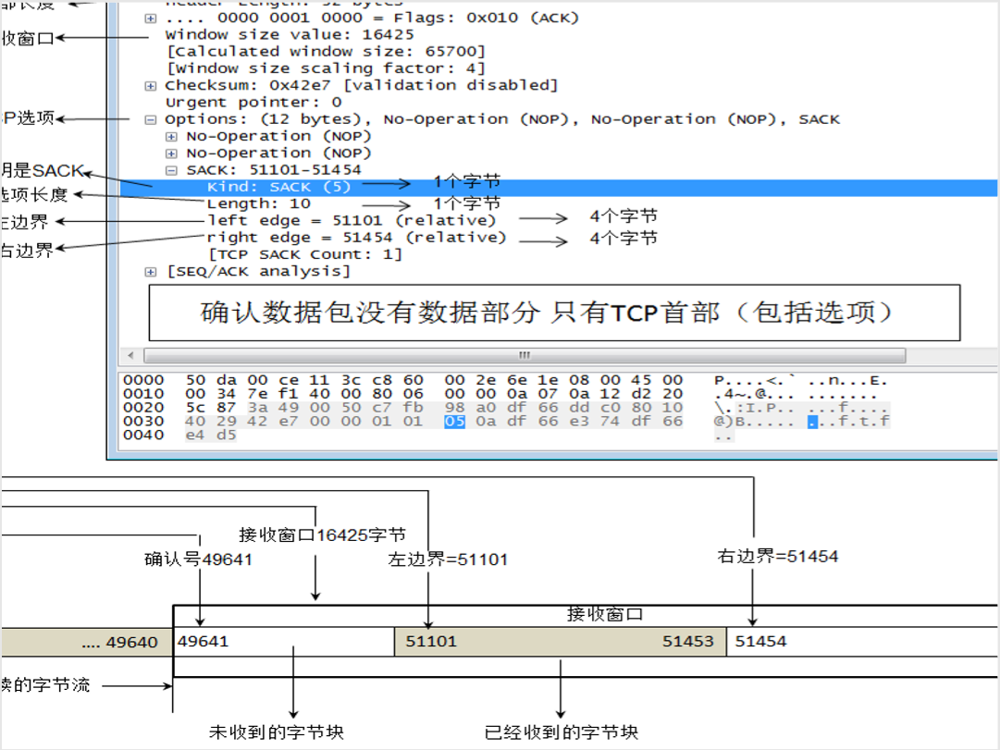


选择性确认最多表示4个边界

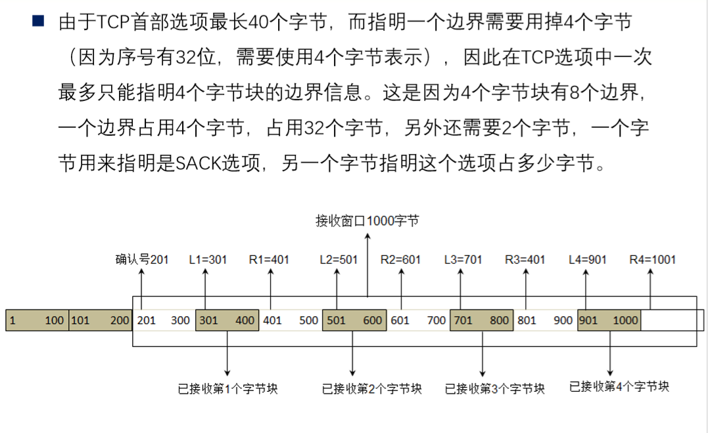

#### 超时时间调整

TCP使用超时重传机制来实现可靠传输。发送方在发送数据后启动一个定时器，如果在定时器到期前没有收到对该数据的确认（ACK），则认为该数据丢失或损坏，发送方会重传该数据。

TCP的超时时间（RTO，Retransmission Timeout）是动态调整的，基于对往返时间（RTT，Round-Trip Time）的估计。RTT是指从发送方发送数据到接收方收到数据并返回确认所需的时间。


### 流量控制


### 拥塞控制


### TCP 连接管理

#### 三次握手


#### 四次挥手

