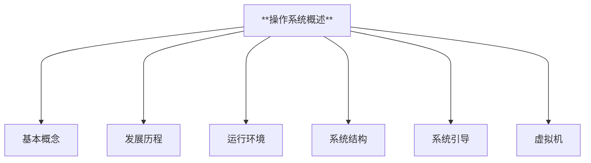
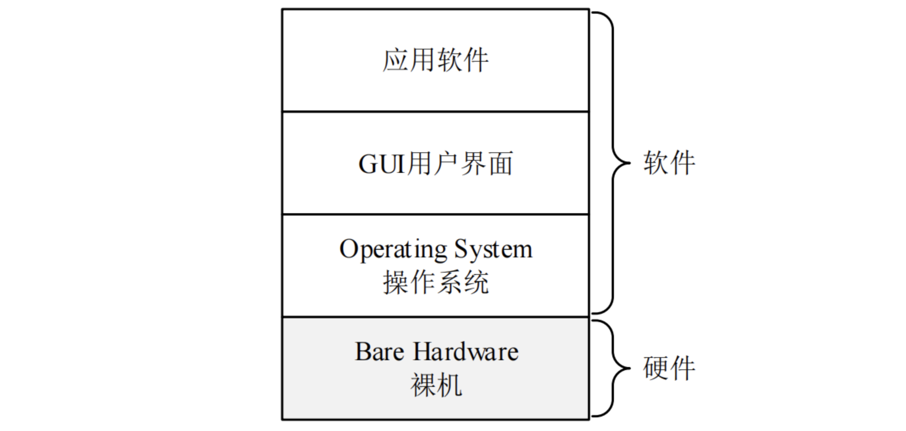
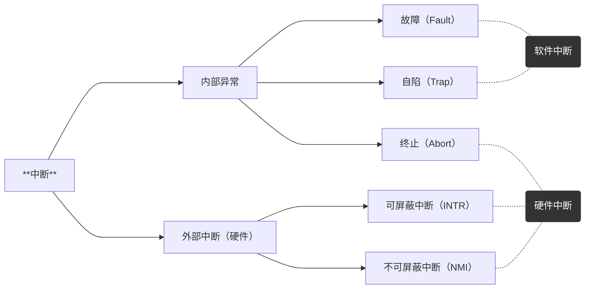
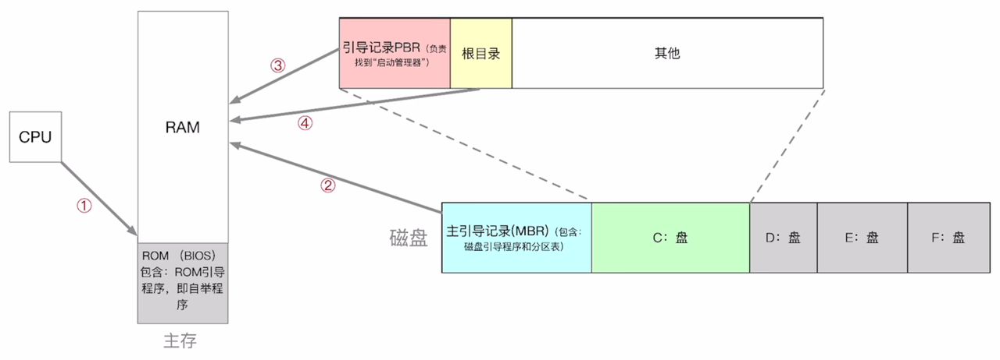
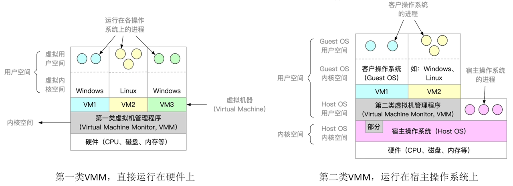

# 系统概述

---

---

## 一、操作系统基本概念

### 1.操作系统定义

操作系统（Operating System，OS）是指控制和管理整个计算机系统的硬件和软件资源，并合理地组织调度计算机的工作和资源的分配；以提供给用户和其他软件方便的接口和环境；它是计算机系统中最基本的系统软件。

:::info

**操作系统关注的是内核（Kernel），内核是一段始终运行在内存中的代码，拥有访问物理硬件的特殊权限。**

:::

### 2.操作系统特征

#### (1) 并发

并发指两个或多个事件在同一时间间隔内发生。这些事件宏观上是同时发生的，但微观上是交替发生的。 OS的并发性是通过 **分时实现**
的。

- 单核CPU同一时刻只能执行一个程序，各个程序只能并发地执行
- 多核CPU同一时刻可以同时执行多个程序，多个程序可以并行地执行

> **并发性：** 两个或多个事件在同一时间间隔内发生。
>
> **并行性：** 两个或多个事件在同一时刻发生，需要硬件支持，如多流水线或多处理机硬件环境。

多道程序环境下，一段时间，宏观上，多道程序同时执行某一时刻，单处理机环境下实际仅有一道程序执行，微观上程序分时交替执行

#### (2) 共享

共享即资源共享，是指系统中的资源可供内存中多个并发执行的进程共同使用。

- 互斥共享方式：系统中的某些资源，虽然可以提供给多个进程使用，但一个时间段内只允许一个进程访问该资源。应用：使用QQ和微信视频。同一时间段内摄像头只能分配给其中一个进程。
- 同时共享方式：系统中的某些资源，允许一个时间段内由多个进程“同时”对它们进行访问。应用：使用QQ发送文件A，同时使用微信发送文件B。宏观上看，两边都在同时读取并发送文件说明两个进程都在访问硬盘资源，从中读取数据。微观上看，两个进程是交替着访问硬盘的。

所谓的“同时”往往是宏观上的，而在微观上，这些进程可能是交替地对该资源进行访问的（即分时共享）

:::info

**并发和共享是操作系统两个最基本的特征，两者之间互为存在的条件：**

- 资源共享是以程序的并发为条件的，若系统不允许程序并发执行，则自然不存在资源共享问题
- 若系统不能对资源共享实施有效的管理，则必将影响到程序的并发执行，甚至根本无法并发执行

:::

#### (3) 虚拟

虚拟是指把一个物理上的实体变为若干个逻辑上的对应物。物理实体（前者）是实际存在的，而逻辑上对应物（后者）是用户感受到的。

- 虚拟处理器：通过时分复用技术，让多道程序并发执行的方法，来分时使用一个处理器的。虽然只有一个处理器，但它能同时为多个用户服务，使每个终端用户都感觉有一个中央处理器（CPU）在专门为它服务。
- 虚拟存储器：通过空分复用技术，将一台机器的物理存储器变为虚拟存储器，以便从逻辑上扩充存储器的容量。当然，这时用户所感觉到的内存容量是虚的。
- 虚拟I/O设备：采用虚拟设备技术将一台物理I/O设备虚拟为多台逻辑上的I/O设备，并允许每个用户占用一台逻辑上的I/O设备，使原来仅允许在一段时间内由一个用户访问的设备（即临界资源）变为在一段时间内允许多个用户同时访问的共享设备。

#### (4) 异步

在多道程序环境下，允许多个程序并发执行，但由于资源有限，进程的执行不是一贯到底的，而是走走停停，以不可预知的速度向前推进，这就是进程的异步性。

---

### 3.操作系统功能

为了给多道程序提供良好的运行环境，操作系统应具有以下几方面的功能：处理机管理、存储器管理、设备管理和文件管理。为了方便用户使用操作系统，还必须向用户提供接口。同时，操作系统可用来扩充机器，以提供更方便的服务、更高的资源利用率。

#### (1) 操作系统是系统资源的管理者

- 处理机管理：即对进程的管理，包括进程控制、进程同步、进程通信、死锁处理、处理机调度等。
- 存储器管理：方便程序运行、用户使用及提高内存的利用率，包括内存分配与回收、地址映射、内存保护与共享和内存扩充等功能。
- 文件管理：计算机中的信息都是以文件的形式存在的，操作系统中负责文件管理的部分称为文件系统。文件管理包括文件存储空间的管理、目录管理及文件读写管理和保护等。
- 设备管理：设备管理的主要任务是完成用户的I/O请求，方便用户使用各种设备，并提高设备的利用率，主要包括缓冲管理、设备分配、设备处理和虚拟设备等功能。

#### (2) 向上层提供方便易用的服务

- 命令接口：用户利用这些操作命令来组织和控制作业的执行。
- 联机命令接口：即交互式命令接口，适用于分时或实时系统。 “雇主”说一句话，“工人”做一件事，并做出反馈，这就强调了交互性。
- 脱机命令接口：即批处理命令接口，适用于批处理系统。“雇主”把要“工人”做的事写在清单上，“工人”按照清单命令逐条完成这些事，这就是批处理。
- 程序接口：程序接口由一组系统调用（也称广义指令）组成。是为编程人员提供的接口。普通用户不能直接使用程序接口，只能通过程序代码间接使用。用户通过在程序中使用系统调用命令请求OS为其提供服务。系统调用命令又称广义指令。
- GUl：图形化用户接口（Graphical User Interface）。用户可以使用形象的图形界面进行操作，而不再需要记忆复杂的命令、参数。

#### (3) 最接近硬件的一层软件

裸机：没有任何软件支持的计算机称为裸机，它仅构成计算机系统的物质基础。在裸机上安装的操作系统，可以提供资源管理功能和方便用户的服务功能，将裸机改造成功能更强、使用更方便的机器。

通常把覆盖了软件的机器成为扩充机器，又称之为虚拟机。

---

## 二、操作系统发展历程

---

## 三、操作系统运行环境

### 1.处理器运行模式

#### (1) CPU运行状态

在计算机系统中，通常CPU执行两种不同性质的程序：

- 操作系统内核程序：是用户自编程序的管理者，“管理程序”（即内核程序）要执行一些特权指令。
- 用户自编程序：即系统外层的应用程序，或简称“应用程序”，“被管理程序”（即用户自编程序）出于安全考虑不能执行这特权指令。

**特权指令和非特权指令**

- 特权指令：是指不允许用户直接使用的指令，如/O指令、置中断指令，存取用于内存保护的寄存器、送程序状态字到程序状态字寄存器等的指令。
- 非特权指令：是指允许用户直接使用的指令，它不能直接访问系统中的软硬件资源，仅限于访问用户的地址空间，这也是为了防止用户程序对系统造成破坏。

**CPU有两种运行状态，【内核态】（核心态、管态）和【用户态】（目态）**

- 用户态（目态）：CPU处于用户态，此时CPU只能执行非特权指令。
- 核心态（又称管态、内核态）：CPU处于核心态，此时CPU可以执行特权指令，切换到用户态的指令也是特权指令。

> CPU 中有一个寄存器PSW（程序状态字寄存器），其中有一个二进制位，1标识【内核态】、0标识【用户态】。
> 
> **应用程序运行在用户态，操作系统内核程序运行在核心态。**
> 
> - 内核态一>用户态：一条修改PSW的特权指令 
> - 用户态一>内核态：应用程序向操作系统请求服务时通过使用访管指令，从而产生一个中断事件将操作系统转换为核心态。

#### (2) 分层管理

一些与硬件关联较紧密的模块，如时钟管理、中断处理、设备驱动等处于最低层。其次是运行频率较高的程序，如进程管理、存储器管理和设备管理等。这两部分内容构成了操作系统的内核。这部分内容的指令操作工作在核心态。

#### (3) 操作系统内核功能

内核（Kernel）是计算机上配置的底层软件，它管理着系统的各种资源，可以看作是连接应用程序和硬件的一座桥梁。由很多内核程序组成操作系统内核。

**时钟管理** 

- 计时：是时钟的第一功能，操作系统需要通过时钟管理，向用户提供标准的系统时间。 
- 进程切换：通过时钟中断的管理实现。

> 例如，在分时操作系统中采用时间片轮转调度，在实时系统中按截止时间控制运行，在批处理系统中通过时钟管理来衡量一个作业的运行程度等。

**中断机制**

中断作用： 让操作系统内核强行夺回CPU的控制权，使CPU从用户态变为内核态。引入原因：提高多道程序运行环境中CPU的利用率。

> **现代操作系统是靠中断驱动的软件**

**原语**

由若干条指令组成的，用于完成一定功能的一个过程。特点：

- 处于操作系统的最底层，是最接近硬件的部分。 
- 这些程序的运行具有原子性，其操作只能一气呵成（出于系统安全性和便于管理考虑）。 
- 这些程序的运行时间都较短，而且调用频繁。

定义原语的直接方法是关闭中断，让其所有动作不可分割地完成后再打开中断。系统中的设备驱动、CPU切换、进程通信等功能中的部分操作都可定义为原语，使它们成为内核的组成部分。

**系统控制的数据结构及处理**

系统中用来登记状态信息的数据结构很多，如作业控制块、进程控制块（PCB）、设备控制块、各类链表、消息队列、缓冲区、空闲区登记表、内存分配表等。为了实现有效的管理，系统需要一些基本的操作，常见的操作有以下3种：

- 进程管理。进程状态管理、进程调度和分派、创建与撤销进程控制块等。 
- 存储器管理。存储器的空间分配和回收、内存信息保护程序、代码对换程序等。 
- 设备管理。缓冲区管理、设备分配和回收等。

核心态指令实际上包括系统调用类指令和一些针对时钟、中断和原语的操作指令。

### 2.中断与异常概念

#### (1) 中断作用

让操作系统内核强行夺回CPU的控制权；使CPU从用户态变为内核态。

> 中断是让操作系统内核重新获取到CPU使用权的唯一途径。

#### (2) 中断和异常的分类

**异常：又称内中断，指来自CPU执行指令内部的事件，如程序的非法操作码、地址越界、运算溢出、虚存系统的缺页及专门的陷入指令等引起的事件。**

- 故障（Fault）通常是由指令执行引起的异常，如非法操作码、缺页故障、除数为0、运算溢出等。
- 自陷（Trap）是一种事先安排的“异常”事件，用于在用户态下调用操作系统内核程序，如条件陷阱指令。
- 终止（Abort）是指出现了使得CPU无法继续执行的硬件故障，如控制器出错、存储器校验错等。

> 有时候应用程序想请求操作系统内核的服务，此时会执行一条特殊的指令（trap陷入指令），该指令会引发一个内部的中断信号。（trap陷入指令-非特权指令）

**中断：又称外中断，指来自CPU执行指令外部的事件，通常用于信息输入/输出，如I/O中断，时钟中断。**

- 可屏蔽中断：指通过INTR线发出的中断请求，通过改变屏蔽字可以实现多重中断，从而使得中断处理更加灵活。 
- 不可屏蔽中断：指通过NMI线发出的中断请求，通常是紧急的硬件故障，如电源掉电等。此外，异常也是不能被屏蔽的。

故障异常和自陷异常属于软件中断（程序性异常），终止异常和外部中断属于硬件中断。异常不能被屏蔽，一旦出现，就应立即处理。

#### (3) 中断和异常的处理过程

当CPU在执行用户程序的第i条指令时检测到一个异常事件，或在执行第i条指令后发现一个中断请求信号，则CPU打断当前的用户程序，然后转到相应的中断或异常处理程序去执行。

若中断或异常处理程序能够解决相应的问题，则在中断或异常处理程序的最后，CPU通过执行中断或异常返回指令，回到被打断的用户程序的第i条指令或第i+1条指令继续执行

返回第i+1条指令：由自陷（Trap）引起的内中断；如系统调用。由外部设备引起的外中断，如键盘返回第i条指令：由故障（Fault）引起的内中断；如缺页等。

若中断或异常处理程序发现是不可恢复的致命错误，则终止用户程序。通常情况下，对中断和异常的具体处理过程由操作系统（和驱动程序）完成。

#### (4) 中断机制的基本原理：

不同的中断信号，需要使用不同的中断处理程序来处理。当CPU检测到中断信号后，会根据中断信号的类型取查询【中断向量表】，以此来找到相应的中断处理程序在内存中的存放位置。

---

### 3.系统调用

系统资源共享：由操作系统内核对共享资源进行统一管理，并向上层应用提供【系统调用】，用户程序想要使用共享资源，只能通过【系统调用】向操作系统内核发出请求。由操作系统内核进行各个请求之间资源的协调。

---

## 四、操作系统结构

---

## 五、操作系统引导

- BIOS 程序（Basic Input/Output System）：BIOS 是固化在主板上的基本输入输出系统，是计算机启动第一个运行的软件，存放在ROM中。它会进行硬件初始化和自检，然后查找引导程序并执行。 
- 引导程序（Boot）：引导程序是存储在主存ROM中的一段小程序，它的作用是将操作系统的内核文件从硬盘中读取到内存中，并跳转到内核入口点开始执行。 
- 主引导记录（MBR）：MBR是硬盘的主引导记录，位于硬盘的第一个扇区。它包含了磁盘引导程序和分区表。该引导程序会找到活动分区并读取其分区引导记录，完成硬盘的引导。 
- 分区引导记录（PBR）：PBR是分区引导记录，位于每个分区的第一个扇区。PBR中包含了一个引导程序，可以寻找并激活分区根目录下的启动管理器，完成分区的引导过程。

1. CPU从一个特定主存地址开始，取指令，执行ROM中的引导程序（先进行硬件自检，再开机）
2. 将磁盘的第一块（主引导记录）读入内存，执行磁盘引导程序，扫描分区表
3. 从活动分区（又称主分区，即安装了操作系统的分区）读入分区引导记录，执行其中的程序
4. 从根目录下找到完整的操作系统初始化程序（即启动管理器）并执行，完成“开机”的一系列动作

---

## 六、虚拟机

使用虚拟化技术，将一台物理机器虚拟化为多台虚拟机器（Virtual Machine，VM），每个虚拟机器都可以独立运行一个操作系统。

[//]: # (![babb5d7bec774542a42669e1fd185de3]&#40;01-OverviewOfComputerSystem.assets/babb5d7bec774542a42669e1fd185de3.png&#41;)

### 1.第一类VMM

第一类虚拟机管理程序就像一个操作系统，因为它是唯一一个运行在最高特权级的程序。

它在裸机上运行并且具备多道程序功能。虚拟机管理程序向上层提供若干台虚拟机，这些虚拟机是裸机硬件的精确复制品。由于每台虚拟机都与裸机相同，所以在不同的虚拟机上可以运行任何不同的操作系统。

虚拟内核态：虚拟机作为用户态的一个进程运行，不允许执行敏感指令。然而，虚拟机上的操作系统认为自己运行在内核态（实际上不是），称为虚拟内核态。

---

### 2.第二类VMM

它是一个依赖于Windows、Linux等操作系统分配和调度资源的程序，很像一个普通的进程。如VMWare Workstation。

对于第二类虚拟机管理程序，运行在底层硬件上的操作系统称为宿主操作系统；运行在虚拟机管理程序上的操作系统称为客户操作系统。

首次启动时，第二类虚拟机管理程序像一台刚启动的计算机那样运转，期望找到的驱动器可以是虚拟设备。然后将操作系统安装到虚拟磁盘上（其实只是宿主操作系统中的一个文件）。客户操作系统安装完成后，就能启动并运行。

---

|  第一类VMM   |                          第二类VMM                           |                                                                   |
|:---------:|:---------------------------------------------------------:|-------------------------------------------------------------------|
| 对物理资源的控制权 |                  直接运行在硬件之上，能直接控制和分配物理资源                   | 运行在Host OS之上，依赖于Host OS为其分配物理资源                                   |
|  资源分配方式   | 在安装Guest OS时，VMM要在原本的硬盘上自行分配存储空间，类似于"外核“的分配方式，分配未经抽象的物理硬件 | GuestOs拥有自己的虚拟磁盘，该盘实际上是HostOs文件系统中的一个大文件。GuestOs分配到的内存是虚拟内存       |
|    性能     |                           性能更好                            | 性能更差，需要Host Os作为"中介”                                              |
| 可支持的虚拟机数量 |           更多，不需要和Host OS竞争资源，相同的硬件资源可以支持更多的虚拟机            | 更少，Host Os本身需要使用物理资源，Host OS上运行的其他进程也需要物理资源                       |
| 虚拟机的可迁移性  |                            更差                             | 更好，只需导出虚拟机镜像文件即可迁移到另一台Host Os上，商业化应用更广泛                           |
|   运行模式    |            第一类VMM运行在最高特权级（Ring 0），可以执行最高特权的指令。            | 第二类VMM部分运行在用户态、部分运行在内核态。GuestOs发出的系统调用会被VMM截获，并转化为VMM对Hostos的系统调用 |

