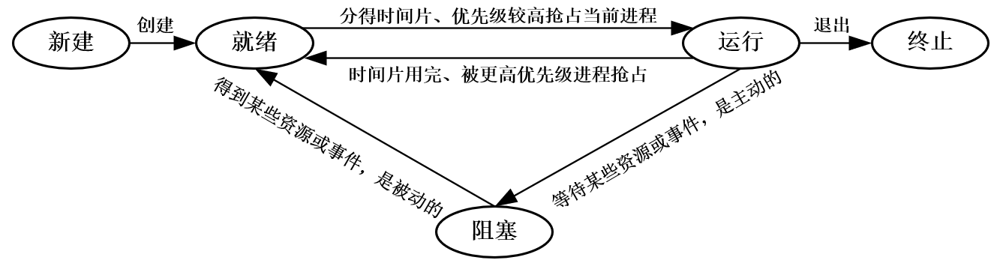

# 进程与线程

---

## 一、进程与线程

### 1.进程的概念和特征

### 2.进程的状态与转换

| 进程状态 | 描述                                                       |
| -------- | ---------------------------------------------------------- |
| 创建状态 | 分配进程标识符并申请PCB—-分配资源—-初始化PCB—-插入就绪队列 |
| 就绪状态 | 已分配到除CPU外的所有必要资源                              |
| 执行状态 | 单CPU中同一时刻只能有一个进程在执行                        |
| 阻塞状态 | 等待某一事件（通常是等待输入输出完成，比如等待打印机空闲） |
| 终止状态 | 操作系统善后处理—-PCB清零并返还系统                        |
| 挂起操作 | 为了系统和用户观察分析进程。                               |

在操作系统中，挂起原语（Suspend）和激活原语（Activate）与挂起状态（Suspended State）的关系是管理进程生命周期的一部分。

- 挂起原语（Suspend）： 挂起原语是操作系统中用于将进程从运行状态或就绪状态转换到挂起状态的一个系统调用或操作。当一个进程被挂起时，它通常会释放所占用的资源，并且其状态会被设置为挂起状态。挂起状态意味着进程不会被操作系统调度执行，直到它被激活或者被终止。

- 激活原语（Activate）： 激活原语与挂起原语相反，它用于将处于挂起状态的进程恢复到就绪状态。当进程被激活时，它的状态会被设置为就绪，这意味着它可以被操作系统调度执行，只要它满足执行条件（如没有更高的优先级进程正在执行）。

- 挂起状态（Suspended State）： 挂起状态是进程可以进入的一种状态，当进程被挂起原语操作时，它就会进入这种状态。在挂起状态下，进程不会消耗CPU资源，也不会执行任何操作，直到它被激活。挂起状态通常用于暂停进程以便进行维护、调试或等待某些事件（如等待I/O操作完成）。

总结来说，挂起原语和激活原语是操作系统用来控制进程状态转换的工具，而挂起状态则是进程在这些转换中可能经历的一种状态。通过这些操作，操作系统能够灵活地管理进程，以满足用户和系统的需求。

### 3.进程的组织

---

## 二、处理机调度

---

## 三、同步与互斥

---

## 四、死锁

