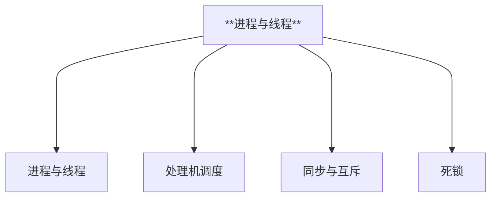

# 进程与线程

---

---

## 一、进程与线程

### 1.进程的概念和特征

#### (1) 进程的概念

**进程的概念：进程是进程实体的运行过程，是系统进行资源分配和调度的一个独立单位。**

> 进程实现操作系统的并发性和共享性。

- 程序：是静态的，就是个存放在磁盘里的可执行文件，如：QQ.exe。 
- 进程：是动态的，是程序的一次执行过程，或者是一个正在运行的程序，如：可同时启动多次QQ程序。 
- 进程实体：即进程映像，是静态的，可理解为进程的一次时刻的状态。 
- 作业：用户向计算机提交的一项任务，是静态的，它通常是一个批处理程序或一个后台程序。

#### (2) 进程实体组成

**进程实体主要有如下三部分组成：程序控制块PCB、程序段、数据段**

**程序控制块PCB：** PCB是进程存在的唯一标志，当进程被创建时，操作系统为其创建PCB，当进程结束时，会回收其PCB。

- 进程描述信息
  - 进程标识符PID：当进程被创建时，操作系统会为该进程分配一个唯一的、不重复的“身份证号”--PID（Process ID，进程ID）
  - 用户标识符UID

- 进程控制和管理信息 
  - CPU、磁盘、网络流量使用情况统计...
  - 进程当前状态：就绪态/阻塞态/运行态.… 

- 资源分配清单
  - 正在使用哪些文件 
  - 正在使用哪些内存区域 
  - 正在使用哪些I/O设备 

- 处理机相关信息（CPU现场信息）：如PSW、PC等等各种寄存器的值（用于实现进程切换）

> ① PCB，即进程控制块，操作系统需要对各个并发运行的进程进行管理， 但凡管理时所需要的信息，都会被放在 PCB 中。 
> 
> ② PCB 是进程存在的唯一标志。
> 
> ③ PCB 存于内存的内核区，注意内存的内核区和 OS 的内核态的区别，内核程序运行在内核态。

**程序段：** 程序的代码（指令序列）

**数据段：** 运行过程中产生的各种数据（如：程序中定义的变量）

> ① PCB 是给操作系统用的，程序段和数据段是给进程自己用的。 
> 
> ② 引入进程实体的概念后，可把进程定义为是进程实体的运行过程，是系统进行资源分配和调度的一个独立单位。

#### (3) 进程的特征

- 动态性：进程是程序的一次执行过程，是动态地产生、变化和消亡的；动态性是进程最基本的特征。 
- 并发性：内存中有多个进程实体，各进程可并发执行
- 独立性：进程是能独立运行、独立获得资源、独立接受调度的基本单位
- 异步性：各进程按各自独立的、不可预知的速度向前推进，异步性会导致并发程序执行结果的不确定性。
- 结构性：每个进程都会配置一个PCB。结构上看，进程由程序段、数据段、PCB组成

---

### 2.进程的状态与转换

#### (1) 进程的基本状态

- 创建态。进程正在被创建，尚未转到就绪态。OS为进程分配系统资源、初始化PCB。

> 首先申请一个空白PCB，并向PCB中填写用于控制和管理进程的信息，
> 然后为该进程分配运行时所必须的资源，
> 最后把该进程转入就绪态并插入就绪队列， 
> 但是，如果进程所需的资源尚不能得到满足，如内存不足，则创建工作尚未完成，进程此时所处的状态称为创建态。

- 运行态。占有CPU，并在CPU上运行；√CPU√其他所需资源 
- 就绪态。已具有运行条件，但无空闲CPU，暂时不能运行；×CPU√其他所需资源。系统中处于就绪状态的进程可能有多个，通常将它们排成一个队列，称为就绪队列。 
- 阻塞态，又称等待态。因等待某一事件暂时不能运行；×CPU×其他所需资源。系统通常将处于阻塞态的进程也排成一个队列，甚至根据阻塞原因的不同，设置多个阻塞队列。
- 终止态。进程正从系统中消失，进程正常结束或其他原因退出运行。OS回收进程拥有的资源，撤销PCB。

#### (2) 进程的状态转换

> - 就绪态一>运行态：进程被调度 
> - 运行态一>就绪态：时间片到 or CPU被其他进程抢占 
> - 运行态一>阻塞态：等待系统资源分配or等待某事件发生（主动行为） 
> - 阻塞态一>就绪态：资源分配到位，等待的事件发生（被动行为） 
> - 创建态一>就绪态：系统完成创建进程相关的工作 
> - 运行态一>终止态：进程运行结束 or 运行过程中遇到不可修复的错误

| 进程状态 | 描述                                                       |
| -------- | ---------------------------------------------------------- |
| 创建状态 | 分配进程标识符并申请PCB—-分配资源—-初始化PCB—-插入就绪队列 |
| 就绪状态 | 已分配到除CPU外的所有必要资源                              |
| 执行状态 | 单CPU中同一时刻只能有一个进程在执行                        |
| 阻塞状态 | 等待某一事件（通常是等待输入输出完成，比如等待打印机空闲） |
| 终止状态 | 操作系统善后处理—-PCB清零并返还系统                        |
| 挂起操作 | 为了系统和用户观察分析进程。                               |

在操作系统中，挂起原语（Suspend）和激活原语（Activate）与挂起状态（Suspended State）的关系是管理进程生命周期的一部分。

- 挂起原语（Suspend）： 挂起原语是操作系统中用于将进程从运行状态或就绪状态转换到挂起状态的一个系统调用或操作。当一个进程被挂起时，它通常会释放所占用的资源，并且其状态会被设置为挂起状态。挂起状态意味着进程不会被操作系统调度执行，直到它被激活或者被终止。

- 激活原语（Activate）： 激活原语与挂起原语相反，它用于将处于挂起状态的进程恢复到就绪状态。当进程被激活时，它的状态会被设置为就绪，这意味着它可以被操作系统调度执行，只要它满足执行条件（如没有更高的优先级进程正在执行）。

- 挂起状态（Suspended State）： 挂起状态是进程可以进入的一种状态，当进程被挂起原语操作时，它就会进入这种状态。在挂起状态下，进程不会消耗CPU资源，也不会执行任何操作，直到它被激活。挂起状态通常用于暂停进程以便进行维护、调试或等待某些事件（如等待I/O操作完成）。

总结来说，挂起原语和激活原语是操作系统用来控制进程状态转换的工具，而挂起状态则是进程在这些转换中可能经历的一种状态。通过这些操作，操作系统能够灵活地管理进程，以满足用户和系统的需求。

### 3.进程的组织方式

**链接方式：链接方式是将同一状态的进程的PCB组成一个双向链表，称为进程队列。**

- 结构：每个队列的队首和队尾都有一个指针，指向第一个和最后一个PCB。每个PCB中也有两个指针，分别指向前一个和后一个PCB。这样，就可以方便地在队列中插入或删除PCB。 
- 优点：简单、灵活 
- 缺点：查找效率低，需要遍历链表

**索引方式：索引方式是将所有的PCB存放在一张索引表中，每个表项包含一个PCB的地址和状态信息。**

- 结构：索引表可以是顺序表或散列表，可以按照进程号或其他关键字进行排序或散列。
- 优点：查找效率高，可以快速定位到某个PCB
- 缺点：需要额外的空间存储索引表，且索引表的大小受限于内存容量

### 4.进程控制

**进程控制就是要实现进程状态的转换，通过原语实现。**

### 5.进程通信

### 6.线程和多线程模型

---

## 二、处理机调度

处理机调度是对处理机进行分配，即从就绪队列中按照一定的算法（公平、高效的原则）去选择一个进程并将处理机分配给它运行，以实现进程并发地执行。

### 1.三层调度

一个作业从提交开始直到完成，要经历以下三级调度：

#### (1) 高级调度（作业调度）

内存空间有限时，无法将用户提交的作业全部放入内存，需要按一定的原则从外存的作业 **后备队列** 中挑选一个作业调入内存，并创建进程。

:::info

每个作业只调入一次，调出一次（不会在未调出前多次调入，也不会在调出之后重复调出）。作业调入时会建立PCB，调出时才撤销PCB。（作业：一个具体的任务）

:::

多道批处理系统中大多配有作业调度，而其他系统中通常不需要配置作业调度。（发生频率最低 外存→内存（面向作业））

##### (2) 中级调度（内存调度）

内存不够时，可将某些进程的数据调出外存。等内存空闲或者进程需要运行时，按照某种策略从 挂起队列 中选择合适的进程重新调入内存。

:::info

暂时调到外存等待的进程状态为挂起状态。被挂起的进程PCB会被组织成挂起队列。（外存→内存（面向进程））

:::

#### (3) 低级调度（进程调度）

在内存中的按照某种策略从 就绪队列 中选取一个进程，将处理机分配给它。（发生频率高 内存→CPU）

### 2.三层调度关系

#### (1) 进程七种状态模型

#### (2) 三层调度对比

|                       |                        要做什么                         |        在哪调度        | 发生频率 |        对进程状态影响         |
| :-------------------: | :-----------------------------------------------------: | :--------------------: | :------: | :---------------------------: |
| 高级调度 （作业调度） | 从后备队列中选择合适的作业 将其调入内存，并为其创建进程 |  外存→内存 (面向作业)  |   最低   |       无→创建态→就绪态        |
| 中级调度 （内存调度） |       从挂起队列中选择合适的进程 将其数据调回内存       | 外存→内存 （面向进程） |   中等   | 挂起态→就绪态 阻塞挂起→阻塞态 |
| 低级调度 （进程调度） |         从就绪队列中选择一个进程 为其分配处理机         |        内存→CPU        |   最高   |         就绪态→运行态         |

#### (3) 三层调度关联

- 作业调度为进程活动做准备，进程调度使进程正常活动起来。 
- 中级调度将暂时不能运行的进程挂起，中级调度处于作业调度和进程调度之间。 
- 作业调度次数少，中级调度次数略多，进程调度频率最高。 
- 进程调度是最基本的，不可或缺。

---

### 3.调度目标

---

## 三、同步与互斥

---

## 四、死锁

