# 内存管理

---

## 一、内存管理概念

虽然计算机技术飞速发展，内存容量也在不断扩大，但仍然不可能将所有用户进程和系统所需的全部程序与数据放入内存，因此操作系统对内存空间进行合理的划分和有效的动态分配。操作系统对内存的划分和动态分配，就是内存管理的概念。

### 1.什么是内存？

内存可以存放数据。程序执行前需要先放到内存中才能被CPU处理（缓和CPU和硬盘之间的速度矛盾）

**内存空间的主要功能有：**

- ① 内存空间的分配与回收：OS 要怎么记录哪些内存区域已经被分配出去了，哪些又还空闲；当进程运行结束之后，如何将进程占用的内存空间回收。 
- ② 内存空间的扩充：OS 利用虚拟内存技术或自动覆盖技术使得系统运行很大的程序，从逻辑上扩充内存。 
- ③ 地址转换：为了使编程更方便，程序员写程序时应该只需要关注指令、数据的逻辑地址。而 逻辑地址到物理地址的转换（这个过程称为地址重定位）应该由操作系统负责，其中地址重定位有三种方式。 
- ④ 内存保护：保证各进程在各自存储空间内运行，互不干扰。

:::info

如果计算机按字节（Byte）编指，则每个存储单元的大小为1字节（1Byte），即8个二进制位。

如果字长为16位的计算机按字编织，则每个存储单元的大小为1个字；每个字的大小为16个二进制位。

:::

---

### 2.程序的执行过程

#### (1) 指令的工作原理

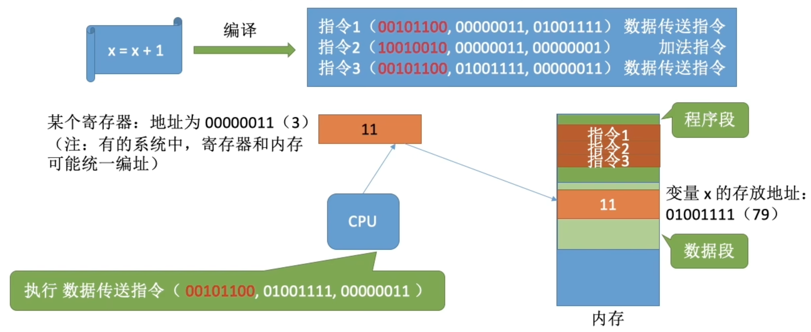

我们写的代码要翻译成CPU能识别的指令，这些指令会告诉CPU应该去内存的哪个地址读/写数据，这个数据应该做什么样的处理。在这个例子中，我们默认让这个进程的相关内容从地址`#0`开始连续存放，指令中的地址参数直接给出了变量`×`的实际存放地址（物理地址）。

**逻辑地址（相对地址）：** 程序经过编译、链接后生成的指令中指明的是逻辑地址（相对地址)，即：相对于进程的起始地址而言的地址。

#### (2) 程序链接的三种方式

- **静态链接：** 在程序运行之前，先将各目标模块及它们所需的库函数连接成一个完整的可执行文件（装入模块），之后不再拆开
- **装入时动态链接：** 将各目标模块装入内存时，边装入边链接的链接方式。
- **运行时动态链接：** 在程序执行中需要该目标模块时，才对它进行链接。其优点是便于修改和更新，便于实现对目标模块的共享。

#### (3) 程序装入的三种方式

- **绝对装入：** 在编译时，如果知道程序将放到内存中的哪个位置，编译程序将产生绝对地址的目标代码。装入程序按照装入模块中的地址，将程序和数据装入内存。
- **静态重定位：** 又称可重定位装入。编译、链接后的装入模块的地址都是从0开始的，指令中使用的地址、数据存放的地址都是相对于起始地址而言的逻辑地址。可根据内存的当前情况，将装入模块装入到内存的适当位置。装入时对地址进行“重定位”，将逻辑地址变换为物理地址（地址变换是在装入时一次完成的)。
- **动态运行时装入：** 又称动态运行时装入。编译、链接后的装入模块的地址都是从0开始的。装入程序把装入模块装入内存后，并不会立即把逻辑地址转换为物理地址，而是把地址转换推迟到程序真正要执行时才进行。因此装入内存后所有的地址依然是逻辑地址。这种方式需要一个重定位寄存器的支持。

#### (4) 从写程序到程序运行

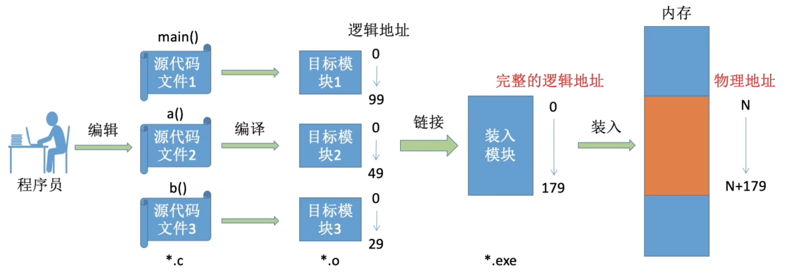

- **编译：** 由编译程序将用户源代码编译成若干个目标模块（编译就是把高级语言翻译为机器语言）
- **链接：** 由链接程序将编译后形成的一组目标模块，以及所需库函数链接在一起，形成一个完整的装入模块
- **装入（装载）：** 由装入程序将装入模块装入内存运行

---

## 内存空间的分配与回收

1. 操作系统负责内存空间的分配与回收。
2. 操作系统需要提供某种技术从逻辑上对内存空间进行扩充。
3. 操作系统需要提供地址转换功能，负责程序的逻辑地址与物理地址的转换。

> 为了使编程更方便，程序员写程序时应该只需要关注指令、数据的逻辑地址。而 **逻辑地址到物理地址的转换（这个过程称为地址重定位）** 应该由操作系统负责，这样就保证了程序员写程序时不需要关注物理内存的实际情况。

4. 操作系统需要提供内存保护功能。保证各进程在各自存储空间内运行，互不干扰

---

## 进程的内存映像

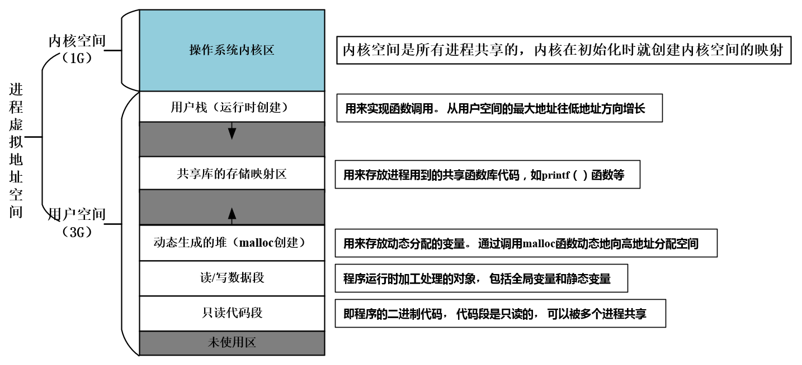

> 宏定义的常量不专门分配存储空间，在预编译阶段会讲代码中的宏定义替换为具体指定的值。

---

## 覆盖与交换

### 覆盖技术

覆盖技术的思想：将程序分为多个段（多个模块）。常用的段常驻内存，不常用的段在需要时调入内存。

内存中分为一个“固定区”和若干个“覆盖区”。需要常驻内存的段放在“固定区”中，调入后就不再调出（除非运行结束）

### 交换技术

交换（对换）技术的设计思想：内存空间紧张时，系统将内存中某些进程暂时换出 **外存** ，把外存中某些已具备运行条件的进程 **换入** 内存（进程在内存与磁盘间动态调度）。

暂时换出外存等待的进程状态为挂起状态（挂起态， `suspend` ），挂起态又可以进一步细分为 **就绪挂起** 、 **阻塞挂起** 两种状态。

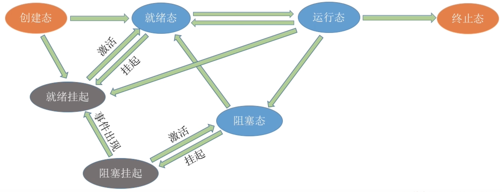

---

## ⚠️ 连续分配管理方式

连续分配方式是指为一个用户程序分配一个连续的内存空间。

### 单一连续分配

### 固定分区分配

### 动态分区分配

动态分区分配又称为可变分区分配。这种分配方式不会预先划分内存分区，而是在进程装入内存时，根据进程的大小动态地建立分区，并使分区的大小正好适合进程的需要。因此系统分区的大小和数目是可变的。

**动态分区分配没有内部碎片，但是有外部碎片。**

- 内部碎片，分配给某进程的内存区域中，如果有些部分没有用上。
- 外部碎片，是指内存中的某些空闲分区由于太小而难以利用。

### 🔴 动态分区分配算法

---

## ⚠️  基本分页存储管理

### 分页存储

将 **内存空间（物理内存空间）** 分为一个个 **大小相等的分区** （比如：每个分区4KB），每个分区就是一个页框（页框、页帧、内存块、物理块、物理页面）。每个页框有一个编号，即页框号（页框号、页帧号、内存块号、物理块号、物理页面号），页框号从0开始。

将进程的 **逻辑地址空间** 也分为与页框大小相等的一个个部分，每个部分称为一个页或者页面。每个页页有一个编号，即页号，页号也是从0开始。

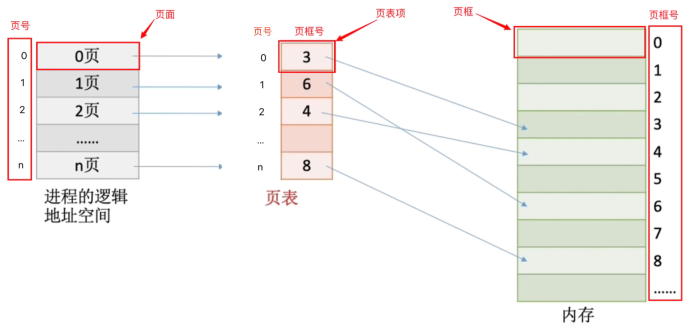

操作系统以页框为单位为各个进程分配内存空间。进程的每个页面分别放入一个页框中。也就是说，进程的页面与内存的页框有一一对应的关系。

各个页面不必连续存放，可以存放到不相邻的各个页框中。

### 页表寄存器

基本地址变换机构可以借助进程的页表将逻辑地址转换为物理地址。通常会在系统中设置一个 **页表寄存器（PTR）** ，存放页表在内存中的起始地址F和页表长度M。进程未执行时，页表的始址和页表长度放在进程控制块（PCB）中，当进程被调度时，操作系统内核会把它们放到页表寄存器中。

**如何确定一个逻辑地址对应的页号、页内偏移量？**

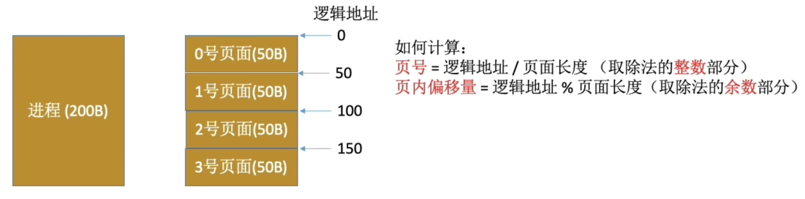

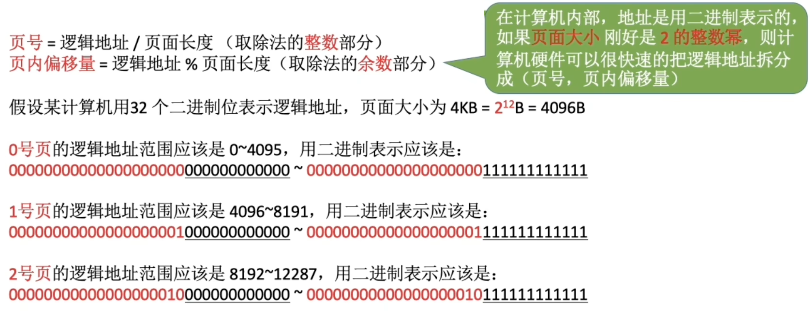

如果页面大小为 `2^k` B，用二进制数表示逻辑地址，则末尾`k`位即为页内偏移量，其余部分就为页号。

如果页面大小为 `2^k` B（2的整数幂），则只需要把页表中记录的物理块号拼接上页内偏移量就能得到对应的物理地址。

### 逻辑地址结构

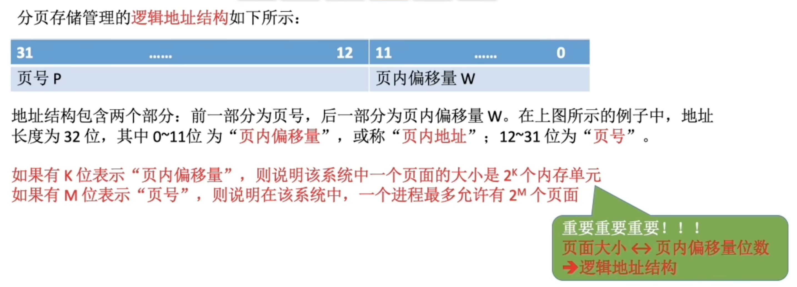

### 基本地址变换

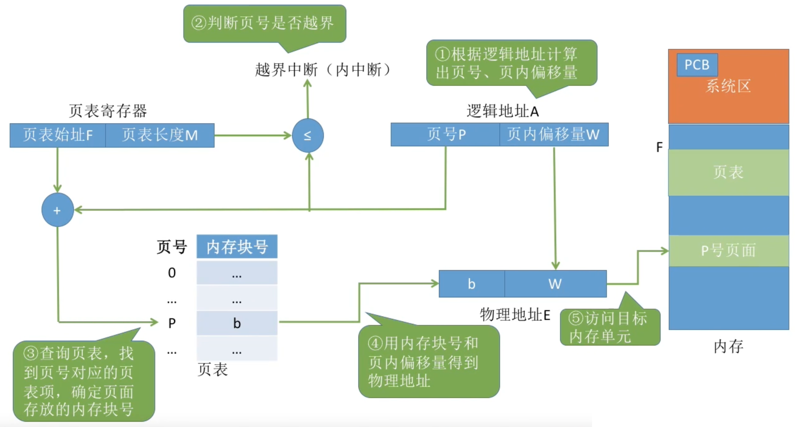

### 快表

### 两级页表

可将长长的页表进面大小4KB，每个页表项4B，每个页面可存放1K个页表项，因此每1K个连续的页表项为一组，每组刚好占一个内存块，再讲各组离散地放到各个内存块中）另外，要为离散分配的页表再建立一张页表，称为页目录表，或称外层页表，或称顶层页表。

| 页表级别 | 特点                                                         |
| -------- | ------------------------------------------------------------ |
| 单级页表 | 会产生很多页表，这些页表需要连续存储且进程执行时必须全部调入内存 |
| 二级页表 | 二级页表在进程执行时只需调入一级页表并调入所需页表           |

---

## ⚠️  基本分段存储管理

### 分段存储

进程的地址空间：按照程序自身的逻辑关系划分为若干个段，每个段都有一个段名（在低级语言中，程序员使用段名来编程），每段从0开始编址

内存分配规则：以段为单位进行分配，每个段在内存中占据连续空间，但各段之间可以不相邻。

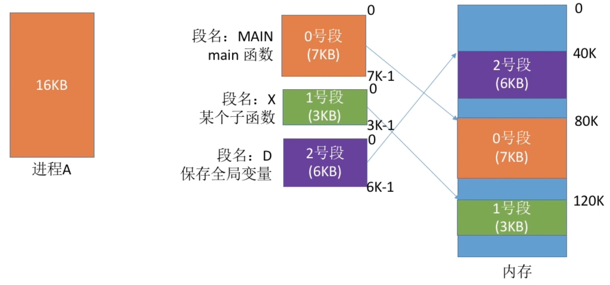

- 段号的位数决定了每个进程最多可以分几个段
- 段内地址位数决定了每个段的最大长度是多少

### 段表

问题：程序分多个段，各段离散地装入内存，为了保证程序能正常运行，就必须能从物理内存中找到各个逻辑段的存放位置。为此，需为每个进程建立一张段映射表，简称“段表”。

---

## ⚠️ 段页式存储管理

|          | 优点                                                   | 缺点                                                         |
| -------- | ------------------------------------------------------ | ------------------------------------------------------------ |
| 分页管理 | 内存空间利用率高，不会产生外部碎片，只会有少量页内碎片 | 不方便按照逻辑模块实现信息的共享和保护                       |
| 分段管理 | 很方便按照逻辑模块实现信息的共享和保护                 | 如果段过长，为其分配很大的连续空间会很不方便。另外，段式管理会产生外部碎片。（分段管理中产生的外部碎片可以用“紧凑”来解决，只是需要付出较大的时间代价） |

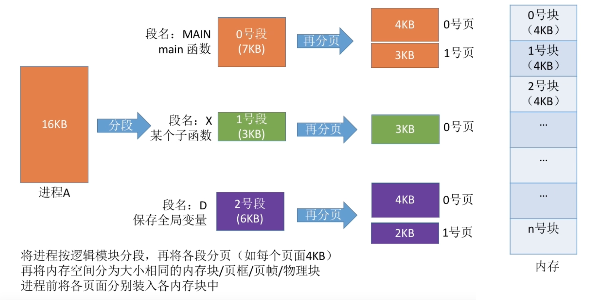

### 段页式地址变换

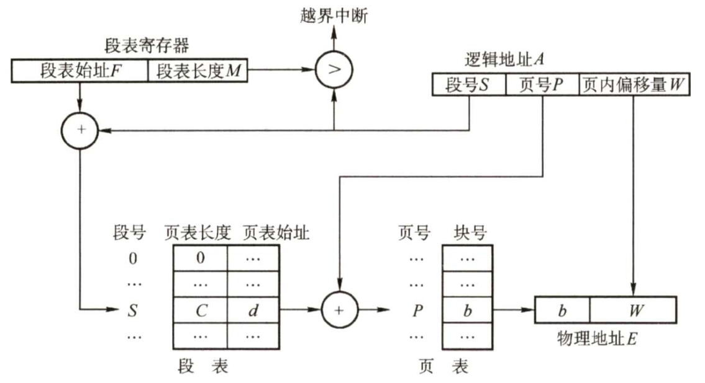

- 地址结构：段号+段内页号+页内地址
- 一个进程中只有一个段表，每个段对应一个页表
- 段表寄存器和页表寄存器都有两个作用：在段表或页表中寻址、判断是否越界

---

## 二、虚拟内存管理

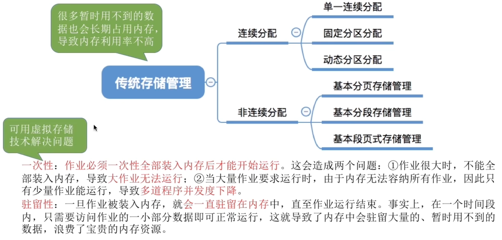

### 局部性原理

- 时间局部性：如果执行了程序中的某条指令，那么不久后这条指令很有可能再次执行：如果某个数据被访问过，不久之后该数据很可能再次被访问。（因为程序中存在大量的循环）
- 空间局部性：一旦程序访问了某个存储单元，在不久之后，其附近的存储单元也很有可能被访问。（因为很多数据在内存中都是连续存放的，并且程序的指令也是顺序地在内存中存放的）

### 虚拟内存

基于局部性原理，在程序装入时，可以将程序中很快会用到的部分装入内存，暂时用不到的部分留在外存，就可以让程序开始执行。

在程序执行过程中，当所访问的信息不在内存时，由操作系统负责将所需信息从外存调入内存，然后继续执行程序。

若内存空间不够，由操作系统负责将内存中暂时用不到的信息换出到外存在操作系统的管理下，在用户看来似乎有一个比实际内存大得多的内存， **这就是虚拟内存** 。

**虚拟内存有三个主要特征：**

- 多次性：无需在作业运行时一次性全部装入内存，而是允许被分成多次调入内存
- 对换性：在作业运行时无需一直常驻内存，而是允许在作业运行过程中，将作业换入、换出。
- 虚拟性：从逻辑上扩充了内存的容量，使用户看到的内存容量，远大于实际的容量。

### 请求分页存储管理

### ⚠️ 页面置换算法

在程序执行过程中，当所访问的信息不在内存时，由操作系统负责将所需信息从外存调入内存，然后继续执行程序。

若内存空间不够，由操作系统负责将内存中暂时用不到的信息换出到外存。

## 内存映射文件

