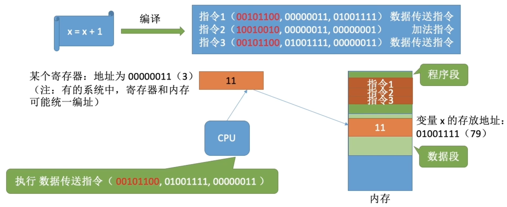
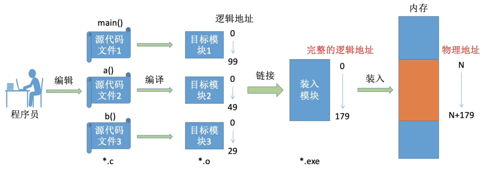
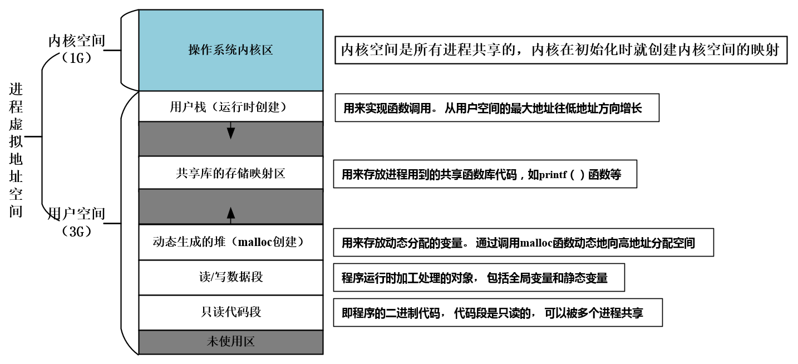
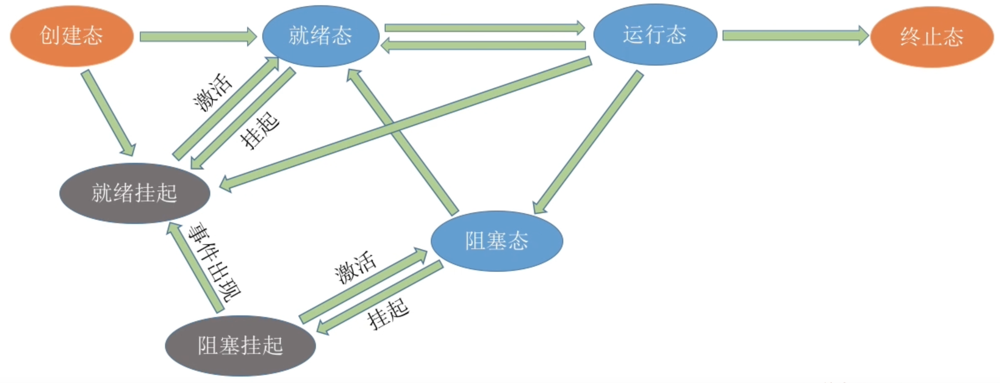

# 内存管理

---

## 内存的基础知识

### 什么是内存？

内存可以存放数据。程序执行前需要先放到内存中才能被CPU处理（缓和CPU和硬盘之间的速度矛盾）

如果计算机按字节（Byte）编指，则每个存储单元的大小为1字节（1Byte），即8个二进制位。

如果字长为16位的计算机按字编织，则每个存储单元的大小为1个字；每个字的大小为16个二进制位。

### 指令的工作原理

我们写的代码要翻译成CPU能识别的指令，这些指令会告诉CPU应该去内存的哪个地址读/写数据，这个数据应该做什么样的处理。在这个例子中，我们默认让这个进程的相关内容从地址`#0`开始连续存放，指令中的地址参数直接给出了变量`×`的实际存放地址（物理地址）。

**逻辑地址（相对地址）：**

程序经过编译、链接后生成的指令中指明的是逻辑地址（相对地址)，即：相对于进程的起始地址而言
的地址。

### 程序链接的三种方式

- **静态链接：** 在程序运行之前，先将各目标模块及它们所需的库函数连接成一个完整的可执行文件（装入模块），之后不再拆开
- **装入时动态链接：** 将各目标模块装入内存时，边装入边链接的链接方式。
- **运行时动态链接：** 在程序执行中需要该目标模块时，才对它进行链接。其优点是便于修改和更新，便于实现对目标模块的共享。

### 程序装入的三种方式

- **绝对装入：** 在编译时，如果知道程序将放到内存中的哪个位置，编译程序将产生绝对地址的目标代码。装入程序按照装入模块中的地址，将程序和数据装入内存。
- **静态重定位：** 又称可重定位装入。编译、链接后的装入模块的地址都是从0开始的，指令中使用的地址、数据存放的地址都是相对于起始地址而言的逻辑地址。可根据内存的当前情况，将装入模块装入到内存的适当位置。装入时对地址进行“重定位”，将逻辑地址变换为物理地址（地址变换是在装入时一次完成的)。
- **动态运行时装入：** 又称动态运行时装入。编译、链接后的装入模块的地址都是从0开始的。装入程序把装入模块装入内存后，并不会立即把逻辑地址转换为物理地址，而是把地址转换推迟到程序真正要执行时才进行。因此装入内存后所有的地址依然是逻辑地址。这种方式需要一个重定位寄存器的支持。

### 从写程序到程序运行

- **编译：** 由编译程序将用户源代码编译成若干个目标模块（编译就是把高级语言翻译为机器语言）
- **链接：** 由链接程序将编译后形成的一组目标模块，以及所需库函数链接在一起，形成一个完整的装入模块
- **装入（装载）：** 由装入程序将装入模块装入内存运行

---

## 内存空间的分配与回收

1. 操作系统负责内存空间的分配与回收。
2. 操作系统需要提供某种技术从逻辑上对内存空间进行扩充。
3. 操作系统需要提供地址转换功能，负责程序的逻辑地址与物理地址的转换。

> 为了使编程更方便，程序员写程序时应该只需要关注指令、数据的逻辑地址。而 **逻辑地址到物理地址的转换（这个过程称为地址重定位）** 应该由操作系统负责，这样就保证了程序员写程序时不需要关注物理内存的实际情况。

4. 操作系统需要提供内存保护功能。保证各进程在各自存储空间内运行，互不干扰

---

## 进程的内存映像

> 宏定义的常量不专门分配存储空间，在预编译阶段会讲代码中的宏定义替换为具体指定的值。

---

## 覆盖与交换

### 覆盖技术

覆盖技术的思想：将程序分为多个段（多个模块）。常用的段常驻内存，不常用的段在需要时调入内存。

内存中分为一个“固定区”和若干个“覆盖区”。需要常驻内存的段放在“固定区”中，调入后就不再调出（除非运行结束）

### 交换技术

交换（对换）技术的设计思想：内存空间紧张时，系统将内存中某些进程暂时换出 **外存** ，把外存中某些已具备运行条件的进程 **换入** 内存（进程在内存与磁盘间动态调度）。

暂时换出外存等待的进程状态为挂起状态（挂起态， `suspend` ），挂起态又可以进一步细分为 **就绪挂起** 、 **阻塞挂起** 两种状态。

---

## ⚠️ 连续分配管理方式

连续分配方式是指为一个用户程序分配一个连续的内存空间。

### 单一连续分配

### 固定分区分配

### 动态分区分配

动态分区分配又称为可变分区分配。这种分配方式不会预先划分内存分区，而是在进程装入内存时，根据进程的大小动态地建立分区，并使分区的大小正好适合进程的需要。因此系统分区的大小和数目是可变的。

**动态分区分配没有内部碎片，但是有外部碎片。**

- 内部碎片，分配给某进程的内存区域中，如果有些部分没有用上。
- 外部碎片，是指内存中的某些空闲分区由于太小而难以利用。

### 🔴 动态分区分配算法

---

## ⚠️  基本分页存储管理

---

## ⚠️  基本分段存储管理

---

## ⚠️ 段页式存储管理

