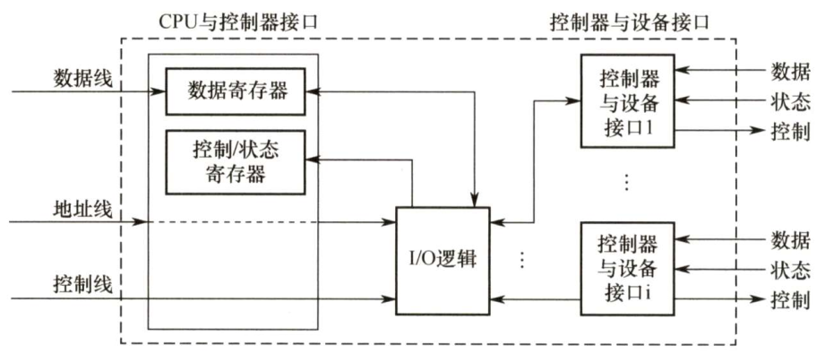
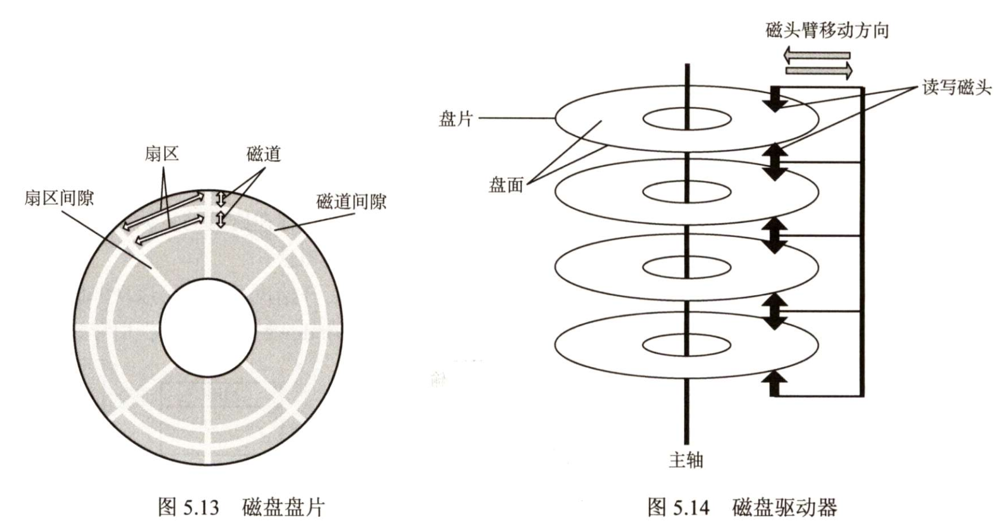
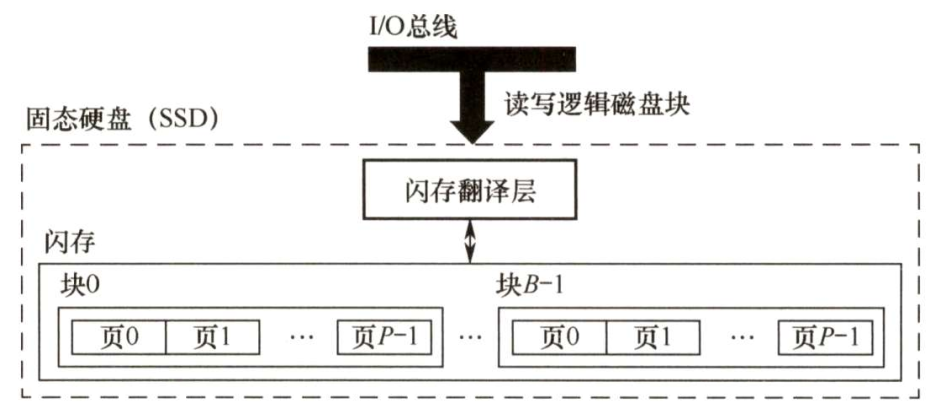

# 输入/输出 管理

---

## 一、IO 管理概述

### 1.IO 设备

#### （1）设备分类

| 分类依据       | 设备类型 | 描述                                                        | 示例                 |
| -------------- | -------- | ----------------------------------------------------------- | -------------------- |
| 按信息交换单位 | 块设备   | 数据交换以块为单位，传输速率高，可寻址，采用DMA方式         | 磁盘                 |
|                | 字符设备 | 数据交换以字符为单位，传输速率低，不可寻址，采用中断I/O方式 | 交互式终端机、打印机 |
| 按传输速率     | 低速设备 | 传输速率低，通常用于输入和输出                              | 键盘、鼠标           |
|                | 中速设备 | 传输速率中等，常用于网络和存储设备                          | 网卡、USB存储设备    |
|                | 高速设备 | 传输速率高，常用于高速存储和网络设备                        | SSD、千兆以太网卡    |

#### （2）IO 接口

组成：设备控制器与CPU的接口+设备控制器与设备的接口+I/O逻辑

#### （3）IO 端口

- 概念：是指设备控制器中可被CPU直接访问的寄存器（数据、状态、控制寄存器）
- 编址方式：独立编制、统一编址

---

## 二、设备独立性软件

### 1.高速缓存与缓冲区

---

## 三、磁盘和固态硬盘

### 1.磁盘结构

#### （1）磁盘结构图示

#### （2）磁盘基础概念

- 扇区：通常固定为512B，也称为盘块，是磁盘最小的物理存储单元
- 簇：由于扇区众多难以寻址，通常把2^n个扇区合并形成簇，一个簇中只能存放一个文件的内容（2017）

### 5.固态硬盘

#### （1）固态硬盘图示

固态硬盘 基于闪存技术

#### （2）固态硬盘特性

数据以页为单位读写，只有在一页所属的块被整个擦除后才能写这一页

:::info

- 随机写比随机读慢很多 
- 比起传统机械硬盘读写速度更快、没有机械噪声和震动， 能耗更低、 抗震性好、 安全性高

:::

#### （3）磨损均衡

- 动态磨损均衡：写入数据时， 自动选择较新的闪存块。 老的闪存块先歇一歇

- 静态磨损均衡：没有数据写入时自动进行数据分配，让老闪存块承担无需写任务的存储任务，平时读写操作在新闪存块中进行

静态磨损均衡比动态磨损均衡的性能更好。

