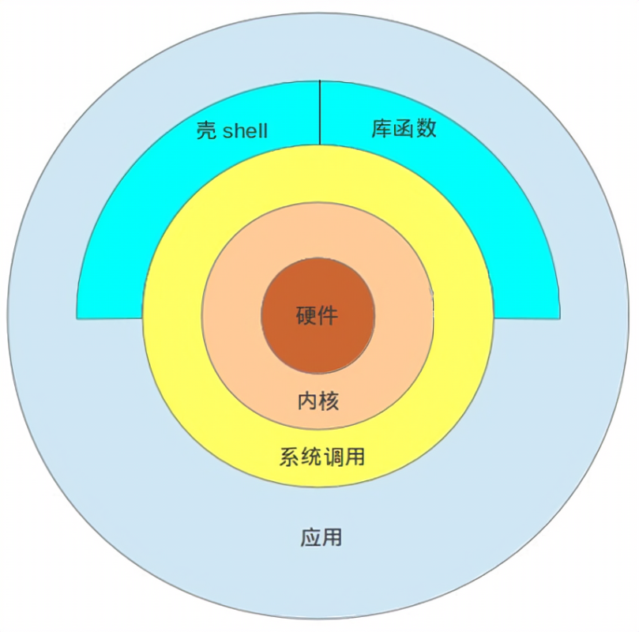

tty：查看终端编号

who：查看链接到当前服务器的终端信息


free -h：查看当前服务器内存使用情况


runlevel：显示当前服务器处于什么模式（显示历史记录：起始模式 当前模式）

- 3：命令行模式
- 5：图形化模式

init 3/5：切换到命令行模式/图形化模式


/etc/motd（文件）：登陆欢迎展示文本（登陆提示文件）

/etc/issue（文件）：登陆前提示


cat 文本文件：查看文本文件内容

---

**交互式接口类型：**

- GUI：`Graphic User Interface`

  X protocol，Windows manger，desktop

  GNOME（C，图形库gtk）

  KDE（C++，图形库qt）

  XFCE（轻量化桌面）

- CLI：`Command Line Interface`

  Shell程序



Shell是Liunx系统的用户界面，提供了用户与内核进行交互操作的一种接口。它接收用户输入的命令并把它送入内核去执行。shellt也被称为Linux的命令解释器（`command interpreter`），shell是一种高级程序设计语言。


**各种Shell：**


GNU Bourne-Again Shell（bash）是GNU计划中重要的工具软件之一，目前也是Linux标准的shell，与sh兼容。

显示当前使用的shell：

```shell
echo $SHELL
```

在`/etc/shells`（文件）中记录了支持的Shell类型

```shell
cat /etc/shells
```

```text
# List of acceptable shells for chpass(1).
# Ftpd will not allow users to connect who are not using
# one of these shells.

/bin/bash
/bin/csh
/bin/dash
/bin/ksh
/bin/sh
/bin/tcsh
/bin/zsh
```

---

ps aux：列出当前系统中正在运行的应用程序

---


