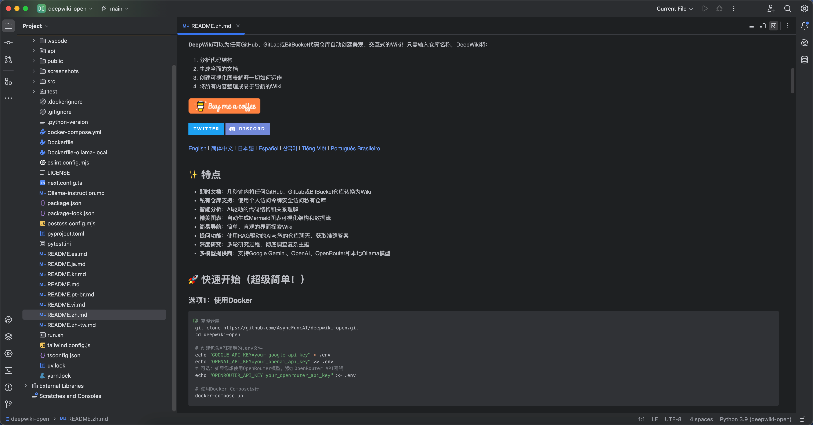
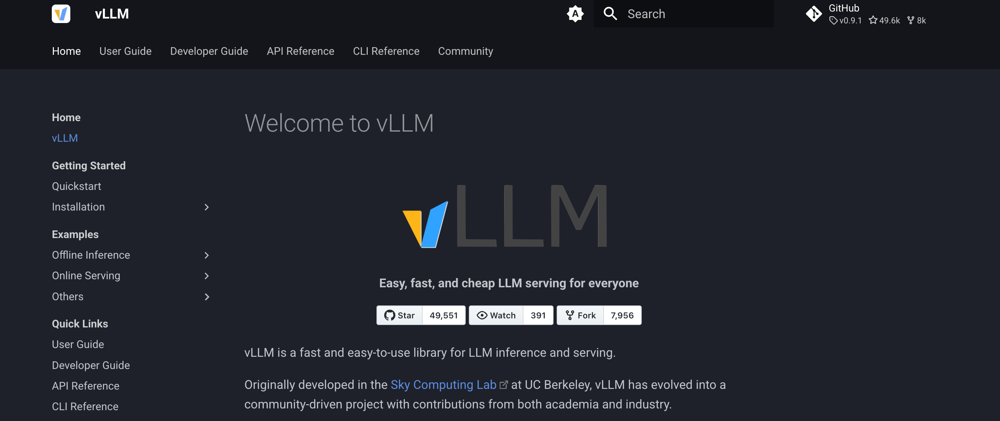
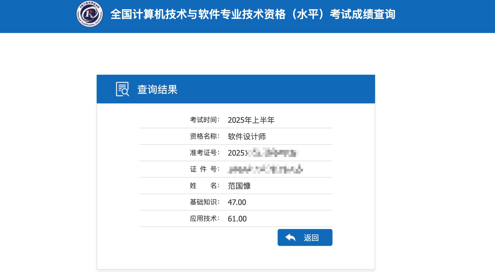

# 2025年06月

## 2025年06月07日

- [x] JVM JMAP工具（完成了JVM命令行工具的学习，后续需要应用到实践中去）
- [x] JVM JConsole 图形化界面（PS：使用限制 本地只能连接Sun JDK！！！）

---

## 2025年06月08日

先做！先把东西做出来，然后再尝试慢慢优化！别总想着一步到位，哪有什么完美！！！Just do it！！！

专心做好一件事，然后再做下一件事，现在最大的问题就是高开低走，有始无终......😢

PS：Mac 打开输入法的表情框快捷键：`Ctrl + Command + Space`

PS：Mac 显示隐藏文件 快捷键：`Ctrl + Shift + .`

---

> 笑死了，突然觉得自己没有啥存在的必要性了～未来果然是LLM的时代（尤其是多模态LLM+具身机器人==ME）


又学到了：不要一味地去追求完全复刻当前最先进的技术水平（**SOTA，即“State - of - the - Art”**）。

在学术研究、工程开发、商业创新等诸多领域，SOTA代表着某个特定领域内目前已知的最佳性能、最佳方法或最佳成果。“不要追求完美复制SOTA”传达的理念是，不应该仅仅着眼于原样照搬现有的最先进成果。

一方面，完美复制SOTA可能面临技术难度大、成本高昂等问题；另一方面，这种做法缺乏创新，不利于推动行业的进一步发展。更鼓励人们在借鉴SOTA的基础上，结合实际情况进行改进、创新，探索出更适合自身需求、更具特色的解决方案。

```
In AI, SOTA refers to the most effective models and techniques that achieve the best performance on a particular task. 
```

---

## 2025年06月11日

- [x] 【架构设计】CAP理论（文章输出）

PS：等一手软考结果，再进行下一步方向！过了准备架构师（软考高级）？？？还是软件管理（软考中级）？？？

---

## 2025年06月12日

再一次感受到AI带来的效率提升和对各行各业（尤其是在软件编程领域）的冲击！！！

---

## 2025年06月14日

- [x] DeepWiki 用 AI 生产代码库文档

仓库地址：https://github.com/AsyncFuncAI/deepwiki-open



- [ ] 模型推理框架调研：vllm

- vllm 推理框架仓库地址：https://github.com/vllm-project/vllm 
- vllm 推理框架官方文档：https://docs.vllm.ai/en/latest/



其他类似的推理框架还有：ollama（`快速使用` `极简化操作`）、llama.cpp（`推理适中`）

- [ ] 知识图谱 技术调研
- [ ] 向量数据库调研
- [ ] 图数据库调研

---

- [x] 【深度学习】Tensor 创建、类型转换

---

## 2025年06月26日

**最近待完成的学习任务：**

- 【2025年B站讲的最透彻的大模型RAG全套企业级程，手把手带你搭建RAG知识库（发环境准备/增强检索/文本向量/知识库搭建）一次讲透！】 https://www.bilibili.com/video/BV1PxoKYzEac/?p=4&share_source=copy_web&vd_source=0819087829bf0d05c72c3d7beb2d5a6b
- 【逐行讲解大模型解码所有超参数【上】（temperature、top-k、top-p等所有参数）】 https://www.bilibili.com/video/BV1rGBZYeEuH/?share_source=copy_web&vd_source=0819087829bf0d05c72c3d7beb2d5a6b

- [x] 记录一下软考成绩：




✅第一阶段完成，接下来是架构师的相关准备！！！

---

