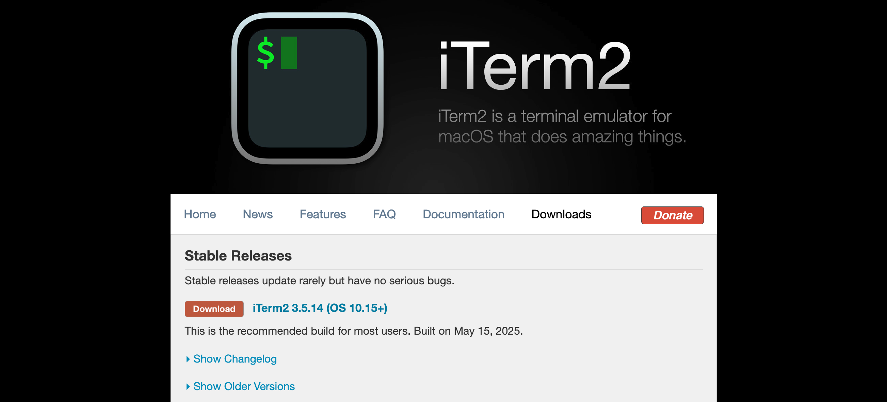
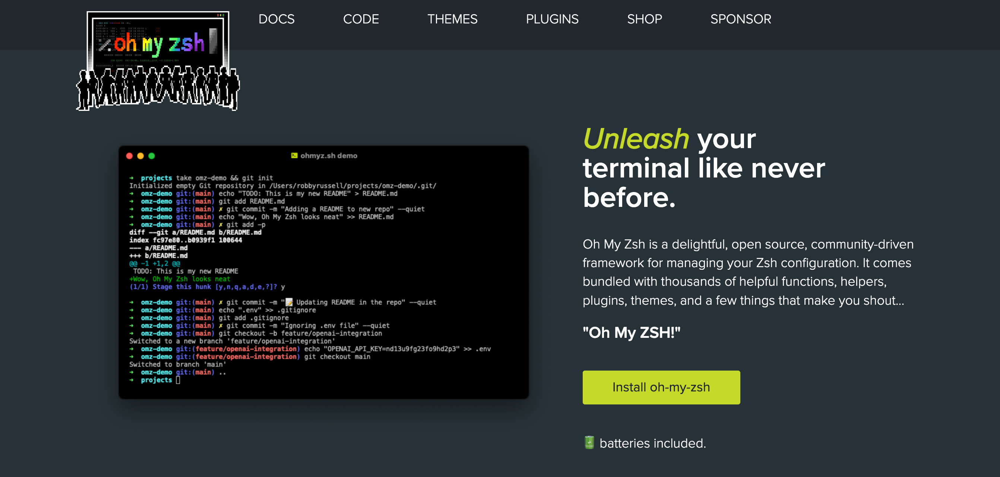
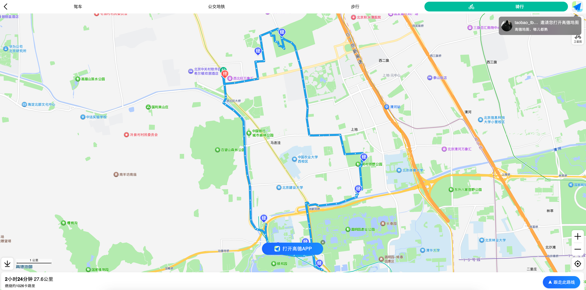

# 2025年07月

## 2025年07月19日

- [x] `iTerm`汉化、常用操作学习（`oh my Zsh`）

`iTerm`下载地址：https://iterm2.com/downloads.html



`oh my zsh` 下载地址：https://ohmyz.sh/



- 安装：`zsh-autosuggestions` 自动命令补全工具：

```shell
git clone https://github.com/zsh-users/zsh-autosuggestions ~/.oh-my-zsh/custom/plugins/zsh-autosuggestions
```

- 安装：`zsh-syntax-highlighting` 自动语法高亮工具：

```shell
git clone https://github.com/zsh-users/zsh-syntax-highlighting.git ~/.oh-my-zsh/custom/plugins/zsh-syntax-highlighting
```

---

## 2025年07月20日

- [x] 记录第一次骑行 27.6 公里（GO！GO！GO！出发咯～）




---

## 2025年07月26日

- [x] 立一个Flag，坚持写知乎！！！（100个回答、100篇文章）


---

- [x] **【理论知识】数字电路（第一遍）完成 ✅**

```
【尚硅谷嵌入式数字电路教程，数字电路入门从零搭建计算机！】 https://www.bilibili.com/video/BV1tF4m1A7xH/?p=73&share_source=copy_web&vd_source=0819087829bf0d05c72c3d7beb2d5a6b
```

后续结合【图灵完备】进行二刷，二刷的时候需要开始记录笔记📒！！！


---

## 2025年07月27日

- [x] 【网络安全】- 初级 学习

```
【【小迪安全】web安全｜渗透测试｜网络安全（6个月线上培训全套）】 https://www.bilibili.com/video/BV1JZ4y1c7ro/?share_source=copy_web&vd_source=0819087829bf0d05c72c3d7beb2d5a6b
```

https://github.com/kaka10te/Awesome-CyberSec?tab=readme-ov-file

**免费靶场收集：**

- https://mozhe.cn/（首次登陆送20个币，初级一个题只要一个币，可以免费练习20题）

---

  ## 2025年07月29日

- [x] 知乎粉丝数 100 啦～ 记录一下


