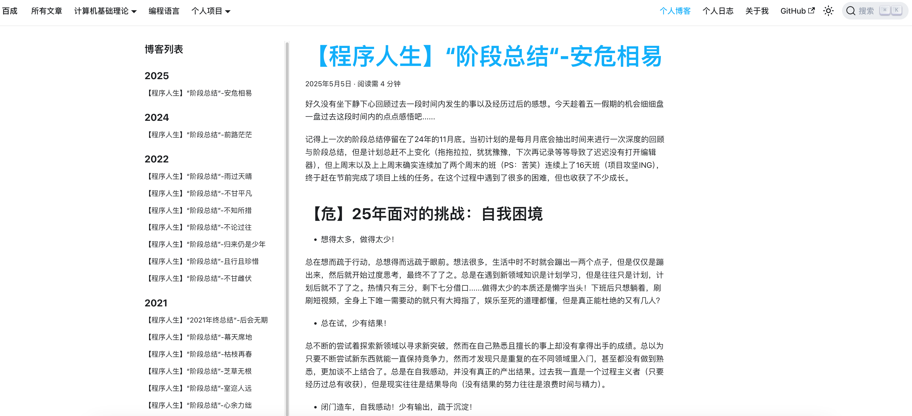

# 2025年08月

## 2025年08月17日：

- [x] 配置`giscus`，申请`Github`：

https://giscus.app/zh-CN


根据配置生成如下代码：

```html
<script src="https://giscus.app/client.js"
        data-repo="LunaticKrian/LunaticKrian.github.io"
        data-repo-id="R_kgDOPaW76g"
        data-category="General"
        data-category-id="DIC_kwDOPaW76s4CuNlp"
        data-mapping="pathname"
        data-strict="0"
        data-reactions-enabled="1"
        data-emit-metadata="0"
        data-input-position="bottom"
        data-theme="preferred_color_scheme"
        data-lang="zh-CN"
        crossorigin="anonymous"
        async>
</script>
```

---

- [x] 配置`algolia`文章搜索

https://dashboard.algolia.com/apps/25YYWI12TQ/crawler/crawler/a7f02973-84eb-4737-99b0-402d874b0f29/overview


- [x] 一阶段个人博客优化完成！！！

【docusaurus 官方文档】https://docusaurus.io/zh-CN/docs/next

【Blog 个人站点】https://lunatickrian.github.io/


- 新增了【评论功能】【全局搜索】【关于我】等等页面：


- 迁移完所有的 CSDN 经历感悟文章：



下一步是对首页进行优化！

---

## 2025年08月18日：

- [ ] Mermaid 思维导图绘制（Mermaid 语法学习）

