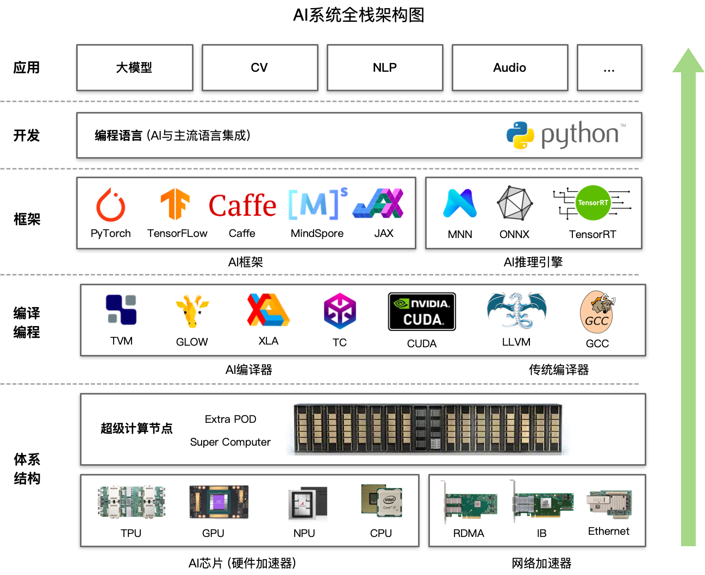

# AI Infra

AI Infra（AI 基础设施）是指为上层的 AI 算法应用提供支持的 AI 全栈底层技术，通过合理利用计算机体系结构，可以实现 AI 计算的加速和部署。

AI Infra 主要包括以下内容：

- AI 训练框架 & 推理引擎
- AI 编译 & 计算架构
- AI 硬件 & 体系结构

、

--

## NVIDIA GPU 硬件

### GPU 硬件架构

- Fermi 架构：提出了首个完整的 GPU 计算架构； 
- Kepler 架构； 
- Maxwell 架构； 
- Pascal 架构：提出了 NVLink； 
- Volta 架构：将 CUDA Core 进行了拆分，分离了 FPU 和 ALU；独立线程调度：每个线程都有独立的 PC（Program Counter）和 Stack；提出了 Tensor Core：针对深度学习提供张量计算核心，专门针对卷积运算进行加速； 
- Turing 架构：提出了 RT Core（Ray Tracing Core），用于三角形与光线的求交； 
- Ampere 架构：提出 NVSwitch，单卡之间通过 NVLink 互联，多卡之间通过 NVSwitch 互联； 
- Hopper 架构。Hopper是由Nvidia开发的图形处理器微架构。

