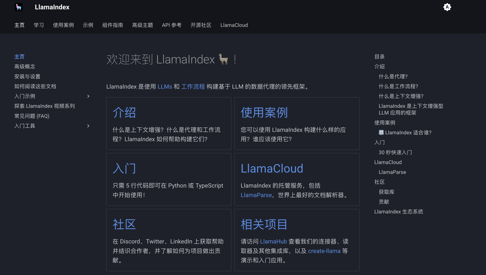
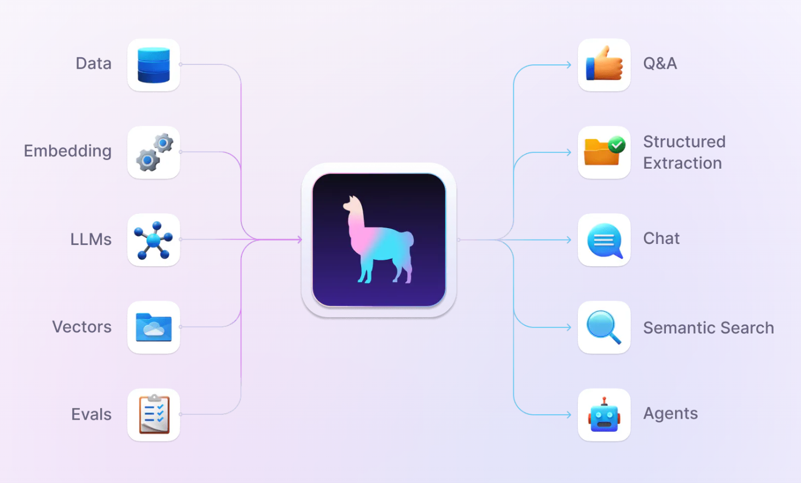
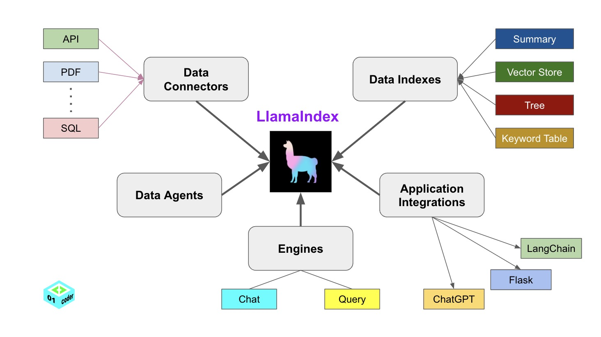
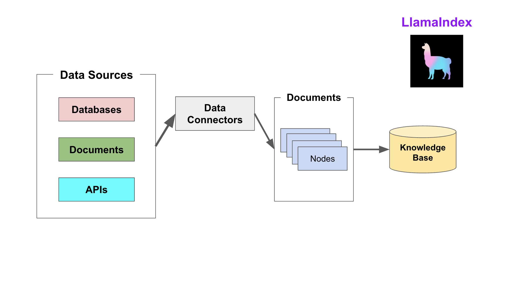
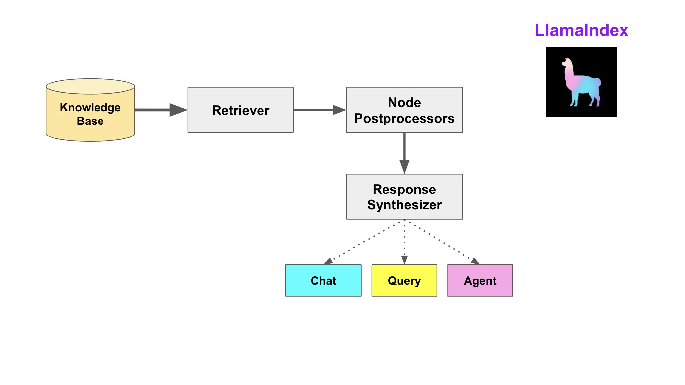

# 模型应用

---

## LlamaIndex RAG 开发

https://docs.llamaindex.org.cn/en/stable/

<div align="center">



</div>

LlamaIndex 是一个用于LLM应用程序的数据框架，用于注入，结构化，并访问私有或特定领域数据。

构建在LLM模型之上的应用程序通常需要使用私有或特定领域数据来增强这些模型。不幸的是，这些数据可能分布在不同的应用程序和数据存储中。它们可能存在于API之后、SQL数据库中，或者存在在PDF文件以及幻灯片中。LlamaIndex应运而生，为我们建立 LLM 与数据之间的桥梁。



LlamaIndex 提供了五大合性工具：

- Data connectors：将不同格式的数据源注入LlamaIndex 
- Data indexes。将数据转为 llm 可以非常容易理解且高效处理、消费的数据。 
- Engines：加载大模型
- Data agents：对接生态的其它工具，比如LangChain、Flask等 
- Application integrations



LlamaIndex 帮助构建 LLM 驱动，基于个人或私域数据的应用。RAG（Retrieval Augmented Generate）是 LlamaIndex 应用的核心概念。

### RAG


#### 索引阶段




#### 检索阶段




---

```shell
pip install llama-index
```

```shell
pip install llama-index-llms-huggingface
```

```python
from llama_index.core.llms import ChatMessage
from llama_index.llms.huggingface import HuggingFaceLLM


# 加载本地模型
llm = HuggingFaceLLM(model_name="/model/Qwen/Qwen3-0.6B",
                     tokenizer_name="/model/Qwen/Qwen3-0.6B",
                     model_kwargs={
                         "trust_remote_code": True
                     }, tokenizer_kwargs={
        "trust_remote_code": True
    })

# 请求模型进行推理生成
response = llm.chat(messages=[ChatMessage("Hello!")])

# 输出响应结果信息
print(response)
```

---

## Embedding Model 嵌入模型

嵌入模型（Embedding Model）是一种将离散数据（文本、图像）映射到连续向量空间的技术。


---

##  Chroma DB 向量数据库
