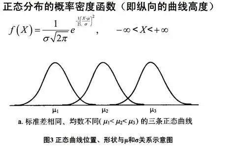

#  Pytorch 机器学习库

## 一、Pytorch 安装

https://pytorch.org/


CPU 安装指令：

```shell
pip3 install torch torchvision
```

验证安装：

```python
import torch

if __name__ == '__main__':
    print(torch.__version__)
```


---

## 二、张量创建

Tensor（张量）是PyTorch的核心数据结构。张量在不同学科中有不同的意义，在深度学习中张量表示一个多维数组，是标量、向量、矩阵的拓展。如一个RGB图像的数组就是一个三维张量，第1维是图像的高，第2维是图像的宽，第3维是图像的颜色通道。

### 1.基本张量创建

 #### (1) torch.tensor(data) 创建指定内容张量

```python
# 引入Pytorch
import torch
```

```python
# 创建一个张量Tensor
tensor_data_number = torch.tensor(10.0)
print(f"tensor_data: {tensor_data_number}")
print(f"tensor_type: {tensor_data_number.dtype}")
print(f"tensor_shap: {tensor_data_number.shape}")
```

```python
# 创建一个张量Tensor
tensor_data_array = torch.tensor([10.0, 20.0, 30.0])
print(f"tensor_data: {tensor_data_array}")
print(f"tensor_type: {tensor_data_array.dtype}")
print(f"tensor_shap: {tensor_data_array.shape}")
```

```python
# 基于ndarray创建tensor
import numpy as np

ndarray_data = np.array([[10.0, 20.0, 30.0], [10.0, 20.0, 30.0]])
tensor_data_ndarray = torch.tensor(ndarray_data)
print(f"tensor_data: {tensor_data_ndarray}")
print(f"tensor_type: {tensor_data_ndarray.dtype}")
print(f"tensor_shap: {tensor_data_ndarray.shape}")
```

#### (2) torch.Tensor(size) 创建指定形状张量

```python
# 引入Pytorch
import torch
```

```python
tensor_shape_size = torch.Tensor(2, 3, 2)
print(f"tensor_shape_size: {tensor_shape_size}")
print(f"tensor_shape_size: {tensor_shape_size.dtype}")
print(f"tensor_shape_size: {tensor_shape_size.shape}")
```

:::info

使用`torch.Tensor` 来创建张量，  `tensor` 默认数据类型 `torch.float32` ，默认会进行数据类型转换。（基于数据形状进行张量创建）

使用`torch.tensor` 来创建张量，根据传入的数据类型进行创建，不会进行数据类型自动转换。（基于数据内容进行张量创建）

:::


#### (3) 创建指定数据类型张量

可以通过`torch.IntTensor()`、`torch.FloatTensor()` 等创建，或者在`torch.tensor()` 中通过`dtype` 参数指定数据类型。

```python
# 创建指定数据类型的Tensor
tensor_data_int = torch.IntTensor(2, 3, 2)
print(f"tensor_data_int: {tensor_data_int}")
print(f"tensor_data_int: {tensor_data_int.dtype}")
print(f"tensor_data_int: {tensor_data_int.shape}")

tensor_data_float = torch.FloatTensor(2, 3, 2)
print(f"tensor_data_float: {tensor_data_float}")
print(f"tensor_data_float: {tensor_data_float.dtype}")
print(f"tensor_data_float: {tensor_data_float.shape}")

# 使用dtype指定Tensor数据类型
tensor_int_data = torch.tensor([1, 2, 3], dtype=torch.int64)
print(f"tensor_int_data: {tensor_int_data}")
print(f"tensor_int_data: {tensor_int_data.dtype}")
print(f"tensor_int_data: {tensor_int_data.shape}")
```

 

#### (4) 指定区间创建张量

- `torch.arange(start, end, step)` 在区间内按照步长创建张量（数据区间左闭右开）

```python
# 创建指定区间张量数据
tensor_data_arange = torch.arange(1, 10, 2)
print(f"tensor_data_arange: {tensor_data_arange}")
print(f"tensor_data_arange: {tensor_data_arange.dtype}")
print(f"tensor_data_arange: {tensor_data_arange.shape}")
```

- `torch.linspace(start, end, steps)` 在区间内按元素数量创建张量（全闭区间，起始元素和结束元素必须取到）

> 步长计算公式：`step = (end - start) / (steps - 1)`

```python
# 按照元素区间指定元素数量创建张量
tensor_linspace = torch.linspace(1, 10, 3)
print(f"tensor_linspace: {tensor_linspace}")
print(f"tensor_linspace: {tensor_linspace.dtype}")
print(f"tensor_linspace: {tensor_linspace.shape}")
```

- `torch.logspace(start, end, steps, base)` 在指数区间内按指数底数创建张量（在start和end区间内生成steps个元素，并以base作为对数运算的底数，创建张量元素）

```python
# 生成对数Tensor
tensor_data_log = torch.logspace(1, 3, 2, 10)
print(f"tensor_data_log: {tensor_data_log}")
print(f"tensor_data_log: {tensor_data_log.dtype}")
print(f"tensor_data_log: {tensor_data_log.shape}")
```

 

#### (5) 按照数值填充张量

- `torch.zeros(size)`：创建指定形状的全0张量
- `torch.ones(size)`：创建指定形状的全1张量
- `torch.full(size，value)`：创建指定形状的按指定值填充的张量
- `torch.empty(size)`：创建指定形状的未初始化的张量
- `torch.zeros_like(input)`：创建与给定张量形状相同的全0张量
- `torch.ones_like(input)`：创建与给定张量形状相同的全1张量
- `torch.full_like(input，value)`：创建与给定张量形状相同的按指定值填充的张量

```python
# 创建一个全零张量
tensor_zero = torch.zeros(1, 3, 2)
print(f"tensor_zero: {tensor_zero}")
print(f"tensor_zero: {tensor_zero.dtype}")
print(f"tensor_zero: {tensor_zero.shape}")

tensor_zero_size = torch.zeros_like(tensor_zero)
print(f"tensor_zero_size: {tensor_zero_size}")
print(f"tensor_zero_size: {tensor_zero_size.dtype}")
print(f"tensor_zero_size: {tensor_zero_size.shape}")
```

- `torch.eye(n, [m])`：创建单位矩阵

```python
 # 创建一个单位矩阵
tensor_eye = torch.eye(3)
print(f"tensor_eye: {tensor_eye}")
print(f"tensor_eye: {tensor_eye.dtype}")
print(f"tensor_eye: {tensor_eye.shape}")

tensor_eye_m = torch.eye(3, 2)
print(f"tensor_eye_m: {tensor_eye_m}")
print(f"tensor_eye_m: {tensor_eye_m.dtype}")
print(f"tensor_eye_m: {tensor_eye_m.shape}")
```


#### (6) 随机张量创建

- `torch.rand(size)`创建在[0.1)上均匀分布的，指定形状的张量
- `torch.randint(low,high,size)`创建在`[lowhigh)`上均匀分布的，指定形状的 
- `torch.randn(size)`：创建标准正态分布的，指定形状的张量
- `torch.normal(mean, std, size)`：创建自定义正态分布的，指定形状的张量
- `torch.rand_like(input)`：创建在`[0,1)`上均匀分布的，与给定张量形状相同的张量
- `torch.randint_like(input，low，high)`：创建在`[low,high)`上均匀分布的，与给定张量形状相同的张量
- `torch.randn_like(input)`：创建标准正态分布的，与给定张量形状相同的张量

```python
```

:::info

**正态分布**（`Normal Distribution`），也叫**高斯分布（`Gaussian Distribution`）**，是统计学中最常见的一种连续型概率分布。
 它的概率密度函数（PDF）是一个“钟形曲线”



:::

- `torch.randperm(n)`生成从0到n-1的随机排列，类似洗牌··········

```python

```

- `torch.random.initial_seed()`查看随机数种子

- `torch.manual_seed(seed)`设置随机数种子

```python
```


---

### 2.Tensor与ndarray转换


### 3.Tensor与标量转换


## 三、张量转换


