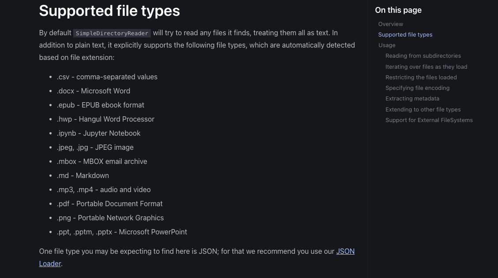

# 文档切分与重排序

## 一、文档解析

### 1.LlamaIndex SimpleDirectoryReader

LlamaIndex 提供了 `SimpleDirectoryReader` 类，用于将目录中的文件解析为 `Document` 对象。

https://developers.llamaindex.ai/python/framework/module_guides/loading/simpledirectoryreader/

```python
from llama_index.core import SimpleDirectoryReader

reader = SimpleDirectoryReader(input_dir="path/to/directory")
documents = reader.load_data()
```

`SimpleDirectoryReader` 支持如下一些文件类型：



但是 `SimpleDirectoryReader` 文档解析功能实现相对较少，通常只能针对一些标准的 txt 格式的文件数据进行解析，对于一些非标准的文件格式解析能力相对较弱。
因此我们在针对这类文件解析时，会选择使用一些三方库进行实现。

PS：针对复杂文件类型处理，**正则匹配** 是一个不错的解决方案。

### 2.LlamaIndex HTMLTagReader

LlamaIndex 封装了 `HTMLTagReader` 类，用于将 HTML 文件解析为 `Document` 对象。

https://developers.llamaindex.ai/python/examples/data_connectors/html_tag_reader/


---

## 二、文档切分

文档切分时需要考虑三个要素：文本块大小、文本块重叠、文本块切分依据


## Reference

- [LlamaIndex] https://developers.llamaindex.ai/python/framework/module_guides/loading/simpledirectoryreader/
- [LlamaIndex] https://developers.llamaindex.ai/python/examples/data_connectors/html_tag_reader/
- [LlamaIndex] https://developers.llamaindex.ai/python/examples/data_connectors/webpagedemo/

