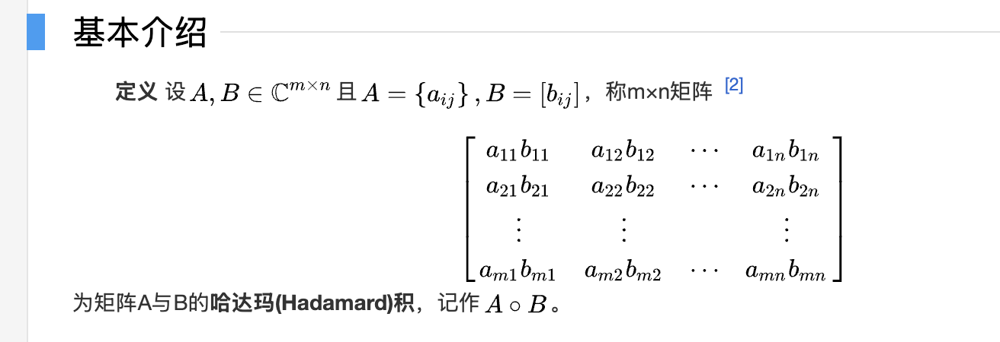

#  Pytorch 张量

---

## 一、Pytorch 安装

https://pytorch.org/


CPU 安装指令：

```shell
pip3 install torch torchvision
```

验证安装：

```python
import torch

if __name__ == '__main__':
    print(torch.__version__)
```


---

## 二、Tensor 张量

Tensor（张量）是PyTorch的核心数据结构。张量在不同学科中有不同的意义，在深度学习中张量表示一个多维数组，是标量、向量、矩阵的拓展。如一个RGB图像的数组就是一个三维张量，第1维是图像的高，第2维是图像的宽，第3维是图像的颜色通道。

### 1.基本张量创建

 #### (1) torch.tensor(data) 创建指定内容张量

```python
# 引入Pytorch
import torch
```

```python
# 创建一个张量Tensor
tensor_data_number = torch.tensor(10.0)
print(f"tensor_data: {tensor_data_number}")
print(f"tensor_type: {tensor_data_number.dtype}")
print(f"tensor_shap: {tensor_data_number.shape}")
```

```python
# 创建一个张量Tensor
tensor_data_array = torch.tensor([10.0, 20.0, 30.0])
print(f"tensor_data: {tensor_data_array}")
print(f"tensor_type: {tensor_data_array.dtype}")
print(f"tensor_shap: {tensor_data_array.shape}")
```

```python
# 基于ndarray创建tensor
import numpy as np

ndarray_data = np.array([[10.0, 20.0, 30.0], [10.0, 20.0, 30.0]])
tensor_data_ndarray = torch.tensor(ndarray_data)
print(f"tensor_data: {tensor_data_ndarray}")
print(f"tensor_type: {tensor_data_ndarray.dtype}")
print(f"tensor_shap: {tensor_data_ndarray.shape}")
```

#### (2) torch.Tensor(size) 创建指定形状张量

```python
# 引入Pytorch
import torch
```

```python
tensor_shape_size = torch.Tensor(2, 3, 2)
print(f"tensor_shape_size: {tensor_shape_size}")
print(f"tensor_shape_size: {tensor_shape_size.dtype}")
print(f"tensor_shape_size: {tensor_shape_size.shape}")
```

:::info

使用`torch.Tensor` 来创建张量，  `tensor` 默认数据类型 `torch.float32` ，默认会进行数据类型转换。（基于数据形状进行张量创建）

使用`torch.tensor` 来创建张量，根据传入的数据类型进行创建，不会进行数据类型自动转换。（基于数据内容进行张量创建）

:::


#### (3) 创建指定数据类型张量

可以通过`torch.IntTensor()`、`torch.FloatTensor()` 等创建，或者在`torch.tensor()` 中通过`dtype` 参数指定数据类型。

```python
# 创建指定数据类型的Tensor
tensor_data_int = torch.IntTensor(2, 3, 2)
print(f"tensor_data_int: {tensor_data_int}")
print(f"tensor_data_int: {tensor_data_int.dtype}")
print(f"tensor_data_int: {tensor_data_int.shape}")

tensor_data_float = torch.FloatTensor(2, 3, 2)
print(f"tensor_data_float: {tensor_data_float}")
print(f"tensor_data_float: {tensor_data_float.dtype}")
print(f"tensor_data_float: {tensor_data_float.shape}")

# 使用dtype指定Tensor数据类型
tensor_int_data = torch.tensor([1, 2, 3], dtype=torch.int64)
print(f"tensor_int_data: {tensor_int_data}")
print(f"tensor_int_data: {tensor_int_data.dtype}")
print(f"tensor_int_data: {tensor_int_data.shape}")
```

 

#### (4) 指定区间创建张量

- `torch.arange(start, end, step)` 在区间内按照步长创建张量（数据区间左闭右开）

```python
# 创建指定区间张量数据
tensor_data_arange = torch.arange(1, 10, 2)
print(f"tensor_data_arange: {tensor_data_arange}")
print(f"tensor_data_arange: {tensor_data_arange.dtype}")
print(f"tensor_data_arange: {tensor_data_arange.shape}")
```

- `torch.linspace(start, end, steps)` 在区间内按元素数量创建张量（全闭区间，起始元素和结束元素必须取到）

> 步长计算公式：`step = (end - start) / (steps - 1)`

```python
# 按照元素区间指定元素数量创建张量
tensor_linspace = torch.linspace(1, 10, 3)
print(f"tensor_linspace: {tensor_linspace}")
print(f"tensor_linspace: {tensor_linspace.dtype}")
print(f"tensor_linspace: {tensor_linspace.shape}")
```

- `torch.logspace(start, end, steps, base)` 在指数区间内按指数底数创建张量（在start和end区间内生成steps个元素，并以base作为对数运算的底数，创建张量元素）

```python
# 生成对数Tensor
tensor_data_log = torch.logspace(1, 3, 2, 10)
print(f"tensor_data_log: {tensor_data_log}")
print(f"tensor_data_log: {tensor_data_log.dtype}")
print(f"tensor_data_log: {tensor_data_log.shape}")
```

 

#### (5) 按照数值填充张量

- `torch.zeros(size)`：创建指定形状的全0张量
- `torch.ones(size)`：创建指定形状的全1张量
- `torch.full(size，value)`：创建指定形状的按指定值填充的张量
- `torch.empty(size)`：创建指定形状的未初始化的张量
- `torch.zeros_like(input)`：创建与给定张量形状相同的全0张量
- `torch.ones_like(input)`：创建与给定张量形状相同的全1张量
- `torch.full_like(input，value)`：创建与给定张量形状相同的按指定值填充的张量

```python
# 创建一个全零张量
tensor_zero = torch.zeros(1, 3, 2)
print(f"tensor_zero: {tensor_zero}")
print(f"tensor_zero: {tensor_zero.dtype}")
print(f"tensor_zero: {tensor_zero.shape}")

tensor_zero_size = torch.zeros_like(tensor_zero)
print(f"tensor_zero_size: {tensor_zero_size}")
print(f"tensor_zero_size: {tensor_zero_size.dtype}")
print(f"tensor_zero_size: {tensor_zero_size.shape}")
```

- `torch.eye(n, [m])`：创建单位矩阵

```python
 # 创建一个单位矩阵
tensor_eye = torch.eye(3)
print(f"tensor_eye: {tensor_eye}")
print(f"tensor_eye: {tensor_eye.dtype}")
print(f"tensor_eye: {tensor_eye.shape}")

tensor_eye_m = torch.eye(3, 2)
print(f"tensor_eye_m: {tensor_eye_m}")
print(f"tensor_eye_m: {tensor_eye_m.dtype}")
print(f"tensor_eye_m: {tensor_eye_m.shape}")
```


#### (6) 随机张量创建

- `torch.rand(size)`创建在[0.1)上均匀分布的，指定形状的张量
- `torch.randint(low, high, size)`创建在`[low, high)`上均匀分布的，指定形状的 
- `torch.randn(size)`：创建标准正态分布的，指定形状的张量
- `torch.normal(mean, std, size)`：创建自定义正态分布的，指定形状的张量
- `torch.rand_like(input)`：创建在`[0,1)`上均匀分布的，与给定张量形状相同的张量
- `torch.randint_like(input，low，high)`：创建在`[low,high)`上均匀分布的，与给定张量形状相同的张量
- `torch.randn_like(input)`：创建标准正态分布的，与给定张量形状相同的张量

:::info

**正态分布**（`Normal Distribution`），也叫**高斯分布（`Gaussian Distribution`）**，是统计学中最常见的一种连续型概率分布。
 它的概率密度函数（PDF）是一个“钟形曲线”


:::

- `torch.randperm(n)`生成从0到n-1的随机排列，类似洗牌··········

- `torch.random.initial_seed()`查看随机数种子

- `torch.manual_seed(seed)`设置随机数种子


---

### 2.Tensor数据类型转换

#### (1) Tensor.type(dtype) 修改张量数据类型

 ```python
 # 创建一个符合正态分布的张量
 tensor_data = torch.Tensor([1, 2, 3, 4, 5])
 print(f"tensor_data: {tensor_data}")
 print(f"tensor_data: {tensor_data.dtype}")
 
 # 修改制定张量的数据类型
 tensor_float = tensor_data.type(torch.int32)
 print(f"tensor_data: {tensor_float.dtype}")
 ```

#### (2) Tensor.double() 修改张量数据类型

```python
# 直接修改tensor数据类型
tensor_long = tensor_data.long()
print(f"tensor_data: {tensor_long.dtype}")
```


---

### 3.Tensor与ndarray转换

#### (1) Tensor.numpy() 将 Tensor转换为ndarray

将Tensor转换为ndarray后共享内存，使用copy() 避免共享内容

```python
# Tensor 转换为 ndarray
tensor_data = torch.tensor([1, 2, 3, 4, 5], dtype=torch.int32)
print(f"tensor_data: {tensor_data}, dtype: {tensor_data.dtype}")  

# 转换Tensor -> ndarray
numpy_ndarray = torch.Tensor.numpy(tensor_data).copy() # 直接使用.numpy()：tensor_data.numpy()
print(f"numpy_ndarray: {numpy_ndarray}, type(numpy_ndarray): {type(numpy_ndarray)}")
```

#### (2) torch.from_numpy(ndarray) 将ndarray转换为 Tensor

将 ndarray 转换为 Tensor 共享内存，使用 copy 避免内存共享

```python
# ndarray 转换为 Tensor
ndarray_data = numpy.random.randn(3, 2)
print(f"ndarray_data: {ndarray_data}, type(ndarray_data): {type(ndarray_data)}")

# 转换 ndarray -> Tensor
tensor_data_from_ndarray = torch.from_numpy(ndarray_data.copy())  # 基于ndarray的copy方法实现深拷贝
print(f"tensor_data_from_ndarray: {tensor_data_from_ndarray}, type(tensor_data_from_ndarray): {type(tensor_data_from_ndarray)}")
```

#### (3) torch.tensor(ndarray) 将 ndarray 转换为 Tensor 不共享内存

```python
# 使用torch.tensor基于内容创建Tensor默认不共享内存
ndarray_data = numpy.random.randn(3, 2, 2)
print(f"ndarray_data: {ndarray_data}, type(ndarray_data): {type(ndarray_data)}")

tensor_data = torch.tensor(ndarray_data)
print(f"tensor_data: {tensor_data}, type(tensor_data): {type(tensor_data)}")
```


---

### 4.Tensor与标量转换

若张量中只有1个元素，Tensor.item() 可提取张量中的元素为标量

```python
# 提取张量中的标量数据
tensor_data = torch.tensor(10)
print(f"tensor_data: {tensor_data}, type(tensor_data): {type(tensor_data)}")

item = tensor_data.item()
print(f"item: {item}, type(item): {type(item)}")
```

---

### 5.张量数值计算

#### (1) 四则运算

- `+`、`-`、`*`、`/`：加减乘除
- `add()`、`sub()`、`mul()`、`div()`：加减乘除，不改变原数据
- `add_()`、`sub_()`、`mul_()`、`div_()`：加减乘除、修改原数据

#### (2) 取负运算

- `-`、`neg()`、`neg_()` ：取负运算

#### (3) 求幂运算

- `**` 、`pow()`、 `pow_()`：求幂运算

#### (4) 平方根元算

- `sqrt()`、`sqrt_()`：求平方根

#### (5) 以e为底数求幂

- `exp()`、 `exp_()`：以e为底数求幂

#### (6) 以e为底求对数

- `log()`、`log_()`：以e为底求对数

---

### 6.哈达玛积（元素级乘法）

两个矩阵对应位置元素相乘称为哈达玛积（`Hadamard product`）。使用`*`、`mul()` 实现两个形状相同的张量之间对位相乘。



---

### 7.矩阵乘法运算

- `mm()`：严格用于二维矩阵相乘。
- `@`、`matmul()`：支持多维张量，按最后两个维度做矩阵乘法，其他维度相同，或者至少一个张量对应维度为1，广播后进行运算。

:::info

广播机制


:::


#### 内存节省

运行一些操作时可能导致为新的结果分配内存，例如X=X@Y，发现`id(X)`会指向另一个位置，这是因为Python首先计算X@Y，为结果分配新的内存，再令X指向内存中的新位置。

如果后续X不再重复使用，可以使用`x[:]=X@Y`来减少内存开销。（如果维度不匹配，如果可以广播，否则会直接报错）


---

### 8.张量统计运算

常见的统计运算函数：

- `sum()`：求和（指定维度求和，产生的效果是张量维度降低）

```python
# 降维，指定维度
tensor_data.sum(dim=0)
```

- `mean()`：求均值（指定维度求均值，产生的效果是张量维度降低，维度消除）

```python
# 降维，指定维度
tensor_data.mean(dim=0)
```

- `std()`：求标准差
- `max()/min()`：求最大/最小值及其索引
- `argmax()/argmin()`：求最大值/最小值的索引
- `unique()`：去重
- `sort()`：排序


### 9.张量索引

#### (1) 简单索引

```python
# 随机生成Tensor数据
tensor_data = torch.randint(1, 10, (3, 5, 4))
print(f"tensor_data: {tensor_data}, type(tensor_data): {type(tensor_data)}")

# 简单索引，基于元素坐标获取
data = tensor_data[2, 1, 3]
print(f"data: {data}, type(data): {type(data)}")

data = tensor_data[2, 1]
print(f"data: {data}, type(data): {type(data)}")
```

#### (2) 范围索引

`起始索引:结束索引:步长`

 ```python
 # 用:取指定维度的所有数据
 data = tensor_data[:, 3]
 print(f"data: {data}, type(data): {type(data)}")
 
 data = tensor_data[1:, 2]
 print(f"data: {data}, type(data): {type(data)}")
 
 data = tensor_data[1:, 2:4, 0:3]
 print(f"data: {data}, type(data): {type(data)}")
 ```

#### (3) 列表索引

```python
# 列表索引，按照给定的列表进行维度映射获取对应的数据
data = tensor_data[[0, 1], [1, 1]]
print(f"data: {data}, type(data): {type(data)}")

data = tensor_data[[0, 1], [1, 1], [1, 1]]
print(f"data: {data}, type(data): {type(data)}")

# 广播索引位置
data = tensor_data[[[0], [1]], [1, 1], [1, 1]]
print(f"data: {data}, type(data): {type(data)}")
```

#### (4) 布尔索引

```python
# 布尔索引
mask = tensor_data[:, :, 0] > 5
print(f"mask: {mask}, type(mask): {type(mask)}")
# 映射回原始矩阵
data = tensor_data[mask]
print(f"data: {data}, type(data): {type(data)}")
```


### 10.张量形状操作

#### (1) 交换维度

- `transpose()`：交换两个维度（维度交换时，表示元素对应坐标进行转换）

```python
tensor_data = torch.randint(1, 10, (2, 3, 6))
print(f"tensor_data: {tensor_data}, type(tensor_data): {type(tensor_data)}")

# 张量维度交换，指定维度进行交换
print(tensor_data.transpose(1, 2))
```

- `permute()`：重新排列多个维度

```python
tensor_data = torch.randint(1, 10, (2, 3, 6))
print(f"tensor_data: {tensor_data}, type(tensor_data): {type(tensor_data)}")

# 张量维度交换，指定多个维度进行重排
print(tensor_data.permute(1, 2, 0))
```

#### (2) 调整形状

- `reshape()`：调整张量形状，给定`-1`自动适配调整

```python
tensor_data = torch.randint(1, 10, (2, 3, 6))
print(f"tensor_data: {tensor_data}, type(tensor_data): {type(tensor_data)}")

# 使用reshape进行张量的形状修改
print(tensor_data.reshape(6, 6))
```

- `view()`：调整张量的形状，需要内存连续。共享内存
  - `is_contiguous()`：判断是否内存连续
  - `contiguous()`：转换为内存连续

```python
tensor_data = torch.randint(1, 10, (2, 3, 6))
print(f"tensor_data: {tensor_data}, type(tensor_data): {type(tensor_data)}")

# 使用view调整张量形状，使用is_contiguous判断是否连续
if tensor_data.is_contiguous():
    print(tensor_data.view(-1))
else:
    print(tensor_data.contiguous().view(-1))
```

#### (3) 增加/减少维度

- `unsqueeze()`：在指定维度上增加1个维度

```python
tensor_data = torch.tensor([1, 2, 3])
print(f"tensor_data: {tensor_data}, type(tensor_data): {tensor_data.shape}")

# 在指定维度上新增一个维度
tensor_data = tensor_data.unsqueeze(1)
print(f"tensor_data: {tensor_data}, type(tensor_data): {tensor_data.shape}")
```

- `squeeze()`：删除大小为1的维度（dim指定维度）

```python
tensor_data = torch.randint(1, 10, (9, 1))
print(f"tensor_data: {tensor_data}, type(tensor_data): {tensor_data.shape}")

# 删除维度为1的维度
tensor_data = tensor_data.squeeze(dim=1)
print(f"tensor_data: {tensor_data}, type(tensor_data): {tensor_data.shape}")
```

#### (4) 张量拼接

- `torch.cat()`：张量拼接，按已有维度拼接。除拼接维度外，其他维度大小须相同

```python
# 张量拼接
tensor_data_1 = torch.randint(1, 10, (2, 2, 5))
tensor_data_2 = torch.randint(1, 10, (2, 3, 5))

# 指定维度进行拼接
tensor_data = torch.cat((tensor_data_1, tensor_data_2), dim=1)
print(f"tensor_data: {tensor_data}, type(tensor_data): {tensor_data.shape}")
```

- `torch.stack()`：张量堆叠，按新维度堆叠。所有张量形状必须一致（指定维度进行堆叠，新增指定维度为2）

```python
# 指定维度进行拼接
tensor_data = torch.cat((tensor_data_1, tensor_data_2), dim=1)
print(f"tensor_data: {tensor_data}, type(tensor_data): {tensor_data.shape}")

# 张量堆叠
tensor_data_1 = torch.randint(1, 10, (3, 2, 5))
tensor_data_2 = torch.randint(1, 10, (3, 2, 5))

# 指定维度进行堆叠
tensor_data = torch.stack((tensor_data_1, tensor_data_2), dim=0)
print(f"tensor_data: {tensor_data}, type(tensor_data): {tensor_data.shape}")
```

