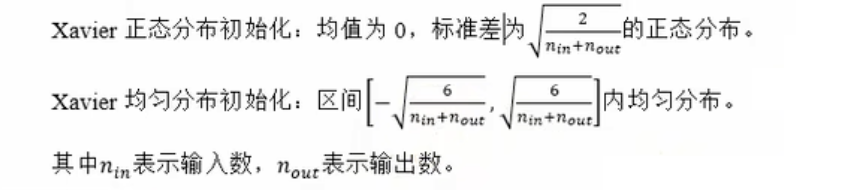

# Pytorch 参数初始化和正则化

---

## 一、全连接层（nn.Linear）

在神经网铬中，参数主要位于全连接层（仿射层Affine)中。

PyTorch提供了`torch.nn`模块，专门用于神经网络的构建和训练。其中全连接层被实现。为Linear类，内部有两个属性：权重weight和偏置bias;这就是神经网络的主要参数。

在PyTorch中，全连接层由`nn.Linear`类实现。它的参数包括输入特征数`in_features`和输出特征数`out_features`。默认情况下，`nn.Linear`会自动初始化权重和偏置。

```python
import torch.nn as nn

# 创建一个输入特征数为5，输出特征数为2的全连接层
linear = nn.Linear(5, 2)
```

---

## 二、常数初始化

在某些情况下，我们希望手动初始化神经网络的参数，而不是使用默认的初始化方法。PyTorch提供了`torch.nn.init`模块，包含多种初始化方法。

所有权重参数初始化为一个常数：

```pyhon
import torch.nn as nn

# 定一个全连接层
linear = nn.Linear(5, 2)

# 常数初始化（全0初始化）
nn.init.zeros_(linear.weight)
print(f"linear.weight = {linear.weight}")

# 常数初始化（全1初始化）
nn.init.ones_(linear.weight)
print(f"linear.weight = {linear.weight}")

# 指定常数初始化
nn.init.constant_(linear.weight, 2)
print(f"linear.weight = {linear.weight}")
```

PS：初始化权重参数时，已经进行了初始化定义权重矩阵的形状进行了转置。

---

## 三、秩初始化

权重矩阵参数初始化为单位矩阵：

```python
import torch.nn as nn

# 定一个全连接层
linear = nn.Linear(5, 2)

# 秩初始化
nn.init.eye_(linear.weight)
print(f"linear.weight = {linear.weight}")
```

---

## 四、正态分布初始化

权重参数按指定均值与标准差正态分布初始化。

```python
import torch.nn as nn

# 定一个全连接层
linear = nn.Linear(5, 2)

# 正态分布
nn.init.normal_(linear.weight, mean=0, std=1)
print(f"linear.weight = {linear.weight}")
```

---

## 五、均匀分布初始化

```python
import torch.nn as nn

# 定一个全连接层
linear = nn.Linear(5, 2)

# 均匀分布初始化
nn.init.uniform_(linear.weight, a=-1.0, b=1.0)
print(f"linear.weight = {linear.weight}")
```

---

## 六、Xavier 初始化（Glorot 初始化）

Xavier初始化根据输入和输出的神经元数量调整权重的初始范围，确保每一层的输出方差与输入方差相近。适用于Sigmoid和Tanh等激活函数，能有效缓解梯度消失或爆炸问题。



```python
nn.init.xavier_normal_(linear.weight)
print(f"linear.weight = {linear.weight}")

nn.init.xavier_uniform_(linear.weight)
print(f"linear.weight = {linear.weight}")
```

---

## 七、He 初始化（Kaiming 初始化）

He 初始化根据输入的神经元数量调整权重的初始范围。主要适用于R©LU及其变体（如Leaky ReLU)激活函数。


```python
nn.init.kaiming_uniform_(linear.weight)
print(f"linear.weight = {linear.weight}")

nn.init.kaiming_normal_(linear.weight)
print(f"linear.weight = {linear.weight}")
```

---

## 八、Dropout 随机失活

Dropout（随机失活，暂退法）是一种在学习的过程中随机关闭神经元的方法。可以通过`torch.nn Dropout(p)`来使用`Dropout`，并通过参数p来设置失活概率。

```python
# Dropout
x = torch.randint(1, 10, (10,), dtype=torch.float32)

# 定义一个Dropout层
dropout = nn.Dropout(p=0.5)

y = dropout(x)
print(f"x = {x}, y = {y}")
```