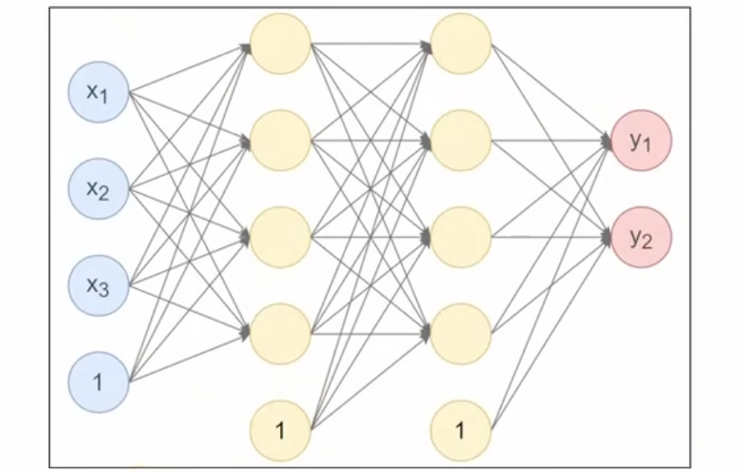

# Pytorch 神经网络搭建

---

## 一、自定义模型

在神经网络框架中，由多个层组成的组件称之为模块（Module）。在PyTorch中模型就是一个Module，各网络层、模块也是Module。Module是所有神经网络的基类。

要自定义一个神经网络模型，需要继承`torch.nn.Module`类，并实现`__init__`方法和`forward`方法。

- `__init__`方法：用于定义模型的层和参数。
- `forward`方法：根据输入进行前向传播，并返回输出。计算其输出关于输入的梯度，可通过其反向传播函数进行访问（通常自动发生）。`forward`方法是每次调用的具体实现。

 

- 第1个隐藏层：使用Xavier正态分布初始化权重，激活函数使用Tanh。
- 第2个隐藏层：使用He正态分布初始化权重，激活函数使用ReLU。
- 输出层：使用均匀分布初始化权重，激活函数使用Softmax。

```python
import torch
import torch.nn as nn

# 自定义神经网络类
class Model(nn.Module):

    # 初始化模型结构
    def __init__(self):
        super().__init__()
        # 定义三个线性层
        self.first_linear = nn.Linear(3, 4)
        nn.init.xavier_uniform_(self.first_linear.weight)

        self.second_linear = nn.Linear(4, 4)
        nn.init.kaiming_uniform_(self.second_linear.weight)

        self.output_linear = nn.Linear(4, 2)

    # 前向传播方法
    def forward(self, x):
        # 前向传播进入模型层
        x = self.first_linear(x)
        # 执行激活函数
        x = torch.tanh(x)

        x = self.second_linear(x)
        x = torch.relu(x)

        x = self.output_linear(x)
        x = torch.softmax(x, dim=1)

        return x

if __name__ == '__main__':
    # 定义输入数据
    x = torch.randn(10, 3)

    # 创建神经网络模型
    model = Model()

    # 前向传播
    output = model(x)

    print(f"output = {output}")
```

---

## 二、查看神经网络参数

可以通过`named_parameters()`方法查看模型的所有参数，包括参数名称和对应的值。

```python
# 基于parameters获取所有参数
for param in model.parameters():
    print(param)

for name, param in model.named_parameters():
    print(name, param)
```

可以通过`state_dict()`方法获取模型的状态字典，包括所有参数和缓冲区。

```python
# 调用state_dict，得到所有参数的字典表示
print(model.state_dict())
```

---

## 三、查看模型网络结构

使用 `torchsummary` 库可以方便地查看模型的网络结构和参数数量。

安装依赖库：

```shell
pip install torchsummary
```

查看模型结构：

```python
from torchsummary import summary

summary(model, input_size=(3,), batch_size=10, device='cpu')
```

---

## 四、device 指定

在定义模型时，可以指定模型运行的设备（CPU或GPU）。通过将模型移动到指定设备，可以利用GPU加速计算。

```python
import torch

# Check if CUDA is available and set the device
device = torch.device("cuda" if torch.cuda.is_available() else "cpu")

# Allocate a tensor on the specified device
data = torch.tensor([1, 2, 3]).to(device)

# Specify the second GPU (index 1)
device = torch.device("cuda:1")

# Allocate a tensor on the specified GPU
data = torch.tensor([1, 2, 3]).to(device)
```

---

## 五、使用 sequential 构建模型

PyTorch 提供了 `torch.nn.Sequential` 类，可以方便地按顺序构建神经网络模型。使用 `Sequential` 可以将多个层和激活函数按顺序组合在一起，简化模型的定义过程。

```python
import torch
import torch.nn as nn

# 定义原始数据
x = torch.randn(10, 3)

# 构建模型
model = nn.Sequential(
    nn.Linear(3, 4),
    nn.Tanh(),
    nn.Linear(4, 4),
    nn.ReLU(),
    nn.Linear(4, 2),
    nn.Softmax(dim=1),
)


# 定义一个参数初始化函数
def init_weights(layer):
    if type(layer) == nn.Linear:
        nn.init.xavier_uniform_(layer.weight)
        nn.init.constant_(layer.bias, 0.1)


# 参数初始化
model.apply(init_weights)

# 前向传播
output = model(x)

print(f"output = {output}")
```

