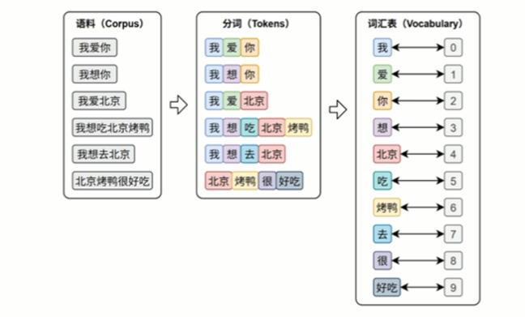
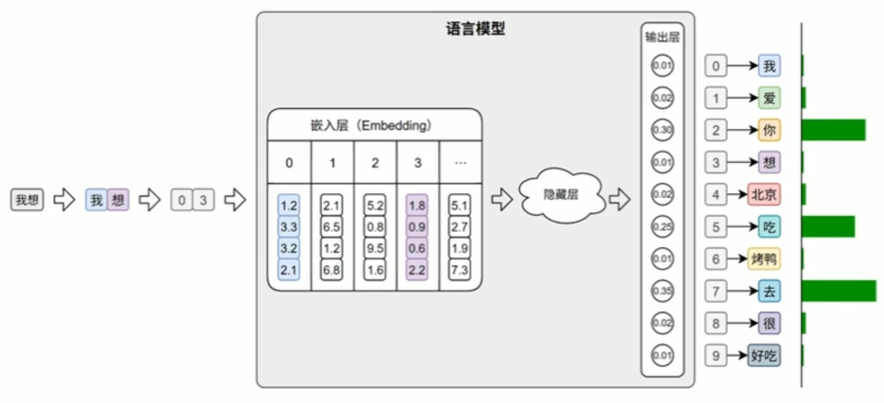
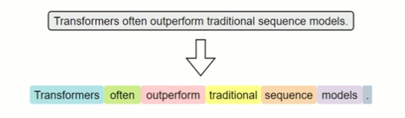
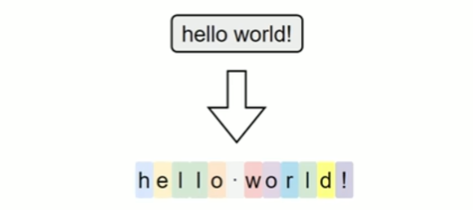
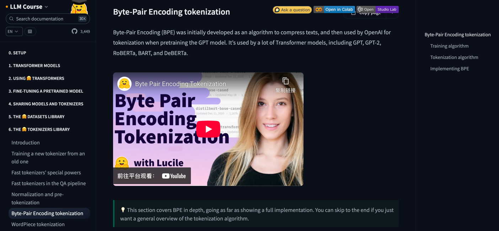
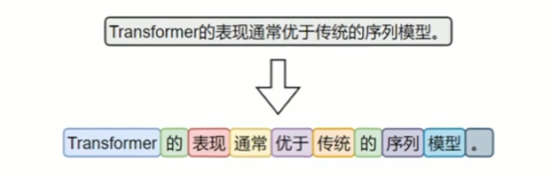
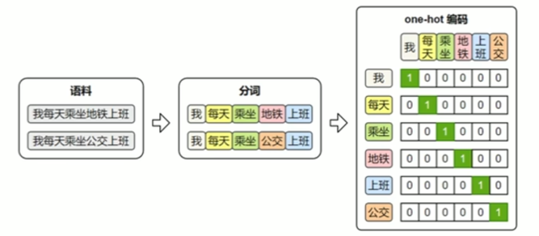
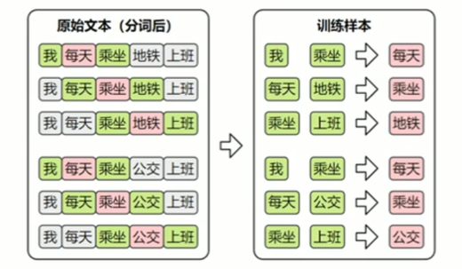
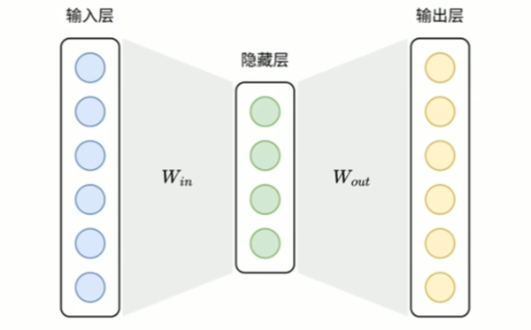
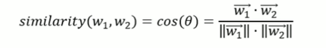

# 文本表示

---

创建 conda 环境

```shell
conda create -n NLP python=3.12
```

激活虚拟环境

```shell
conda activate NLP
```

依赖库：

- pytorch：深度学习框架，主要用于模型的构建、训练与推理。
- jieba：高效的中文分词工具，用于对原始中文文本进行分词预处理。
- gensim：用于训练词向量模型（如Word2Vec、FastText），提升模型对词语语义关系的理解。
- transformers：由HuggingFace提供的预训练模型库，用于加载和微调BERT等主流模型。
- datasets：HuggingFace 提供的数据处理库，用于高效加载和预处理大规模数据集。
- TensorBoard：可视化工具，用于展示训练过程中的损失函数、准确率等指标变化。
- tqdm：用于显示进度条，帮助实时监控训练与数据处理的进度。
- JupyterNotebook：交互式开发环境，用于编写、测试和可视化模型代码与实验过程。

---

## 一、文本表示概述

文本表示是将自然语言转化为计算机能够理解的数值形式，是绝大多数自然语言处理（NLP）任务的基础步骤。

早期的文本表示方法（如词袋模型）通常将整段文本编码为一个向量。这类方法实现简单、计算高效，但存在明显的局限性一表达语序和上下文语义的能力较弱。因此，现代NLP
技术逐渐引入更加精细和表达力更强的文本表示方法，以更有效地建模语言的结构和含义。

文本表示的第一步通常是分词和词表构建，如下图所示：

<div align="center">



</div>

- 分词（Tokenization）是将原始文本切分为若干具有独立语义的最小单元（即token）的过程，是所有NLP任务的起点。
- 词表（Vocabulary）是由语料库构建出的、包含模型可识别token的集合。词表中每个token都分配有唯一的ID，并支持token与ID之间的双向映射。在后续训练或预测过程中，模型会首先对输入文本进行分词，
  再通过词表将每个token映射为其对应的ID。接着，这些ID会被输入嵌入层（EmbeddingLayer），转换为低维稠密的向量表示（即词向量），如下图所示。

<div align="center">



</div>

此外，在文本生成任务中，模型的输出层会针对词表中的每个token生成一个概率分布，表示其作为下一个词的可能性。系统通常选取具有最大概率的ID，并通过词表查找对应的token，从而逐步生成最终的输出文本。

---

## 二、分词

不同语言由于语言结构、词边界的差异，其分词策略和算法也不尽相同，本节将分别介绍英文与中文中常见的分词方式。

### 1.英文分词

按照分词粒度的大小，可分为词级（Word-Level）分词、字符级（Character-Level）分词和子词级（Subword-Level）分词。下面逐一介绍

#### (1) 词级分词

词级分词是指将文本按词语进行切分，是最传统、最直观的分词方式。在英文中，空格和标点往往是天然的分隔符。

<div align="center">



</div>

词级分词虽便于理解和实现I但在实际应用中容易出现OOV（Out-Of-Vocabulary，未登录词）问题。所谓OOV，是指在模型使用阶段，输入文本中出现了不在预先构建词表中的词语，常见的包括网络热词、专有名词、复合词及拼写变体等。
由于模型无法识别这些词，通常会将其统一替换为特殊标记（如 `<UNK>` ），从而导致语义信息的丢失，影响模型的理解与预测能力。

#### (2) 字符级分词

字符级分词（Character-level Tokenization）是以单个字符为最小单位进行分词的方法，文本中的每一个字母、数字、标点甚至空格，都会被视作一个独立的token。

<div align="center">



</div>

在这种分词方式下，词表仅由所有可能出现的字符组成，因此词表规模非常小，覆盖率极高，几乎不存在OOV（Out-of-Vocabulary）问题。无论输入中出现什么样的新词或拼写变体，只要字符在词表中，都能被表示出来。

然而，由于单个字符本身语义信息极弱，模型必须依赖更长的上下文来推断词义和结构，这显著增加了建模难度和训练成本。此外，输入序列也会变得更长，影响模型效率。

#### (3) 子词级分词

子词级分词是一种介于词级分词与字符级分词之间的分词方法，它将词语切分为更小的单元一一子词（subword），
例如词根、前缀、后缀或常见词片段。r与词级分词相比，子词分词可以显著缓解OOV问题；与字符级分词相比，它能更好地保留一定的语义结构。

子词分词的基本思想是：即使一个完整的词没有出现在词表中，只要它可以被拆分为词表中存在的子词单元，就可以被模型识别和表示，从而避免整体被替换为 `<UNK>` 。

<div align="center">


</div>

常见的子词分词算法包括 BPE（BytePairEncoding）、WordPiece 和Unigram Language Model。

:::info

Token 切分站点

https://tiktokenizer.vercel.app/

<div align="center">


</div>

:::

其中，BPE是最早被广泛应用的子词分词方法。其基本思想是，在训练阶段，首先将语料中的词汇拆分为单个字符，构建初始词表；然后迭代地统计语料中出现频率最高的相邻字符对，将其合并为新的子词单元，并加入词表。这个过程持续进行，直到词表大小达到预设上限。

在分词阶段，BPE会根据构建好的词表和合并规则对新输入的文本进行处理。具体做法是：将文本拆分为最小单位（如字符或字节），然后按顺序应用训练中学习到的合并规则，逐步合并，直到无法继续。最终得到的就是由子词组成的分词结果。

详细的实现过程可参考HuggingFace提供的一篇优秀教程：https://hf-mirror.com/learn/llm-course/chapter6/5?fw=pt



子词级分词已经成为现代英文NLP模型中的主流方法，如BERT、GPT等模型均采用了基于子词的分词机制。

### 2.中文分词

尽管中文的语言结构与英文存在显著差异，我们仍可以借助“分词粒度”的视角，对中文的分词方式进行归类和分析。

#### (1) 字符级分词

字符级分词是中文处理中最简单的一种方式，即将文本按照单个汉字进行切分，文本中的每一个汉字都被视为一个独立的token。

<div align="center">


</div>

由于汉字本身通常具有独立语义，因此字符级分词在中文中具备天然的可行性。相比英文中的字符分词，中文的字符分词更加“语义友好”。

#### (2) 词级分词

词级分词是将中文文本按照完整词语进行切分的传统方法，切分结果更贴近人类阅读习惯。

<div align="center">



</div>

由于中文没有空格等天然词边界，词级分词通常依赖词典、规则或模型来识别词语边界。

#### (3) 子词级分词

虽然中文没有英文中的子词结构（如前缀、后缀、词根等），但子词分词算法（如BPE）仍可直接应用于中文。它们以汉字为基本单位，通过学习语料中高频的字组合（如“自然”、“语言”、“处理”），自动构建子词词表。这种方式无需人工词典，具有较强的适应能力。

在当前主流的中文大模型（如通义千问、DeepSeek）中，子词分词已成为广泛采用的文本切分策略。

### 3.分词工具

目前市面上可用于中文分词的工具种类繁多，按照实现方式大致可以分为如下两类：

- 一类是基于词典或模型的传统方法，主要以“词”为单位进行切分；
- 另一类是基于子词建模算法（如BPE）的方式，从数据中自动学习高频字组合，构建子词词表。

前者的代表工具包括 jieba、HanLP等，这些工具广泛应用于传统NLP任务中。

后者的代表工具包括 HuggingFace Tokenizer、Sentence Piece、tiktoken等，常用于大规模预训练语言模型中。

#### jieba 分词

jieba是中文分词领域中应用广泛的开源工具之一，具有接口简洁、模式灵活、词典可扩展等特点，在各类传统NLP任务中依然具备良好的实用价值。

```shell
pip install jieba
```

https://github.com/fxsjy/jieba

jieba分词器提供了多种分词模式，以适应不同的应用场景。

**分词模式：**

- **精确模式**

试图将句子最精确地切开，适合文本分析。分词效果如下：


精确模式分词可使用 jieba.cut 或者jieba.lcut 方法，前者返回一个生成器对象，后者返回一个list。

- **全模式**

把句子中所有的可以成词的词语都扫描出来，分词效果如下：


全模式分词可使用jieba.cut或者jieba.lcut，并将cutall参数设置为True

- **搜索引擎模式**

在精确模式基础上，对长词进一步切分，适合用于搜索引擎分词，分词效果如下：


可使用jieba.cutforsearch或者jieba.lcutforsearch。

---

**自定义词典**

jieba支持用户自定义词典，以便包含jieba词库里没有的词，用于增强特定领域词汇的识别能力。自定义词典的格式为：一个词占一行，每一行分三部分：词语、词频（可省略，词频决定某个词在分词时的优先级。词频越高被优先切分出来的概率越大）、词性标签（可省略，不影响分词结果），用空格隔开，顺序不可颠倒。例如

```txt
云计算
云原生 5
大模型 5 n
```

可使用jieba.load_userdict(file_name)加载词典文件，也可以使用jieba.add_word(word,freq=None,tag=None)与jieba.delword(word)
动态修改词典。

---

## 三、词表示

在分词完成之后，文本被转换为一系列的token（词、子词或字符）。然而，这些符号本身对计算机而言是不可计算的。因此，为了让模型能够理解和处理文本，必须将这些token转换为计算机可以识别和操作的数值形式，这一步就是所谓的词表示（word
representation）。

词表示的发展经历了从稀疏的one-hot编码，到稠密的语义化词向量，再到近年来的上下文相关的词表示。不同的词表示方法在表达能力、语义建模、上下文适应性等方面存在显著差异。

### 1.One-hot 编码

最早期的词向量表示方式是One-hot编码：它将词汇表中的每个词映射为一个稀疏向量，向量的长度等于整个词表的大小。该词在对应的位置为1，其他位置为0。



one-hot虽然实现简单、直观易懂，但它无法体现词与词之间的语义关系，且随着词表规模的扩大，向量维度会迅速膨胀，导致计算效率低下。因此，在实际自然语言处理任务中，one-hot表示已经很少被直接使用。

---

### 2.语义化词向量

传统的one-hot表示虽然结构简单，但它无法反映词语之间的语义关系，也无法衡量词与词之间的相似度。为了解决这个问题，研究者提出了Word2Vec模型，它通过对大规模语料的学习，为每个词生成一个具有语义意义的稠密向量表示。这些向量能够在连续空间中表达词与词之间的关系，使得“意思相近"
的词在空间中距离更近。


#### (1) Word2Vec 原理

Word2Vec的设计理念源自“分布假设”一一即一个词的含义由它周围的词决定。


基于这一假设，Word2Vec构建了一个简洁的神经网络模型，通过学习词与上下文之间的关系，自动为每个词生成一个能够反映语义特征的向量表示。

Word2Vec提供了两种典型的模型结构，用于实现对词向量的学习：


**数据集**

Word2Vec不依赖人工标注，而是直接利用大规模原始文本（如书籍、新闻、网页等）作为数据源，从中自动构造训练样本。

由于两种模型的输入和输出都是词语，因此首先需要对原始文本进行分词，将连续文本转换为token序列。

此外，模型无法直接处理文本符号，训练时仍需将词语转换为one-hot编码，以便作为模型的输入和输出进行计算。


**Skip-Gram**

(1) 训练数据集

Skip-Gram的目标是根据中间词预测上下文，所以其训练样本为：


**Skip-Gram 模型结构：**


**Skip-Gram 损失计算模型：**


---

#### (2) CBOW

CBOW的目标是根据上下文预测中间词，所以其训练样本为：



**CBOW 模型结构：**



**CBOW 损失计算模型：**


---

### 2.获取 Word2Vec 词向量

词向量的获取通常有两种方式：一种是直接使用他人公开发布的词向量，另一种是在特定语料上自行训练。

在实际工作中，无论是加载已有模型还是从零训练，都可借助Gensim来完成，它提供了便捷的接口来加载Word2Vec格式的词向量，也支持基于自有语料训练属于自己的词向量模型。

可执行以下命令安装Gensim

```shell
pip install gensim
```

#### (1) 使用公开词向量

公开的中文词向量，可从 https://github.com/Embedding/Chinese-Word-Vectors 下载，其提供了基于多个数据集训练得到的词向量。


词向量文件的格式为：第一行记录基本信息，包括两个整数，分别表示总词数和词向量维度。从第二行起，每一行表示一个词及其对应的词向量，格式为：词+向量的各个维度值。
所有内容通过空格分隔，该格式已成为自然语言处理领域中广泛接受的约定俗成的通用。

```text
<词汇总数><向量维度>
wordl vall1 vall2 ..vallN
word2 val21 val22 ..val2N
...
```

可使用 `KeyedVectors.load word2 vec format` (加载上述词向量文件，具体代码如下。

```python
from gensim.models import KeyedVectors

model_path = './data/sgns.weibo.word.bz2'
model = KeyedVectors.load_word2vec_format(model_path)
```

上述代码使用的`sgns.weibo.word.bz2`词向量文件包含195202个词，每个词向量300维。词向量加载完后，便可使用如下API查询词向量。

词向量加载完后，便可使用如下API查询词向量

- 查看词向量维度

```python
print(model.vector_size)
```

- 查看某个词的向量

```python
print(model['地铁'])
```

- 查看两个向量的相似度

```python
similarity=model.similarity('地铁'，'公交')
print('地铁vs公交相似度：'，similarity)
```

<div align="center">



</div>


---

### 3.上下文相关词表示

虽然像Word2Vec这样的模型已经能够为词语提供具有语义的向量表示，但是它只为每个词分配一个固定的向量表示，不论它在句中出现的语境如何。这种表示被称为静态词向量（static embeddings）。

然而，语言的表达极其灵活，一个词在不同上下文中可能有完全不同的含义。例如：

<div align="center">


</div>

这时，使用同一个静态词向量去表示“苹果”，显然无法区分这两种语义。这就推动了上下文相关的词表示的发展。

上下文相关词表示（Contextual Word Representations），是指词语的向量表示会根据它所在的句子上下文动态变化，从而更好地捕捉其语义。一个具有代表性的模型是——ELMo。

该模型全称为 Embeddings from Language Models，发表于2018年2月。其基于LSTM 语言模型，使用上下文动态生成每个词的表示，每个词的向量由其前文和后文共同决定，是第一个被广泛应用于下游任务的上下文词向量模型。